# Generate audios by the trained model with discrete attention weights

- Running date: 2020-07-21
- Purpose: Check how audio results vary with discrete attention weights.

## Cases to check
1. Continous attention weights
1. Discrete attention weights
  - At each decoding step, the maximum attention weight is discretized to 1 and the others to 0.
  - The discretized attention weights are cumulated to the cumulative attention, which is an input of the attention network.
1. Discrete attention weights: Only nonmax values
  - At each decoding step, the only nonmax attention weights are discretized to 0.
1. Discrete attention weights: Only maximums
  - At each decoding step, the only maximum attention weight is discretized to 1.

## 1. Load a trained model


```python
import os
cwd_old = os.getcwd()
os.chdir('..')
cwd_new = os.getcwd()
print("The working directory is moved from {} to {}.".format(cwd_old, cwd_new))
```

    The working directory is moved from /data2/sungjaecho/Projects/tacotron2/inference_ipynb to /data2/sungjaecho/Projects/tacotron2.


```python
# Hide warning to make the notebook clear.
import warnings
#warnings.filterwarnings('ignore')
```


```python
import os
os.environ["CUDA_VISIBLE_DEVICES"]="4"
```

#### Import libraries and setup matplotlib


```python
import matplotlib
%matplotlib inline
import matplotlib.pylab as plt

import IPython.display as ipd

import sys
sys.path.append('waveglow/')
import numpy as np
import torch

from hparams import create_hparams
from data_utils import TextMelLoader
from model import Tacotron2
from layers import TacotronSTFT, STFT
from train import load_model
from text import text_to_sequence
from denoiser import Denoiser
from utils import load_pretrained_model
```


```python
def plot_data(data, figsize=(16, 4)):
    fig, axes = plt.subplots(1, len(data), figsize=figsize)
    for i in range(len(data)):
        axes[i].imshow(data[i], aspect='auto', origin='bottom', 
                       interpolation='none')
    # Turn interactive plotting off
    plt.ioff()
```

#### Setup hparams


```python
hparams = create_hparams()
hparams.batch_size=32
hparams.all_dbs=['ljspeech']
hparams.all_speakers=['ljs-w']
hparams.all_emotions=['neutral']
hparams.dbs=['ljspeech']
hparams.speakers=['ljs-w']
hparams.emotions=['neutral']
hparams.has_style_token_lstm_1=False
hparams.has_style_token_lstm_2=False
hparams.neutral_zero_vector=False
```

    WARNING:tensorflow:
    The TensorFlow contrib module will not be included in TensorFlow 2.0.
    For more information, please see:
      * https://github.com/tensorflow/community/blob/master/rfcs/20180907-contrib-sunset.md
      * https://github.com/tensorflow/addons
      * https://github.com/tensorflow/io (for I/O related ops)
    If you depend on functionality not listed there, please file an issue.
    


#### Load model from checkpoint


```python
prj_name = 'DiscreteAttentionWeights'
run_name = 'DiscreteAttentionWeights'
checkpoint_name = 'tacotron2_statedict.pt'
checkpoint_path = "../../pretrained/tacotron2_statedict.pt"

model = load_model(hparams)
model = load_pretrained_model(model, checkpoint_path)[0]
_ = model.cuda().eval().half()
```

    embedding.weight	torch.Size([148, 512])	True
    encoder.convolutions.0.0.conv.weight	torch.Size([512, 512, 5])	True
    encoder.convolutions.0.0.conv.bias	torch.Size([512])	True
    encoder.convolutions.0.1.weight	torch.Size([512])	True
    encoder.convolutions.0.1.bias	torch.Size([512])	True
    encoder.convolutions.1.0.conv.weight	torch.Size([512, 512, 5])	True
    encoder.convolutions.1.0.conv.bias	torch.Size([512])	True
    encoder.convolutions.1.1.weight	torch.Size([512])	True
    encoder.convolutions.1.1.bias	torch.Size([512])	True
    encoder.convolutions.2.0.conv.weight	torch.Size([512, 512, 5])	True
    encoder.convolutions.2.0.conv.bias	torch.Size([512])	True
    encoder.convolutions.2.1.weight	torch.Size([512])	True
    encoder.convolutions.2.1.bias	torch.Size([512])	True
    encoder.lstm.weight_ih_l0	torch.Size([1024, 512])	True
    encoder.lstm.weight_hh_l0	torch.Size([1024, 256])	True
    encoder.lstm.bias_ih_l0	torch.Size([1024])	True
    encoder.lstm.bias_hh_l0	torch.Size([1024])	True
    encoder.lstm.weight_ih_l0_reverse	torch.Size([1024, 512])	True
    encoder.lstm.weight_hh_l0_reverse	torch.Size([1024, 256])	True
    encoder.lstm.bias_ih_l0_reverse	torch.Size([1024])	True
    encoder.lstm.bias_hh_l0_reverse	torch.Size([1024])	True
    decoder.prenet.layers.0.linear_layer.weight	torch.Size([256, 80])	True
    decoder.prenet.layers.1.linear_layer.weight	torch.Size([256, 256])	True
    decoder.attention_rnn.weight_ih	torch.Size([4096, 768])	True
    decoder.attention_rnn.weight_hh	torch.Size([4096, 1024])	True
    decoder.attention_rnn.bias_ih	torch.Size([4096])	True
    decoder.attention_rnn.bias_hh	torch.Size([4096])	True
    decoder.attention_layer.query_layer.linear_layer.weight	torch.Size([128, 1024])	True
    decoder.attention_layer.memory_layer.linear_layer.weight	torch.Size([128, 512])	True
    decoder.attention_layer.v.linear_layer.weight	torch.Size([1, 128])	True
    decoder.attention_layer.location_layer.location_conv.conv.weight	torch.Size([32, 2, 31])	True
    decoder.attention_layer.location_layer.location_dense.linear_layer.weight	torch.Size([128, 32])	True
    decoder.decoder_rnn.weight_ih	torch.Size([4096, 1536])	True
    decoder.decoder_rnn.weight_hh	torch.Size([4096, 1024])	True
    decoder.decoder_rnn.bias_ih	torch.Size([4096])	True
    decoder.decoder_rnn.bias_hh	torch.Size([4096])	True
    decoder.linear_projection.linear_layer.weight	torch.Size([80, 1536])	True
    decoder.linear_projection.linear_layer.bias	torch.Size([80])	True
    decoder.gate_layer.linear_layer.weight	torch.Size([1, 1536])	True
    decoder.gate_layer.linear_layer.bias	torch.Size([1])	True
    postnet.convolutions.0.0.conv.weight	torch.Size([512, 80, 5])	True
    postnet.convolutions.0.0.conv.bias	torch.Size([512])	True
    postnet.convolutions.0.1.weight	torch.Size([512])	True
    postnet.convolutions.0.1.bias	torch.Size([512])	True
    postnet.convolutions.1.0.conv.weight	torch.Size([512, 512, 5])	True
    postnet.convolutions.1.0.conv.bias	torch.Size([512])	True
    postnet.convolutions.1.1.weight	torch.Size([512])	True
    postnet.convolutions.1.1.bias	torch.Size([512])	True
    postnet.convolutions.2.0.conv.weight	torch.Size([512, 512, 5])	True
    postnet.convolutions.2.0.conv.bias	torch.Size([512])	True
    postnet.convolutions.2.1.weight	torch.Size([512])	True
    postnet.convolutions.2.1.bias	torch.Size([512])	True
    postnet.convolutions.3.0.conv.weight	torch.Size([512, 512, 5])	True
    postnet.convolutions.3.0.conv.bias	torch.Size([512])	True
    postnet.convolutions.3.1.weight	torch.Size([512])	True
    postnet.convolutions.3.1.bias	torch.Size([512])	True
    postnet.convolutions.4.0.conv.weight	torch.Size([80, 512, 5])	True
    postnet.convolutions.4.0.conv.bias	torch.Size([80])	True
    postnet.convolutions.4.1.weight	torch.Size([80])	True
    postnet.convolutions.4.1.bias	torch.Size([80])	True
    speaker_embedding_layer.linear_projection.weight	torch.Size([1, 3])	True
    emotion_embedding_layer.linear_projection.weight	torch.Size([3, 1])	True
    loaded checkpoint ../../pretrained/tacotron2_statedict.pt


#### Load WaveGlow for mel2audio synthesis and denoiser


```python
waveglow_path = '/data2/sungjaecho/pretrained/waveglow_256channels_ljs_v2.pt'
waveglow = torch.load(waveglow_path)['model']
waveglow.cuda().eval().half()
for k in waveglow.convinv:
    k.float()
denoiser = Denoiser(waveglow)
```

## 2. Generate audios of the 4 cases on a single sentence

### 2.1. Functionalize the generating process


```python
import matplotlib.pylab as plt
import soundfile as sf
import os
from measures import forward_attention_ratio, attention_ratio, attention_range_ratio, multiple_attention_ratio

import matplotlib
matplotlib.use('Agg')
# Turn interactive plotting off
plt.ioff()

def synthesize_speech(text, str_speaker, str_emotion, discrete_attention_weight, png_path):
    # Prepare a text input.
    val_set = TextMelLoader(hparams, 'val')
    sequence = np.array(text_to_sequence(text, ['english_cleaners']))[None, :]
    sequence = torch.autograd.Variable(
        torch.from_numpy(sequence)).cuda().long()

    speaker_index = val_set.get_speaker(str_speaker).long().cuda()
    emotion_vector = val_set.get_emotion_input(str_emotion).half().cuda().view(1,-1)
    
    mel_outputs, mel_outputs_postnet, gate_outputs, alignments = model.inference(sequence, speaker_index, emotion_vector, discrete_attention_weight)
    
    alignments = alignments.squeeze(dim=2)
    
    input_lengths = torch.Tensor([sequence.size(1)]).long().cuda()
    far, _ = forward_attention_ratio(alignments, input_lengths, gate_outputs=gate_outputs, mode_mel_length="stop_token")
    ar_tuple = attention_ratio(alignments, input_lengths, sequence, gate_outputs=gate_outputs, mode_mel_length="stop_token")
    ar = ar_tuple[0][0]
    arr, _ = attention_range_ratio(alignments, input_lengths, gate_outputs=gate_outputs, mode_mel_length="stop_token")
    mar, _ = multiple_attention_ratio(alignments, input_lengths, gate_outputs=gate_outputs, mode_mel_length="stop_token")
    att_quality = far * ar * arr * (1 - mar)
    
    print("Speaker: {}".format(str_speaker))
    print("Emotion: {}".format(str_emotion))
    print("Text   : {}".format(text))
    print("Attention quality:        {:.4f}".format(att_quality))
    print("Forward attentoin ratio:  {:.4f}".format(far))
    print("Attentoin ratio:          {:.4f}".format(ar))
    print("Range attentoin ratio:    {:.4f}".format(arr))
    print("Multiple attentoin ratio: {:.4f}".format(mar))
    
    plot_data((mel_outputs.float().data.cpu().numpy()[0],
               mel_outputs_postnet.float().data.cpu().numpy()[0],
               alignments.float().data.cpu().numpy()[0].T))
    plt.show()
    #plt.ioff()

    
    with torch.no_grad():
        audio = waveglow.infer(mel_outputs_postnet, sigma=1)
        #audio = waveglow.infer(mel_outputs_postnet, sigma=0.666)
        
    np_audio = audio[0].data.cpu().numpy()
    sample_rate = hparams.sampling_rate
    return np_audio, sample_rate, sequence


def make_wav_dir(prj_name, run_name, checkpoint_name):
    top_dir = 'inference_ipynb'
    
    wav_dir = os.path.join(top_dir, prj_name)
    if not os.path.exists(wav_dir):
        os.mkdir(wav_dir)
    
    wav_dir = os.path.join(top_dir, prj_name, run_name)
    if not os.path.exists(wav_dir):
        os.mkdir(wav_dir)
    
    wav_dir = os.path.join(top_dir, prj_name, run_name, checkpoint_name)
    if not os.path.exists(wav_dir):
        os.mkdir(wav_dir)
        
    return wav_dir

def drop_top_dir(path):
    return os.path.join(*(path.split(os.path.sep)[1:]))


def slugify(text):
    """
    From: https://stackoverflow.com/questions/295135/turn-a-string-into-a-valid-filename
    Normalizes string, converts to lowercase, removes non-alpha characters,
    and converts spaces to hyphens.
    
    I have added replacing the blank with the underscore.
    """
    import string
    valid_chars = "-_() %s%s" % (string.ascii_letters, string.digits)

    text = ''.join(c for c in text if c in valid_chars)
    text = text.replace(' ', '_')
    
    return text
```

### 2.2. Generation


```python
wav_dir = make_wav_dir(prj_name, run_name, checkpoint_name)
```


```python
text = "This is audio generated by Tacotron 2."
speaker = 'ljs-w'
emotion = 'neutral'
discrete_attention_weight=[False,False]
daw = discrete_attention_weight

wav_name = "{}_{}_{}_[Discrete({},{})].wav".format(speaker, emotion, slugify(text).replace(' ', '_'), daw[0], daw[1])
png_name = "{}_{}_{}_[Discrete({},{})].png".format(speaker, emotion, slugify(text), daw[0], daw[1])
wav_path = os.path.join(wav_dir, wav_name)
png_path = os.path.join(wav_dir, png_name)
np_audio, sample_rate, sequence = synthesize_speech(text, speaker, emotion, discrete_attention_weight, png_path)
sf.write(wav_path, np_audio.reshape(-1,1).astype('float32'), hparams.sampling_rate)
plt.savefig(png_path, bbox_inches='tight')
print("Saved {}".format(wav_path))
print("Saved {}".format(png_path))
#ipd.display(ipd.Audio(wav_path, rate=hparams.sampling_rate))
ipd.display(ipd.HTML('<audio controls><source src="{}" type="audio/wav"></audio>'.format(drop_top_dir(wav_path))))
ipd.display(ipd.HTML('</img>'.format(drop_top_dir(png_path))))
```

    Speaker: ljs-w
    Emotion: neutral
    Text   : This is audio generated by Tacotron 2.
    Attention quality:        0.8277
    Forward attentoin ratio:  0.9958
    Attentoin ratio:          0.8750
    Range attentoin ratio:    1.0000
    Multiple attentoin ratio: 0.0500
    Saved inference_ipynb/DiscreteAttentionWeights/DiscreteAttentionWeights/tacotron2_statedict.pt/ljs-w_neutral_This_is_audio_generated_by_Tacotron_2_[Discrete(False,False)].wav
    Saved inference_ipynb/DiscreteAttentionWeights/DiscreteAttentionWeights/tacotron2_statedict.pt/ljs-w_neutral_This_is_audio_generated_by_Tacotron_2_[Discrete(False,False)].png


<audio controls><source src="DiscreteAttentionWeights/DiscreteAttentionWeights/tacotron2_statedict.pt/ljs-w_neutral_This_is_audio_generated_by_Tacotron_2_[Discrete(False,False)].wav" type="audio/wav"></audio>


</img>


```python
text = "This is audio generated by Tacotron 2."
speaker = 'ljs-w'
emotion = 'neutral'
discrete_attention_weight=[True,True]
daw = discrete_attention_weight

wav_name = "{}_{}_{}_[Discrete({},{})].wav".format(speaker, emotion, slugify(text), daw[0], daw[1])
png_name = "{}_{}_{}_[Discrete({},{})].png".format(speaker, emotion, slugify(text), daw[0], daw[1])
wav_path = os.path.join(wav_dir, wav_name)
png_path = os.path.join(wav_dir, png_name)
np_audio, sample_rate, sequence = synthesize_speech(text, speaker, emotion, discrete_attention_weight, png_path)
sf.write(wav_path, np_audio.reshape(-1,1).astype('float32'), hparams.sampling_rate)
plt.savefig(png_path, bbox_inches='tight')
print("Saved {}".format(wav_path))
print("Saved {}".format(png_path))
#ipd.display(ipd.Audio(wav_path, rate=hparams.sampling_rate))
ipd.display(ipd.HTML('<audio controls><source src="{}" type="audio/wav"></audio>'.format(drop_top_dir(wav_path))))
ipd.display(ipd.HTML('</img>'.format(drop_top_dir(png_path))))
```

    Speaker: ljs-w
    Emotion: neutral
    Text   : This is audio generated by Tacotron 2.
    Attention quality:        0.9500
    Forward attentoin ratio:  1.0000
    Attentoin ratio:          0.9500
    Range attentoin ratio:    1.0000
    Multiple attentoin ratio: 0.0000
    Saved inference_ipynb/DiscreteAttentionWeights/DiscreteAttentionWeights/tacotron2_statedict.pt/ljs-w_neutral_This_is_audio_generated_by_Tacotron_2_[Discrete(True,True)].wav
    Saved inference_ipynb/DiscreteAttentionWeights/DiscreteAttentionWeights/tacotron2_statedict.pt/ljs-w_neutral_This_is_audio_generated_by_Tacotron_2_[Discrete(True,True)].png


<audio controls><source src="DiscreteAttentionWeights/DiscreteAttentionWeights/tacotron2_statedict.pt/ljs-w_neutral_This_is_audio_generated_by_Tacotron_2_[Discrete(True,True)].wav" type="audio/wav"></audio>


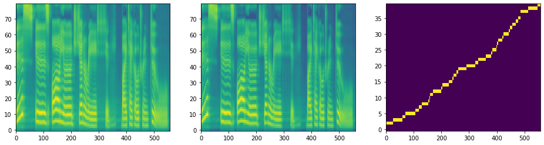</img>


```python
text = "This is audio generated by Tacotron 2."
speaker = 'ljs-w'
emotion = 'neutral'
discrete_attention_weight=[False,True]
daw = discrete_attention_weight

wav_name = "{}_{}_{}_[Discrete({},{})].wav".format(speaker, emotion, slugify(text), daw[0], daw[1])
png_name = "{}_{}_{}_[Discrete({},{})].png".format(speaker, emotion, slugify(text), daw[0], daw[1])
wav_path = os.path.join(wav_dir, wav_name)
png_path = os.path.join(wav_dir, png_name)
np_audio, sample_rate, sequence = synthesize_speech(text, speaker, emotion, discrete_attention_weight, png_path)
sf.write(wav_path, np_audio.reshape(-1,1).astype('float32'), hparams.sampling_rate)
plt.savefig(png_path, bbox_inches='tight')
print("Saved {}".format(wav_path))
print("Saved {}".format(png_path))
#ipd.display(ipd.Audio(wav_path, rate=hparams.sampling_rate))
ipd.display(ipd.HTML('<audio controls><source src="{}" type="audio/wav"></audio>'.format(drop_top_dir(wav_path))))
ipd.display(ipd.HTML('</img>'.format(drop_top_dir(png_path))))
```

    Speaker: ljs-w
    Emotion: neutral
    Text   : This is audio generated by Tacotron 2.
    Attention quality:        0.8750
    Forward attentoin ratio:  1.0000
    Attentoin ratio:          0.8750
    Range attentoin ratio:    1.0000
    Multiple attentoin ratio: 0.0000
    Saved inference_ipynb/DiscreteAttentionWeights/DiscreteAttentionWeights/tacotron2_statedict.pt/ljs-w_neutral_This_is_audio_generated_by_Tacotron_2_[Discrete(False,True)].wav
    Saved inference_ipynb/DiscreteAttentionWeights/DiscreteAttentionWeights/tacotron2_statedict.pt/ljs-w_neutral_This_is_audio_generated_by_Tacotron_2_[Discrete(False,True)].png


<audio controls><source src="DiscreteAttentionWeights/DiscreteAttentionWeights/tacotron2_statedict.pt/ljs-w_neutral_This_is_audio_generated_by_Tacotron_2_[Discrete(False,True)].wav" type="audio/wav"></audio>


</img>


```python
text = "This is audio generated by Tacotron 2."
speaker = 'ljs-w'
emotion = 'neutral'
discrete_attention_weight=[True,False]
daw = discrete_attention_weight

wav_name = "{}_{}_{}_[Discrete({},{})].wav".format(speaker, emotion, slugify(text), daw[0], daw[1])
png_name = "{}_{}_{}_[Discrete({},{})].png".format(speaker, emotion, slugify(text), daw[0], daw[1])
wav_path = os.path.join(wav_dir, wav_name)
png_path = os.path.join(wav_dir, png_name)
np_audio, sample_rate, sequence = synthesize_speech(text, speaker, emotion, discrete_attention_weight, png_path)
sf.write(wav_path, np_audio.reshape(-1,1).astype('float32'), hparams.sampling_rate)
plt.savefig(png_path, bbox_inches='tight')
print("Saved {}".format(wav_path))
print("Saved {}".format(png_path))
#ipd.display(ipd.Audio(wav_path, rate=hparams.sampling_rate))
ipd.display(ipd.HTML('<audio controls><source src="{}" type="audio/wav"></audio>'.format(drop_top_dir(wav_path))))
ipd.display(ipd.HTML('</img>'.format(drop_top_dir(png_path))))
```

    Warning! Reached max decoder steps
    Speaker: ljs-w
    Emotion: neutral
    Text   : This is audio generated by Tacotron 2.
    Attention quality:        0.4232
    Forward attentoin ratio:  0.9730
    Attentoin ratio:          0.7250
    Range attentoin ratio:    1.0000
    Multiple attentoin ratio: 0.4000
    Saved inference_ipynb/DiscreteAttentionWeights/DiscreteAttentionWeights/tacotron2_statedict.pt/ljs-w_neutral_This_is_audio_generated_by_Tacotron_2_[Discrete(True,False)].wav
    Saved inference_ipynb/DiscreteAttentionWeights/DiscreteAttentionWeights/tacotron2_statedict.pt/ljs-w_neutral_This_is_audio_generated_by_Tacotron_2_[Discrete(True,False)].png


<audio controls><source src="DiscreteAttentionWeights/DiscreteAttentionWeights/tacotron2_statedict.pt/ljs-w_neutral_This_is_audio_generated_by_Tacotron_2_[Discrete(True,False)].wav" type="audio/wav"></audio>


</img>


## 3. Generate audios of the 4 cases on 10 validation sentences


```python
from utils import load_wavpath_text_speaker_sex_emotion_lang
```


```python
valsets = dict()
```


```python
speaker = 'ljs-w'
emotion = 'neutral'
valsets[(speaker, emotion)] = load_wavpath_text_speaker_sex_emotion_lang(hparams, 'val', speaker, emotion, 0)[0]
print("len(valsets[({speaker}, {emotion})]) = {length}".format(
    speaker=speaker,
    emotion=emotion,
    length=len(valsets[(speaker, emotion)])
))
```

    len(valsets[(ljs-w, neutral)]) = 100


```python
cnt = 0
v = valsets[(speaker, emotion)]
for sample in v:
    text = sample[1]
    for daw in [[False,False], [True,True], [False,True], [True,False]]:
        discrete_attention_weight = daw
        wav_name = "[{:03d}]{}_{}_{}_[Discrete({},{})].wav".format(cnt, speaker, emotion, slugify(text), daw[0], daw[1])
        png_name = "[{:03d}]{}_{}_{}_[Discrete({},{})].png".format(cnt, speaker, emotion, slugify(text), daw[0], daw[1])
        wav_path = os.path.join(wav_dir, wav_name)
        png_path = os.path.join(wav_dir, png_name)
        np_audio, sample_rate, sequence = synthesize_speech(text, speaker, emotion, discrete_attention_weight, png_path)
        sf.write(wav_path, np_audio.reshape(-1,1).astype('float32'), hparams.sampling_rate)
        plt.savefig(png_path, bbox_inches='tight')
        print("Saved {}".format(wav_path))
        print("Saved {}".format(png_path))
        #ipd.display(ipd.Audio(wav_path, rate=hparams.sampling_rate))
        ipd.display(ipd.HTML('<audio controls><source src="{}" type="audio/wav"></audio>'.format(drop_top_dir(wav_path))))
        ipd.display(ipd.HTML('</img>'.format(drop_top_dir(png_path))))
    cnt += 1
    print("[{} Done!]======================================================================================================================================================".format(cnt))
    if cnt == 10:
        break
```

    Speaker: ljs-w
    Emotion: neutral
    Text   : he was reported to have fallen away to a shadow.
    Attention quality:        0.8333
    Forward attentoin ratio:  1.0000
    Attentoin ratio:          0.8333
    Range attentoin ratio:    1.0000
    Multiple attentoin ratio: 0.0000
    Saved inference_ipynb/DiscreteAttentionWeights/DiscreteAttentionWeights/tacotron2_statedict.pt/[000]ljs-w_neutral_he_was_reported_to_have_fallen_away_to_a_shadow_[Discrete(False,False)].wav
    Saved inference_ipynb/DiscreteAttentionWeights/DiscreteAttentionWeights/tacotron2_statedict.pt/[000]ljs-w_neutral_he_was_reported_to_have_fallen_away_to_a_shadow_[Discrete(False,False)].png


<audio controls><source src="DiscreteAttentionWeights/DiscreteAttentionWeights/tacotron2_statedict.pt/[000]ljs-w_neutral_he_was_reported_to_have_fallen_away_to_a_shadow_[Discrete(False,False)].wav" type="audio/wav"></audio>


</img>


    Speaker: ljs-w
    Emotion: neutral
    Text   : he was reported to have fallen away to a shadow.
    Attention quality:        0.9583
    Forward attentoin ratio:  1.0000
    Attentoin ratio:          0.9583
    Range attentoin ratio:    1.0000
    Multiple attentoin ratio: 0.0000
    Saved inference_ipynb/DiscreteAttentionWeights/DiscreteAttentionWeights/tacotron2_statedict.pt/[000]ljs-w_neutral_he_was_reported_to_have_fallen_away_to_a_shadow_[Discrete(True,True)].wav
    Saved inference_ipynb/DiscreteAttentionWeights/DiscreteAttentionWeights/tacotron2_statedict.pt/[000]ljs-w_neutral_he_was_reported_to_have_fallen_away_to_a_shadow_[Discrete(True,True)].png


<audio controls><source src="DiscreteAttentionWeights/DiscreteAttentionWeights/tacotron2_statedict.pt/[000]ljs-w_neutral_he_was_reported_to_have_fallen_away_to_a_shadow_[Discrete(True,True)].wav" type="audio/wav"></audio>


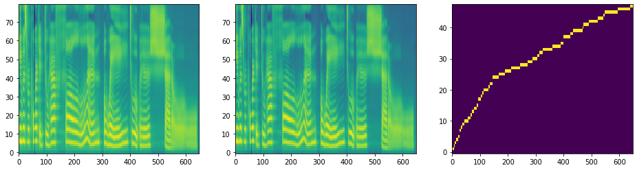</img>


    Speaker: ljs-w
    Emotion: neutral
    Text   : he was reported to have fallen away to a shadow.
    Attention quality:        0.8333
    Forward attentoin ratio:  1.0000
    Attentoin ratio:          0.8333
    Range attentoin ratio:    1.0000
    Multiple attentoin ratio: 0.0000
    Saved inference_ipynb/DiscreteAttentionWeights/DiscreteAttentionWeights/tacotron2_statedict.pt/[000]ljs-w_neutral_he_was_reported_to_have_fallen_away_to_a_shadow_[Discrete(False,True)].wav
    Saved inference_ipynb/DiscreteAttentionWeights/DiscreteAttentionWeights/tacotron2_statedict.pt/[000]ljs-w_neutral_he_was_reported_to_have_fallen_away_to_a_shadow_[Discrete(False,True)].png


<audio controls><source src="DiscreteAttentionWeights/DiscreteAttentionWeights/tacotron2_statedict.pt/[000]ljs-w_neutral_he_was_reported_to_have_fallen_away_to_a_shadow_[Discrete(False,True)].wav" type="audio/wav"></audio>


</img>


    Speaker: ljs-w
    Emotion: neutral
    Text   : he was reported to have fallen away to a shadow.
    Attention quality:        0.6033
    Forward attentoin ratio:  0.9986
    Attentoin ratio:          0.6042
    Range attentoin ratio:    1.0000
    Multiple attentoin ratio: 0.0000
    Saved inference_ipynb/DiscreteAttentionWeights/DiscreteAttentionWeights/tacotron2_statedict.pt/[000]ljs-w_neutral_he_was_reported_to_have_fallen_away_to_a_shadow_[Discrete(True,False)].wav
    Saved inference_ipynb/DiscreteAttentionWeights/DiscreteAttentionWeights/tacotron2_statedict.pt/[000]ljs-w_neutral_he_was_reported_to_have_fallen_away_to_a_shadow_[Discrete(True,False)].png


<audio controls><source src="DiscreteAttentionWeights/DiscreteAttentionWeights/tacotron2_statedict.pt/[000]ljs-w_neutral_he_was_reported_to_have_fallen_away_to_a_shadow_[Discrete(True,False)].wav" type="audio/wav"></audio>


</img>


    [1 Done!]======================================================================================================================================================
    Speaker: ljs-w
    Emotion: neutral
    Text   : Speaking on a debate on prison matters, he declared that
    Attention quality:        0.8393
    Forward attentoin ratio:  1.0000
    Attentoin ratio:          0.8393
    Range attentoin ratio:    1.0000
    Multiple attentoin ratio: 0.0000
    Saved inference_ipynb/DiscreteAttentionWeights/DiscreteAttentionWeights/tacotron2_statedict.pt/[001]ljs-w_neutral_Speaking_on_a_debate_on_prison_matters_he_declared_that_[Discrete(False,False)].wav
    Saved inference_ipynb/DiscreteAttentionWeights/DiscreteAttentionWeights/tacotron2_statedict.pt/[001]ljs-w_neutral_Speaking_on_a_debate_on_prison_matters_he_declared_that_[Discrete(False,False)].png


<audio controls><source src="DiscreteAttentionWeights/DiscreteAttentionWeights/tacotron2_statedict.pt/[001]ljs-w_neutral_Speaking_on_a_debate_on_prison_matters_he_declared_that_[Discrete(False,False)].wav" type="audio/wav"></audio>


</img>


    Speaker: ljs-w
    Emotion: neutral
    Text   : Speaking on a debate on prison matters, he declared that
    Attention quality:        0.8929
    Forward attentoin ratio:  1.0000
    Attentoin ratio:          0.8929
    Range attentoin ratio:    1.0000
    Multiple attentoin ratio: 0.0000
    Saved inference_ipynb/DiscreteAttentionWeights/DiscreteAttentionWeights/tacotron2_statedict.pt/[001]ljs-w_neutral_Speaking_on_a_debate_on_prison_matters_he_declared_that_[Discrete(True,True)].wav
    Saved inference_ipynb/DiscreteAttentionWeights/DiscreteAttentionWeights/tacotron2_statedict.pt/[001]ljs-w_neutral_Speaking_on_a_debate_on_prison_matters_he_declared_that_[Discrete(True,True)].png


<audio controls><source src="DiscreteAttentionWeights/DiscreteAttentionWeights/tacotron2_statedict.pt/[001]ljs-w_neutral_Speaking_on_a_debate_on_prison_matters_he_declared_that_[Discrete(True,True)].wav" type="audio/wav"></audio>


</img>


    Warning! Reached max decoder steps
    Speaker: ljs-w
    Emotion: neutral
    Text   : Speaking on a debate on prison matters, he declared that
    Attention quality:        0.4697
    Forward attentoin ratio:  0.9960
    Attentoin ratio:          0.9107
    Range attentoin ratio:    1.0000
    Multiple attentoin ratio: 0.4821
    Saved inference_ipynb/DiscreteAttentionWeights/DiscreteAttentionWeights/tacotron2_statedict.pt/[001]ljs-w_neutral_Speaking_on_a_debate_on_prison_matters_he_declared_that_[Discrete(False,True)].wav
    Saved inference_ipynb/DiscreteAttentionWeights/DiscreteAttentionWeights/tacotron2_statedict.pt/[001]ljs-w_neutral_Speaking_on_a_debate_on_prison_matters_he_declared_that_[Discrete(False,True)].png


<audio controls><source src="DiscreteAttentionWeights/DiscreteAttentionWeights/tacotron2_statedict.pt/[001]ljs-w_neutral_Speaking_on_a_debate_on_prison_matters_he_declared_that_[Discrete(False,True)].wav" type="audio/wav"></audio>


</img>


    Speaker: ljs-w
    Emotion: neutral
    Text   : Speaking on a debate on prison matters, he declared that
    Attention quality:        0.0729
    Forward attentoin ratio:  0.9921
    Attentoin ratio:          0.1964
    Range attentoin ratio:    0.4107
    Multiple attentoin ratio: 0.0893
    Saved inference_ipynb/DiscreteAttentionWeights/DiscreteAttentionWeights/tacotron2_statedict.pt/[001]ljs-w_neutral_Speaking_on_a_debate_on_prison_matters_he_declared_that_[Discrete(True,False)].wav
    Saved inference_ipynb/DiscreteAttentionWeights/DiscreteAttentionWeights/tacotron2_statedict.pt/[001]ljs-w_neutral_Speaking_on_a_debate_on_prison_matters_he_declared_that_[Discrete(True,False)].png


<audio controls><source src="DiscreteAttentionWeights/DiscreteAttentionWeights/tacotron2_statedict.pt/[001]ljs-w_neutral_Speaking_on_a_debate_on_prison_matters_he_declared_that_[Discrete(True,False)].wav" type="audio/wav"></audio>


</img>


    [2 Done!]======================================================================================================================================================
    Speaker: ljs-w
    Emotion: neutral
    Text   : These pungent and well-grounded strictures applied with still greater force to the unconvicted prisoner, the man who came to the prison innocent, and still uncontaminated,
    Attention quality:        0.8602
    Forward attentoin ratio:  0.9989
    Attentoin ratio:          0.8713
    Range attentoin ratio:    1.0000
    Multiple attentoin ratio: 0.0117
    Saved inference_ipynb/DiscreteAttentionWeights/DiscreteAttentionWeights/tacotron2_statedict.pt/[002]ljs-w_neutral_These_pungent_and_well-grounded_strictures_applied_with_still_greater_force_to_the_unconvicted_prisoner_the_man_who_came_to_the_prison_innocent_and_still_uncontaminated_[Discrete(False,False)].wav
    Saved inference_ipynb/DiscreteAttentionWeights/DiscreteAttentionWeights/tacotron2_statedict.pt/[002]ljs-w_neutral_These_pungent_and_well-grounded_strictures_applied_with_still_greater_force_to_the_unconvicted_prisoner_the_man_who_came_to_the_prison_innocent_and_still_uncontaminated_[Discrete(False,False)].png


<audio controls><source src="DiscreteAttentionWeights/DiscreteAttentionWeights/tacotron2_statedict.pt/[002]ljs-w_neutral_These_pungent_and_well-grounded_strictures_applied_with_still_greater_force_to_the_unconvicted_prisoner_the_man_who_came_to_the_prison_innocent_and_still_uncontaminated_[Discrete(False,False)].wav" type="audio/wav"></audio>


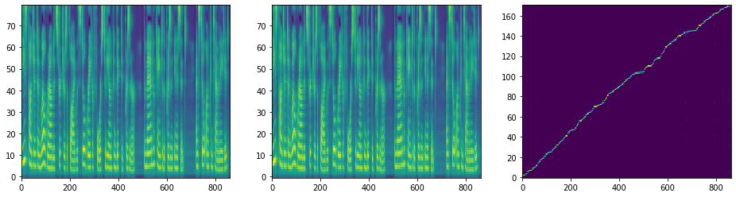</img>


    Warning! Reached max decoder steps
    Speaker: ljs-w
    Emotion: neutral
    Text   : These pungent and well-grounded strictures applied with still greater force to the unconvicted prisoner, the man who came to the prison innocent, and still uncontaminated,
    Attention quality:        0.1554
    Forward attentoin ratio:  1.0000
    Attentoin ratio:          0.3743
    Range attentoin ratio:    0.4152
    Multiple attentoin ratio: 0.0000
    Saved inference_ipynb/DiscreteAttentionWeights/DiscreteAttentionWeights/tacotron2_statedict.pt/[002]ljs-w_neutral_These_pungent_and_well-grounded_strictures_applied_with_still_greater_force_to_the_unconvicted_prisoner_the_man_who_came_to_the_prison_innocent_and_still_uncontaminated_[Discrete(True,True)].wav
    Saved inference_ipynb/DiscreteAttentionWeights/DiscreteAttentionWeights/tacotron2_statedict.pt/[002]ljs-w_neutral_These_pungent_and_well-grounded_strictures_applied_with_still_greater_force_to_the_unconvicted_prisoner_the_man_who_came_to_the_prison_innocent_and_still_uncontaminated_[Discrete(True,True)].png


<audio controls><source src="DiscreteAttentionWeights/DiscreteAttentionWeights/tacotron2_statedict.pt/[002]ljs-w_neutral_These_pungent_and_well-grounded_strictures_applied_with_still_greater_force_to_the_unconvicted_prisoner_the_man_who_came_to_the_prison_innocent_and_still_uncontaminated_[Discrete(True,True)].wav" type="audio/wav"></audio>


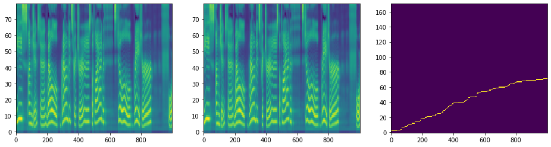</img>


    Warning! Reached max decoder steps
    Speaker: ljs-w
    Emotion: neutral
    Text   : These pungent and well-grounded strictures applied with still greater force to the unconvicted prisoner, the man who came to the prison innocent, and still uncontaminated,
    Attention quality:        0.8005
    Forward attentoin ratio:  1.0000
    Attentoin ratio:          0.8246
    Range attentoin ratio:    0.9708
    Multiple attentoin ratio: 0.0000
    Saved inference_ipynb/DiscreteAttentionWeights/DiscreteAttentionWeights/tacotron2_statedict.pt/[002]ljs-w_neutral_These_pungent_and_well-grounded_strictures_applied_with_still_greater_force_to_the_unconvicted_prisoner_the_man_who_came_to_the_prison_innocent_and_still_uncontaminated_[Discrete(False,True)].wav
    Saved inference_ipynb/DiscreteAttentionWeights/DiscreteAttentionWeights/tacotron2_statedict.pt/[002]ljs-w_neutral_These_pungent_and_well-grounded_strictures_applied_with_still_greater_force_to_the_unconvicted_prisoner_the_man_who_came_to_the_prison_innocent_and_still_uncontaminated_[Discrete(False,True)].png


<audio controls><source src="DiscreteAttentionWeights/DiscreteAttentionWeights/tacotron2_statedict.pt/[002]ljs-w_neutral_These_pungent_and_well-grounded_strictures_applied_with_still_greater_force_to_the_unconvicted_prisoner_the_man_who_came_to_the_prison_innocent_and_still_uncontaminated_[Discrete(False,True)].wav" type="audio/wav"></audio>


</img>


    Warning! Reached max decoder steps
    Speaker: ljs-w
    Emotion: neutral
    Text   : These pungent and well-grounded strictures applied with still greater force to the unconvicted prisoner, the man who came to the prison innocent, and still uncontaminated,
    Attention quality:        0.0260
    Forward attentoin ratio:  0.9510
    Attentoin ratio:          0.1228
    Range attentoin ratio:    0.2456
    Multiple attentoin ratio: 0.0936
    Saved inference_ipynb/DiscreteAttentionWeights/DiscreteAttentionWeights/tacotron2_statedict.pt/[002]ljs-w_neutral_These_pungent_and_well-grounded_strictures_applied_with_still_greater_force_to_the_unconvicted_prisoner_the_man_who_came_to_the_prison_innocent_and_still_uncontaminated_[Discrete(True,False)].wav
    Saved inference_ipynb/DiscreteAttentionWeights/DiscreteAttentionWeights/tacotron2_statedict.pt/[002]ljs-w_neutral_These_pungent_and_well-grounded_strictures_applied_with_still_greater_force_to_the_unconvicted_prisoner_the_man_who_came_to_the_prison_innocent_and_still_uncontaminated_[Discrete(True,False)].png


<audio controls><source src="DiscreteAttentionWeights/DiscreteAttentionWeights/tacotron2_statedict.pt/[002]ljs-w_neutral_These_pungent_and_well-grounded_strictures_applied_with_still_greater_force_to_the_unconvicted_prisoner_the_man_who_came_to_the_prison_innocent_and_still_uncontaminated_[Discrete(True,False)].wav" type="audio/wav"></audio>


</img>


    [3 Done!]======================================================================================================================================================
    Speaker: ljs-w
    Emotion: neutral
    Text   : although at Mr. Buxton's visit a new jail was in process of erection, the first step towards reform since Howard's visitation in seventeen seventy-four.
    Attention quality:        0.8516
    Forward attentoin ratio:  1.0000
    Attentoin ratio:          0.8516
    Range attentoin ratio:    1.0000
    Multiple attentoin ratio: 0.0000
    Saved inference_ipynb/DiscreteAttentionWeights/DiscreteAttentionWeights/tacotron2_statedict.pt/[003]ljs-w_neutral_although_at_Mr_Buxtons_visit_a_new_jail_was_in_process_of_erection_the_first_step_towards_reform_since_Howards_visitation_in_seventeen_seventy-four_[Discrete(False,False)].wav
    Saved inference_ipynb/DiscreteAttentionWeights/DiscreteAttentionWeights/tacotron2_statedict.pt/[003]ljs-w_neutral_although_at_Mr_Buxtons_visit_a_new_jail_was_in_process_of_erection_the_first_step_towards_reform_since_Howards_visitation_in_seventeen_seventy-four_[Discrete(False,False)].png


<audio controls><source src="DiscreteAttentionWeights/DiscreteAttentionWeights/tacotron2_statedict.pt/[003]ljs-w_neutral_although_at_Mr_Buxtons_visit_a_new_jail_was_in_process_of_erection_the_first_step_towards_reform_since_Howards_visitation_in_seventeen_seventy-four_[Discrete(False,False)].wav" type="audio/wav"></audio>


</img>


    Warning! Reached max decoder steps
    Speaker: ljs-w
    Emotion: neutral
    Text   : although at Mr. Buxton's visit a new jail was in process of erection, the first step towards reform since Howard's visitation in seventeen seventy-four.
    Attention quality:        0.1020
    Forward attentoin ratio:  1.0000
    Attentoin ratio:          0.3161
    Range attentoin ratio:    0.3226
    Multiple attentoin ratio: 0.0000
    Saved inference_ipynb/DiscreteAttentionWeights/DiscreteAttentionWeights/tacotron2_statedict.pt/[003]ljs-w_neutral_although_at_Mr_Buxtons_visit_a_new_jail_was_in_process_of_erection_the_first_step_towards_reform_since_Howards_visitation_in_seventeen_seventy-four_[Discrete(True,True)].wav
    Saved inference_ipynb/DiscreteAttentionWeights/DiscreteAttentionWeights/tacotron2_statedict.pt/[003]ljs-w_neutral_although_at_Mr_Buxtons_visit_a_new_jail_was_in_process_of_erection_the_first_step_towards_reform_since_Howards_visitation_in_seventeen_seventy-four_[Discrete(True,True)].png


<audio controls><source src="DiscreteAttentionWeights/DiscreteAttentionWeights/tacotron2_statedict.pt/[003]ljs-w_neutral_although_at_Mr_Buxtons_visit_a_new_jail_was_in_process_of_erection_the_first_step_towards_reform_since_Howards_visitation_in_seventeen_seventy-four_[Discrete(True,True)].wav" type="audio/wav"></audio>


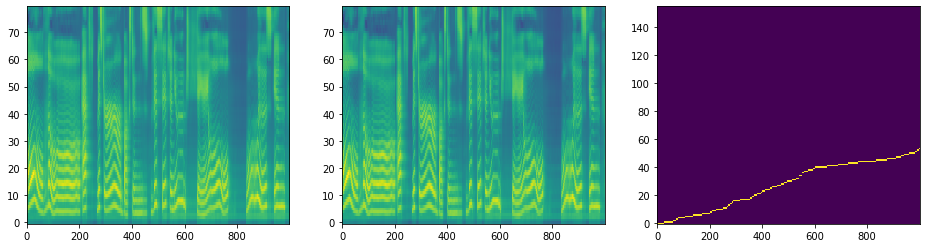</img>


    Speaker: ljs-w
    Emotion: neutral
    Text   : although at Mr. Buxton's visit a new jail was in process of erection, the first step towards reform since Howard's visitation in seventeen seventy-four.
    Attention quality:        0.8258
    Forward attentoin ratio:  1.0000
    Attentoin ratio:          0.8258
    Range attentoin ratio:    1.0000
    Multiple attentoin ratio: 0.0000
    Saved inference_ipynb/DiscreteAttentionWeights/DiscreteAttentionWeights/tacotron2_statedict.pt/[003]ljs-w_neutral_although_at_Mr_Buxtons_visit_a_new_jail_was_in_process_of_erection_the_first_step_towards_reform_since_Howards_visitation_in_seventeen_seventy-four_[Discrete(False,True)].wav
    Saved inference_ipynb/DiscreteAttentionWeights/DiscreteAttentionWeights/tacotron2_statedict.pt/[003]ljs-w_neutral_although_at_Mr_Buxtons_visit_a_new_jail_was_in_process_of_erection_the_first_step_towards_reform_since_Howards_visitation_in_seventeen_seventy-four_[Discrete(False,True)].png


<audio controls><source src="DiscreteAttentionWeights/DiscreteAttentionWeights/tacotron2_statedict.pt/[003]ljs-w_neutral_although_at_Mr_Buxtons_visit_a_new_jail_was_in_process_of_erection_the_first_step_towards_reform_since_Howards_visitation_in_seventeen_seventy-four_[Discrete(False,True)].wav" type="audio/wav"></audio>


</img>


    Warning! Reached max decoder steps
    Speaker: ljs-w
    Emotion: neutral
    Text   : although at Mr. Buxton's visit a new jail was in process of erection, the first step towards reform since Howard's visitation in seventeen seventy-four.
    Attention quality:        0.0660
    Forward attentoin ratio:  0.9830
    Attentoin ratio:          0.2000
    Range attentoin ratio:    0.3613
    Multiple attentoin ratio: 0.0710
    Saved inference_ipynb/DiscreteAttentionWeights/DiscreteAttentionWeights/tacotron2_statedict.pt/[003]ljs-w_neutral_although_at_Mr_Buxtons_visit_a_new_jail_was_in_process_of_erection_the_first_step_towards_reform_since_Howards_visitation_in_seventeen_seventy-four_[Discrete(True,False)].wav
    Saved inference_ipynb/DiscreteAttentionWeights/DiscreteAttentionWeights/tacotron2_statedict.pt/[003]ljs-w_neutral_although_at_Mr_Buxtons_visit_a_new_jail_was_in_process_of_erection_the_first_step_towards_reform_since_Howards_visitation_in_seventeen_seventy-four_[Discrete(True,False)].png


<audio controls><source src="DiscreteAttentionWeights/DiscreteAttentionWeights/tacotron2_statedict.pt/[003]ljs-w_neutral_although_at_Mr_Buxtons_visit_a_new_jail_was_in_process_of_erection_the_first_step_towards_reform_since_Howards_visitation_in_seventeen_seventy-four_[Discrete(True,False)].wav" type="audio/wav"></audio>


</img>


    [4 Done!]======================================================================================================================================================
    Speaker: ljs-w
    Emotion: neutral
    Text   : together with a great increase in the payrolls, there has come a substantial rise in the total of industrial profits
    Attention quality:        0.8362
    Forward attentoin ratio:  1.0000
    Attentoin ratio:          0.8362
    Range attentoin ratio:    1.0000
    Multiple attentoin ratio: 0.0000
    Saved inference_ipynb/DiscreteAttentionWeights/DiscreteAttentionWeights/tacotron2_statedict.pt/[004]ljs-w_neutral_together_with_a_great_increase_in_the_payrolls_there_has_come_a_substantial_rise_in_the_total_of_industrial_profits_[Discrete(False,False)].wav
    Saved inference_ipynb/DiscreteAttentionWeights/DiscreteAttentionWeights/tacotron2_statedict.pt/[004]ljs-w_neutral_together_with_a_great_increase_in_the_payrolls_there_has_come_a_substantial_rise_in_the_total_of_industrial_profits_[Discrete(False,False)].png


<audio controls><source src="DiscreteAttentionWeights/DiscreteAttentionWeights/tacotron2_statedict.pt/[004]ljs-w_neutral_together_with_a_great_increase_in_the_payrolls_there_has_come_a_substantial_rise_in_the_total_of_industrial_profits_[Discrete(False,False)].wav" type="audio/wav"></audio>


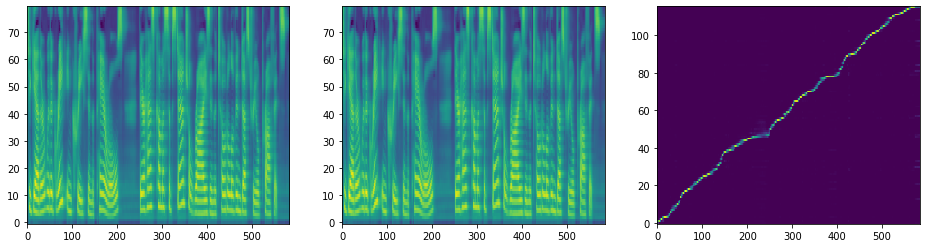</img>


    Warning! Reached max decoder steps
    Speaker: ljs-w
    Emotion: neutral
    Text   : together with a great increase in the payrolls, there has come a substantial rise in the total of industrial profits
    Attention quality:        0.2385
    Forward attentoin ratio:  0.9990
    Attentoin ratio:          0.4655
    Range attentoin ratio:    0.5172
    Multiple attentoin ratio: 0.0086
    Saved inference_ipynb/DiscreteAttentionWeights/DiscreteAttentionWeights/tacotron2_statedict.pt/[004]ljs-w_neutral_together_with_a_great_increase_in_the_payrolls_there_has_come_a_substantial_rise_in_the_total_of_industrial_profits_[Discrete(True,True)].wav
    Saved inference_ipynb/DiscreteAttentionWeights/DiscreteAttentionWeights/tacotron2_statedict.pt/[004]ljs-w_neutral_together_with_a_great_increase_in_the_payrolls_there_has_come_a_substantial_rise_in_the_total_of_industrial_profits_[Discrete(True,True)].png


<audio controls><source src="DiscreteAttentionWeights/DiscreteAttentionWeights/tacotron2_statedict.pt/[004]ljs-w_neutral_together_with_a_great_increase_in_the_payrolls_there_has_come_a_substantial_rise_in_the_total_of_industrial_profits_[Discrete(True,True)].wav" type="audio/wav"></audio>


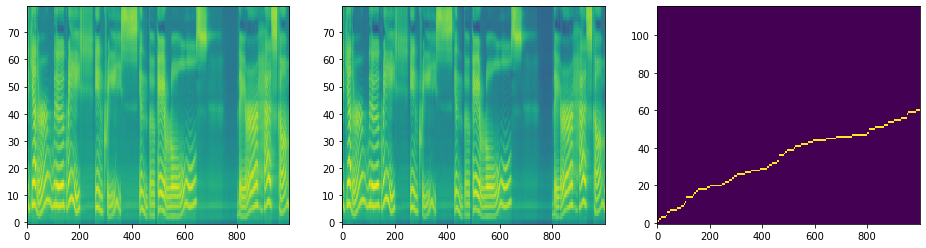</img>


    Warning! Reached max decoder steps
    Speaker: ljs-w
    Emotion: neutral
    Text   : together with a great increase in the payrolls, there has come a substantial rise in the total of industrial profits
    Attention quality:        0.7595
    Forward attentoin ratio:  0.9990
    Attentoin ratio:          0.8017
    Range attentoin ratio:    1.0000
    Multiple attentoin ratio: 0.0517
    Saved inference_ipynb/DiscreteAttentionWeights/DiscreteAttentionWeights/tacotron2_statedict.pt/[004]ljs-w_neutral_together_with_a_great_increase_in_the_payrolls_there_has_come_a_substantial_rise_in_the_total_of_industrial_profits_[Discrete(False,True)].wav
    Saved inference_ipynb/DiscreteAttentionWeights/DiscreteAttentionWeights/tacotron2_statedict.pt/[004]ljs-w_neutral_together_with_a_great_increase_in_the_payrolls_there_has_come_a_substantial_rise_in_the_total_of_industrial_profits_[Discrete(False,True)].png


<audio controls><source src="DiscreteAttentionWeights/DiscreteAttentionWeights/tacotron2_statedict.pt/[004]ljs-w_neutral_together_with_a_great_increase_in_the_payrolls_there_has_come_a_substantial_rise_in_the_total_of_industrial_profits_[Discrete(False,True)].wav" type="audio/wav"></audio>


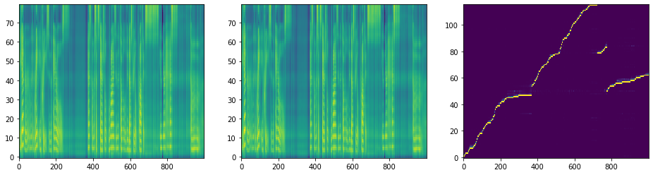</img>


    Speaker: ljs-w
    Emotion: neutral
    Text   : together with a great increase in the payrolls, there has come a substantial rise in the total of industrial profits
    Attention quality:        0.0504
    Forward attentoin ratio:  0.9759
    Attentoin ratio:          0.1466
    Range attentoin ratio:    0.3966
    Multiple attentoin ratio: 0.1121
    Saved inference_ipynb/DiscreteAttentionWeights/DiscreteAttentionWeights/tacotron2_statedict.pt/[004]ljs-w_neutral_together_with_a_great_increase_in_the_payrolls_there_has_come_a_substantial_rise_in_the_total_of_industrial_profits_[Discrete(True,False)].wav
    Saved inference_ipynb/DiscreteAttentionWeights/DiscreteAttentionWeights/tacotron2_statedict.pt/[004]ljs-w_neutral_together_with_a_great_increase_in_the_payrolls_there_has_come_a_substantial_rise_in_the_total_of_industrial_profits_[Discrete(True,False)].png


<audio controls><source src="DiscreteAttentionWeights/DiscreteAttentionWeights/tacotron2_statedict.pt/[004]ljs-w_neutral_together_with_a_great_increase_in_the_payrolls_there_has_come_a_substantial_rise_in_the_total_of_industrial_profits_[Discrete(True,False)].wav" type="audio/wav"></audio>


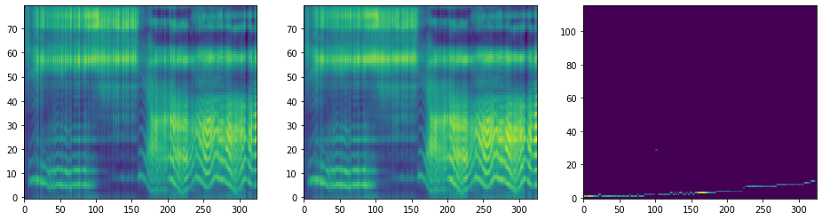</img>


    [5 Done!]======================================================================================================================================================
    Speaker: ljs-w
    Emotion: neutral
    Text   : Let me retrace my steps, and speak more in detail of the treatment of the condemned in those bloodthirsty and brutally indifferent days,
    Attention quality:        0.8382
    Forward attentoin ratio:  1.0000
    Attentoin ratio:          0.8382
    Range attentoin ratio:    1.0000
    Multiple attentoin ratio: 0.0000
    Saved inference_ipynb/DiscreteAttentionWeights/DiscreteAttentionWeights/tacotron2_statedict.pt/[005]ljs-w_neutral_Let_me_retrace_my_steps_and_speak_more_in_detail_of_the_treatment_of_the_condemned_in_those_bloodthirsty_and_brutally_indifferent_days_[Discrete(False,False)].wav
    Saved inference_ipynb/DiscreteAttentionWeights/DiscreteAttentionWeights/tacotron2_statedict.pt/[005]ljs-w_neutral_Let_me_retrace_my_steps_and_speak_more_in_detail_of_the_treatment_of_the_condemned_in_those_bloodthirsty_and_brutally_indifferent_days_[Discrete(False,False)].png


<audio controls><source src="DiscreteAttentionWeights/DiscreteAttentionWeights/tacotron2_statedict.pt/[005]ljs-w_neutral_Let_me_retrace_my_steps_and_speak_more_in_detail_of_the_treatment_of_the_condemned_in_those_bloodthirsty_and_brutally_indifferent_days_[Discrete(False,False)].wav" type="audio/wav"></audio>


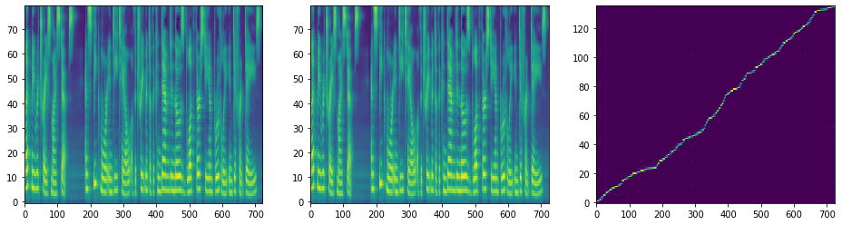</img>


    Warning! Reached max decoder steps
    Speaker: ljs-w
    Emotion: neutral
    Text   : Let me retrace my steps, and speak more in detail of the treatment of the condemned in those bloodthirsty and brutally indifferent days,
    Attention quality:        0.2948
    Forward attentoin ratio:  1.0000
    Attentoin ratio:          0.4265
    Range attentoin ratio:    0.6912
    Multiple attentoin ratio: 0.0000
    Saved inference_ipynb/DiscreteAttentionWeights/DiscreteAttentionWeights/tacotron2_statedict.pt/[005]ljs-w_neutral_Let_me_retrace_my_steps_and_speak_more_in_detail_of_the_treatment_of_the_condemned_in_those_bloodthirsty_and_brutally_indifferent_days_[Discrete(True,True)].wav
    Saved inference_ipynb/DiscreteAttentionWeights/DiscreteAttentionWeights/tacotron2_statedict.pt/[005]ljs-w_neutral_Let_me_retrace_my_steps_and_speak_more_in_detail_of_the_treatment_of_the_condemned_in_those_bloodthirsty_and_brutally_indifferent_days_[Discrete(True,True)].png


<audio controls><source src="DiscreteAttentionWeights/DiscreteAttentionWeights/tacotron2_statedict.pt/[005]ljs-w_neutral_Let_me_retrace_my_steps_and_speak_more_in_detail_of_the_treatment_of_the_condemned_in_those_bloodthirsty_and_brutally_indifferent_days_[Discrete(True,True)].wav" type="audio/wav"></audio>


</img>


    Speaker: ljs-w
    Emotion: neutral
    Text   : Let me retrace my steps, and speak more in detail of the treatment of the condemned in those bloodthirsty and brutally indifferent days,
    Attention quality:        0.7941
    Forward attentoin ratio:  1.0000
    Attentoin ratio:          0.7941
    Range attentoin ratio:    1.0000
    Multiple attentoin ratio: 0.0000
    Saved inference_ipynb/DiscreteAttentionWeights/DiscreteAttentionWeights/tacotron2_statedict.pt/[005]ljs-w_neutral_Let_me_retrace_my_steps_and_speak_more_in_detail_of_the_treatment_of_the_condemned_in_those_bloodthirsty_and_brutally_indifferent_days_[Discrete(False,True)].wav
    Saved inference_ipynb/DiscreteAttentionWeights/DiscreteAttentionWeights/tacotron2_statedict.pt/[005]ljs-w_neutral_Let_me_retrace_my_steps_and_speak_more_in_detail_of_the_treatment_of_the_condemned_in_those_bloodthirsty_and_brutally_indifferent_days_[Discrete(False,True)].png


<audio controls><source src="DiscreteAttentionWeights/DiscreteAttentionWeights/tacotron2_statedict.pt/[005]ljs-w_neutral_Let_me_retrace_my_steps_and_speak_more_in_detail_of_the_treatment_of_the_condemned_in_those_bloodthirsty_and_brutally_indifferent_days_[Discrete(False,True)].wav" type="audio/wav"></audio>


</img>


    Speaker: ljs-w
    Emotion: neutral
    Text   : Let me retrace my steps, and speak more in detail of the treatment of the condemned in those bloodthirsty and brutally indifferent days,
    Attention quality:        0.0168
    Forward attentoin ratio:  0.9632
    Attentoin ratio:          0.1176
    Range attentoin ratio:    0.1618
    Multiple attentoin ratio: 0.0809
    Saved inference_ipynb/DiscreteAttentionWeights/DiscreteAttentionWeights/tacotron2_statedict.pt/[005]ljs-w_neutral_Let_me_retrace_my_steps_and_speak_more_in_detail_of_the_treatment_of_the_condemned_in_those_bloodthirsty_and_brutally_indifferent_days_[Discrete(True,False)].wav
    Saved inference_ipynb/DiscreteAttentionWeights/DiscreteAttentionWeights/tacotron2_statedict.pt/[005]ljs-w_neutral_Let_me_retrace_my_steps_and_speak_more_in_detail_of_the_treatment_of_the_condemned_in_those_bloodthirsty_and_brutally_indifferent_days_[Discrete(True,False)].png


<audio controls><source src="DiscreteAttentionWeights/DiscreteAttentionWeights/tacotron2_statedict.pt/[005]ljs-w_neutral_Let_me_retrace_my_steps_and_speak_more_in_detail_of_the_treatment_of_the_condemned_in_those_bloodthirsty_and_brutally_indifferent_days_[Discrete(True,False)].wav" type="audio/wav"></audio>


</img>


    [6 Done!]======================================================================================================================================================
    Speaker: ljs-w
    Emotion: neutral
    Text   : The inadequacy of the jail was noticed and reported upon again and again by the grand juries of the city of London,
    Attention quality:        0.8246
    Forward attentoin ratio:  0.9981
    Attentoin ratio:          0.8261
    Range attentoin ratio:    1.0000
    Multiple attentoin ratio: 0.0000
    Saved inference_ipynb/DiscreteAttentionWeights/DiscreteAttentionWeights/tacotron2_statedict.pt/[006]ljs-w_neutral_The_inadequacy_of_the_jail_was_noticed_and_reported_upon_again_and_again_by_the_grand_juries_of_the_city_of_London_[Discrete(False,False)].wav
    Saved inference_ipynb/DiscreteAttentionWeights/DiscreteAttentionWeights/tacotron2_statedict.pt/[006]ljs-w_neutral_The_inadequacy_of_the_jail_was_noticed_and_reported_upon_again_and_again_by_the_grand_juries_of_the_city_of_London_[Discrete(False,False)].png


<audio controls><source src="DiscreteAttentionWeights/DiscreteAttentionWeights/tacotron2_statedict.pt/[006]ljs-w_neutral_The_inadequacy_of_the_jail_was_noticed_and_reported_upon_again_and_again_by_the_grand_juries_of_the_city_of_London_[Discrete(False,False)].wav" type="audio/wav"></audio>


</img>


    Warning! Reached max decoder steps
    Speaker: ljs-w
    Emotion: neutral
    Text   : The inadequacy of the jail was noticed and reported upon again and again by the grand juries of the city of London,
    Attention quality:        0.3643
    Forward attentoin ratio:  1.0000
    Attentoin ratio:          0.5739
    Range attentoin ratio:    0.6348
    Multiple attentoin ratio: 0.0000
    Saved inference_ipynb/DiscreteAttentionWeights/DiscreteAttentionWeights/tacotron2_statedict.pt/[006]ljs-w_neutral_The_inadequacy_of_the_jail_was_noticed_and_reported_upon_again_and_again_by_the_grand_juries_of_the_city_of_London_[Discrete(True,True)].wav
    Saved inference_ipynb/DiscreteAttentionWeights/DiscreteAttentionWeights/tacotron2_statedict.pt/[006]ljs-w_neutral_The_inadequacy_of_the_jail_was_noticed_and_reported_upon_again_and_again_by_the_grand_juries_of_the_city_of_London_[Discrete(True,True)].png


<audio controls><source src="DiscreteAttentionWeights/DiscreteAttentionWeights/tacotron2_statedict.pt/[006]ljs-w_neutral_The_inadequacy_of_the_jail_was_noticed_and_reported_upon_again_and_again_by_the_grand_juries_of_the_city_of_London_[Discrete(True,True)].wav" type="audio/wav"></audio>


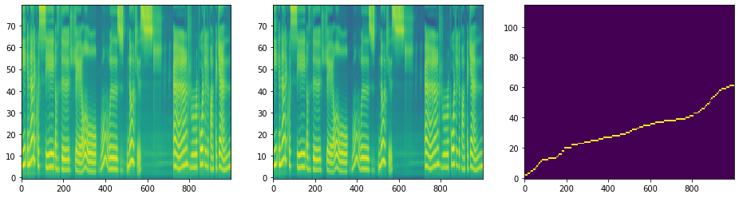</img>


    Speaker: ljs-w
    Emotion: neutral
    Text   : The inadequacy of the jail was noticed and reported upon again and again by the grand juries of the city of London,
    Attention quality:        0.7913
    Forward attentoin ratio:  1.0000
    Attentoin ratio:          0.7913
    Range attentoin ratio:    1.0000
    Multiple attentoin ratio: 0.0000
    Saved inference_ipynb/DiscreteAttentionWeights/DiscreteAttentionWeights/tacotron2_statedict.pt/[006]ljs-w_neutral_The_inadequacy_of_the_jail_was_noticed_and_reported_upon_again_and_again_by_the_grand_juries_of_the_city_of_London_[Discrete(False,True)].wav
    Saved inference_ipynb/DiscreteAttentionWeights/DiscreteAttentionWeights/tacotron2_statedict.pt/[006]ljs-w_neutral_The_inadequacy_of_the_jail_was_noticed_and_reported_upon_again_and_again_by_the_grand_juries_of_the_city_of_London_[Discrete(False,True)].png


<audio controls><source src="DiscreteAttentionWeights/DiscreteAttentionWeights/tacotron2_statedict.pt/[006]ljs-w_neutral_The_inadequacy_of_the_jail_was_noticed_and_reported_upon_again_and_again_by_the_grand_juries_of_the_city_of_London_[Discrete(False,True)].wav" type="audio/wav"></audio>


</img>


    Warning! Reached max decoder steps
    Speaker: ljs-w
    Emotion: neutral
    Text   : The inadequacy of the jail was noticed and reported upon again and again by the grand juries of the city of London,
    Attention quality:        0.0534
    Forward attentoin ratio:  0.9019
    Attentoin ratio:          0.1739
    Range attentoin ratio:    0.3913
    Multiple attentoin ratio: 0.1304
    Saved inference_ipynb/DiscreteAttentionWeights/DiscreteAttentionWeights/tacotron2_statedict.pt/[006]ljs-w_neutral_The_inadequacy_of_the_jail_was_noticed_and_reported_upon_again_and_again_by_the_grand_juries_of_the_city_of_London_[Discrete(True,False)].wav
    Saved inference_ipynb/DiscreteAttentionWeights/DiscreteAttentionWeights/tacotron2_statedict.pt/[006]ljs-w_neutral_The_inadequacy_of_the_jail_was_noticed_and_reported_upon_again_and_again_by_the_grand_juries_of_the_city_of_London_[Discrete(True,False)].png


<audio controls><source src="DiscreteAttentionWeights/DiscreteAttentionWeights/tacotron2_statedict.pt/[006]ljs-w_neutral_The_inadequacy_of_the_jail_was_noticed_and_reported_upon_again_and_again_by_the_grand_juries_of_the_city_of_London_[Discrete(True,False)].wav" type="audio/wav"></audio>


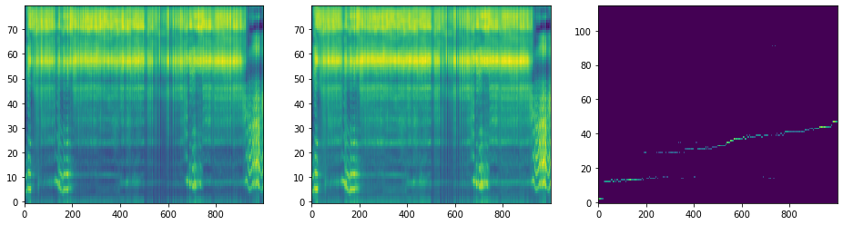</img>


    [7 Done!]======================================================================================================================================================
    Speaker: ljs-w
    Emotion: neutral
    Text   : The criteria in effect prior to November twenty-two, nineteen sixty-three, for determining whether to accept material for the PRS general files
    Attention quality:        0.8337
    Forward attentoin ratio:  0.9962
    Attentoin ratio:          0.8671
    Range attentoin ratio:    1.0000
    Multiple attentoin ratio: 0.0350
    Saved inference_ipynb/DiscreteAttentionWeights/DiscreteAttentionWeights/tacotron2_statedict.pt/[007]ljs-w_neutral_The_criteria_in_effect_prior_to_November_twenty-two_nineteen_sixty-three_for_determining_whether_to_accept_material_for_the_PRS_general_files_[Discrete(False,False)].wav
    Saved inference_ipynb/DiscreteAttentionWeights/DiscreteAttentionWeights/tacotron2_statedict.pt/[007]ljs-w_neutral_The_criteria_in_effect_prior_to_November_twenty-two_nineteen_sixty-three_for_determining_whether_to_accept_material_for_the_PRS_general_files_[Discrete(False,False)].png


<audio controls><source src="DiscreteAttentionWeights/DiscreteAttentionWeights/tacotron2_statedict.pt/[007]ljs-w_neutral_The_criteria_in_effect_prior_to_November_twenty-two_nineteen_sixty-three_for_determining_whether_to_accept_material_for_the_PRS_general_files_[Discrete(False,False)].wav" type="audio/wav"></audio>


</img>


    Warning! Reached max decoder steps
    Speaker: ljs-w
    Emotion: neutral
    Text   : The criteria in effect prior to November twenty-two, nineteen sixty-three, for determining whether to accept material for the PRS general files
    Attention quality:        0.2359
    Forward attentoin ratio:  1.0000
    Attentoin ratio:          0.4685
    Range attentoin ratio:    0.5035
    Multiple attentoin ratio: 0.0000
    Saved inference_ipynb/DiscreteAttentionWeights/DiscreteAttentionWeights/tacotron2_statedict.pt/[007]ljs-w_neutral_The_criteria_in_effect_prior_to_November_twenty-two_nineteen_sixty-three_for_determining_whether_to_accept_material_for_the_PRS_general_files_[Discrete(True,True)].wav
    Saved inference_ipynb/DiscreteAttentionWeights/DiscreteAttentionWeights/tacotron2_statedict.pt/[007]ljs-w_neutral_The_criteria_in_effect_prior_to_November_twenty-two_nineteen_sixty-three_for_determining_whether_to_accept_material_for_the_PRS_general_files_[Discrete(True,True)].png


<audio controls><source src="DiscreteAttentionWeights/DiscreteAttentionWeights/tacotron2_statedict.pt/[007]ljs-w_neutral_The_criteria_in_effect_prior_to_November_twenty-two_nineteen_sixty-three_for_determining_whether_to_accept_material_for_the_PRS_general_files_[Discrete(True,True)].wav" type="audio/wav"></audio>


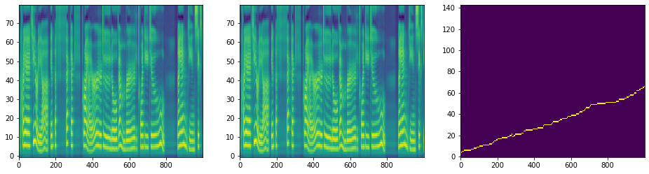</img>


    Warning! Reached max decoder steps
    Speaker: ljs-w
    Emotion: neutral
    Text   : The criteria in effect prior to November twenty-two, nineteen sixty-three, for determining whether to accept material for the PRS general files
    Attention quality:        0.8197
    Forward attentoin ratio:  0.9990
    Attentoin ratio:          0.8322
    Range attentoin ratio:    1.0000
    Multiple attentoin ratio: 0.0140
    Saved inference_ipynb/DiscreteAttentionWeights/DiscreteAttentionWeights/tacotron2_statedict.pt/[007]ljs-w_neutral_The_criteria_in_effect_prior_to_November_twenty-two_nineteen_sixty-three_for_determining_whether_to_accept_material_for_the_PRS_general_files_[Discrete(False,True)].wav
    Saved inference_ipynb/DiscreteAttentionWeights/DiscreteAttentionWeights/tacotron2_statedict.pt/[007]ljs-w_neutral_The_criteria_in_effect_prior_to_November_twenty-two_nineteen_sixty-three_for_determining_whether_to_accept_material_for_the_PRS_general_files_[Discrete(False,True)].png


<audio controls><source src="DiscreteAttentionWeights/DiscreteAttentionWeights/tacotron2_statedict.pt/[007]ljs-w_neutral_The_criteria_in_effect_prior_to_November_twenty-two_nineteen_sixty-three_for_determining_whether_to_accept_material_for_the_PRS_general_files_[Discrete(False,True)].wav" type="audio/wav"></audio>


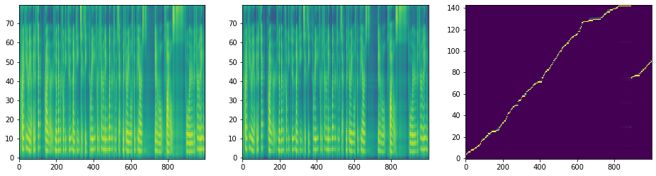</img>


    Speaker: ljs-w
    Emotion: neutral
    Text   : The criteria in effect prior to November twenty-two, nineteen sixty-three, for determining whether to accept material for the PRS general files
    Attention quality:        0.0298
    Forward attentoin ratio:  0.9698
    Attentoin ratio:          0.1049
    Range attentoin ratio:    0.3077
    Multiple attentoin ratio: 0.0490
    Saved inference_ipynb/DiscreteAttentionWeights/DiscreteAttentionWeights/tacotron2_statedict.pt/[007]ljs-w_neutral_The_criteria_in_effect_prior_to_November_twenty-two_nineteen_sixty-three_for_determining_whether_to_accept_material_for_the_PRS_general_files_[Discrete(True,False)].wav
    Saved inference_ipynb/DiscreteAttentionWeights/DiscreteAttentionWeights/tacotron2_statedict.pt/[007]ljs-w_neutral_The_criteria_in_effect_prior_to_November_twenty-two_nineteen_sixty-three_for_determining_whether_to_accept_material_for_the_PRS_general_files_[Discrete(True,False)].png


<audio controls><source src="DiscreteAttentionWeights/DiscreteAttentionWeights/tacotron2_statedict.pt/[007]ljs-w_neutral_The_criteria_in_effect_prior_to_November_twenty-two_nineteen_sixty-three_for_determining_whether_to_accept_material_for_the_PRS_general_files_[Discrete(True,False)].wav" type="audio/wav"></audio>


</img>


    [8 Done!]======================================================================================================================================================
    Speaker: ljs-w
    Emotion: neutral
    Text   : On October twenty-five,
    Attention quality:        0.9130
    Forward attentoin ratio:  1.0000
    Attentoin ratio:          0.9130
    Range attentoin ratio:    1.0000
    Multiple attentoin ratio: 0.0000
    Saved inference_ipynb/DiscreteAttentionWeights/DiscreteAttentionWeights/tacotron2_statedict.pt/[008]ljs-w_neutral_On_October_twenty-five_[Discrete(False,False)].wav
    Saved inference_ipynb/DiscreteAttentionWeights/DiscreteAttentionWeights/tacotron2_statedict.pt/[008]ljs-w_neutral_On_October_twenty-five_[Discrete(False,False)].png


<audio controls><source src="DiscreteAttentionWeights/DiscreteAttentionWeights/tacotron2_statedict.pt/[008]ljs-w_neutral_On_October_twenty-five_[Discrete(False,False)].wav" type="audio/wav"></audio>


</img>


    Speaker: ljs-w
    Emotion: neutral
    Text   : On October twenty-five,
    Attention quality:        0.8733
    Forward attentoin ratio:  1.0000
    Attentoin ratio:          0.9130
    Range attentoin ratio:    0.9565
    Multiple attentoin ratio: 0.0000
    Saved inference_ipynb/DiscreteAttentionWeights/DiscreteAttentionWeights/tacotron2_statedict.pt/[008]ljs-w_neutral_On_October_twenty-five_[Discrete(True,True)].wav
    Saved inference_ipynb/DiscreteAttentionWeights/DiscreteAttentionWeights/tacotron2_statedict.pt/[008]ljs-w_neutral_On_October_twenty-five_[Discrete(True,True)].png


<audio controls><source src="DiscreteAttentionWeights/DiscreteAttentionWeights/tacotron2_statedict.pt/[008]ljs-w_neutral_On_October_twenty-five_[Discrete(True,True)].wav" type="audio/wav"></audio>


</img>


    Speaker: ljs-w
    Emotion: neutral
    Text   : On October twenty-five,
    Attention quality:        0.8696
    Forward attentoin ratio:  1.0000
    Attentoin ratio:          0.8696
    Range attentoin ratio:    1.0000
    Multiple attentoin ratio: 0.0000
    Saved inference_ipynb/DiscreteAttentionWeights/DiscreteAttentionWeights/tacotron2_statedict.pt/[008]ljs-w_neutral_On_October_twenty-five_[Discrete(False,True)].wav
    Saved inference_ipynb/DiscreteAttentionWeights/DiscreteAttentionWeights/tacotron2_statedict.pt/[008]ljs-w_neutral_On_October_twenty-five_[Discrete(False,True)].png


<audio controls><source src="DiscreteAttentionWeights/DiscreteAttentionWeights/tacotron2_statedict.pt/[008]ljs-w_neutral_On_October_twenty-five_[Discrete(False,True)].wav" type="audio/wav"></audio>


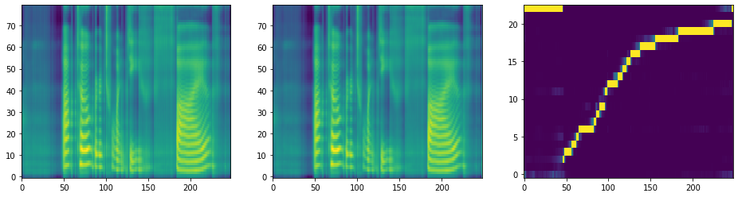</img>


    Speaker: ljs-w
    Emotion: neutral
    Text   : On October twenty-five,
    Attention quality:        0.5633
    Forward attentoin ratio:  0.9965
    Attentoin ratio:          0.5652
    Range attentoin ratio:    1.0000
    Multiple attentoin ratio: 0.0000
    Saved inference_ipynb/DiscreteAttentionWeights/DiscreteAttentionWeights/tacotron2_statedict.pt/[008]ljs-w_neutral_On_October_twenty-five_[Discrete(True,False)].wav
    Saved inference_ipynb/DiscreteAttentionWeights/DiscreteAttentionWeights/tacotron2_statedict.pt/[008]ljs-w_neutral_On_October_twenty-five_[Discrete(True,False)].png


<audio controls><source src="DiscreteAttentionWeights/DiscreteAttentionWeights/tacotron2_statedict.pt/[008]ljs-w_neutral_On_October_twenty-five_[Discrete(True,False)].wav" type="audio/wav"></audio>


</img>


    [9 Done!]======================================================================================================================================================
    Speaker: ljs-w
    Emotion: neutral
    Text   : is closely reproduced in the life-history of existing deer. Or, in other words,
    Attention quality:        0.8604
    Forward attentoin ratio:  0.9963
    Attentoin ratio:          0.8861
    Range attentoin ratio:    1.0000
    Multiple attentoin ratio: 0.0253
    Saved inference_ipynb/DiscreteAttentionWeights/DiscreteAttentionWeights/tacotron2_statedict.pt/[009]ljs-w_neutral_is_closely_reproduced_in_the_life-history_of_existing_deer_Or_in_other_words_[Discrete(False,False)].wav
    Saved inference_ipynb/DiscreteAttentionWeights/DiscreteAttentionWeights/tacotron2_statedict.pt/[009]ljs-w_neutral_is_closely_reproduced_in_the_life-history_of_existing_deer_Or_in_other_words_[Discrete(False,False)].png


<audio controls><source src="DiscreteAttentionWeights/DiscreteAttentionWeights/tacotron2_statedict.pt/[009]ljs-w_neutral_is_closely_reproduced_in_the_life-history_of_existing_deer_Or_in_other_words_[Discrete(False,False)].wav" type="audio/wav"></audio>


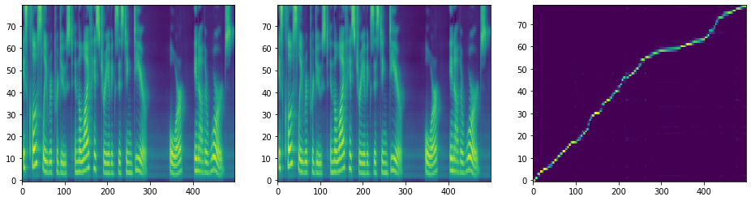</img>


    Warning! Reached max decoder steps
    Speaker: ljs-w
    Emotion: neutral
    Text   : is closely reproduced in the life-history of existing deer. Or, in other words,
    Attention quality:        0.5288
    Forward attentoin ratio:  1.0000
    Attentoin ratio:          0.6962
    Range attentoin ratio:    0.7595
    Multiple attentoin ratio: 0.0000
    Saved inference_ipynb/DiscreteAttentionWeights/DiscreteAttentionWeights/tacotron2_statedict.pt/[009]ljs-w_neutral_is_closely_reproduced_in_the_life-history_of_existing_deer_Or_in_other_words_[Discrete(True,True)].wav
    Saved inference_ipynb/DiscreteAttentionWeights/DiscreteAttentionWeights/tacotron2_statedict.pt/[009]ljs-w_neutral_is_closely_reproduced_in_the_life-history_of_existing_deer_Or_in_other_words_[Discrete(True,True)].png


<audio controls><source src="DiscreteAttentionWeights/DiscreteAttentionWeights/tacotron2_statedict.pt/[009]ljs-w_neutral_is_closely_reproduced_in_the_life-history_of_existing_deer_Or_in_other_words_[Discrete(True,True)].wav" type="audio/wav"></audio>


</img>


    Speaker: ljs-w
    Emotion: neutral
    Text   : is closely reproduced in the life-history of existing deer. Or, in other words,
    Attention quality:        0.8608
    Forward attentoin ratio:  1.0000
    Attentoin ratio:          0.8608
    Range attentoin ratio:    1.0000
    Multiple attentoin ratio: 0.0000
    Saved inference_ipynb/DiscreteAttentionWeights/DiscreteAttentionWeights/tacotron2_statedict.pt/[009]ljs-w_neutral_is_closely_reproduced_in_the_life-history_of_existing_deer_Or_in_other_words_[Discrete(False,True)].wav
    Saved inference_ipynb/DiscreteAttentionWeights/DiscreteAttentionWeights/tacotron2_statedict.pt/[009]ljs-w_neutral_is_closely_reproduced_in_the_life-history_of_existing_deer_Or_in_other_words_[Discrete(False,True)].png


<audio controls><source src="DiscreteAttentionWeights/DiscreteAttentionWeights/tacotron2_statedict.pt/[009]ljs-w_neutral_is_closely_reproduced_in_the_life-history_of_existing_deer_Or_in_other_words_[Discrete(False,True)].wav" type="audio/wav"></audio>


</img>


    Speaker: ljs-w
    Emotion: neutral
    Text   : is closely reproduced in the life-history of existing deer. Or, in other words,
    Attention quality:        0.0764
    Forward attentoin ratio:  0.9771
    Attentoin ratio:          0.1519
    Range attentoin ratio:    0.5570
    Multiple attentoin ratio: 0.0759
    Saved inference_ipynb/DiscreteAttentionWeights/DiscreteAttentionWeights/tacotron2_statedict.pt/[009]ljs-w_neutral_is_closely_reproduced_in_the_life-history_of_existing_deer_Or_in_other_words_[Discrete(True,False)].wav
    Saved inference_ipynb/DiscreteAttentionWeights/DiscreteAttentionWeights/tacotron2_statedict.pt/[009]ljs-w_neutral_is_closely_reproduced_in_the_life-history_of_existing_deer_Or_in_other_words_[Discrete(True,False)].png


<audio controls><source src="DiscreteAttentionWeights/DiscreteAttentionWeights/tacotron2_statedict.pt/[009]ljs-w_neutral_is_closely_reproduced_in_the_life-history_of_existing_deer_Or_in_other_words_[Discrete(True,False)].wav" type="audio/wav"></audio>


</img>


    [10 Done!]======================================================================================================================================================

