# Generate audios by the trained model with discrete attention weights

- Running date: 2020-07-21
- Purpose: Check how audio results vary with discrete attention weights.

## Cases to check
1. Continous attention weights
1. Discrete attention weights
  - At each decoding step, the maximum attention weight is discretized to 1 and the others to 0.
  - The discretized attention weights are cumulated to the cumulative attention, which is an input of the attention network.
1. Discrete attention weights: Only nonmax values
  - At each decoding step, the only nonmax attention weights are discretized to 0.
1. Discrete attention weights: Only maximums
  - At each decoding step, the only maximum attention weight is discretized to 1.

## 1. Load a trained model


```python
import os
cwd_old = os.getcwd()
os.chdir('..')
cwd_new = os.getcwd()
print("The working directory is moved from {} to {}.".format(cwd_old, cwd_new))
```

    The working directory is moved from /data2/sungjaecho/Projects/tacotron2/inference_ipynb to /data2/sungjaecho/Projects/tacotron2.


```python
# Hide warning to make the notebook clear.
import warnings
#warnings.filterwarnings('ignore')
```


```python
import os
os.environ["CUDA_VISIBLE_DEVICES"]="4"
```

#### Import libraries and setup matplotlib


```python
import matplotlib
%matplotlib inline
import matplotlib.pylab as plt

import IPython.display as ipd

import sys
sys.path.append('waveglow/')
import numpy as np
import torch

from hparams import create_hparams
from data_utils import TextMelLoader
from model import Tacotron2
from layers import TacotronSTFT, STFT
from train import load_model
from text import text_to_sequence
from denoiser import Denoiser
from utils import load_pretrained_model
```


```python
def plot_data(data, figsize=(16, 4)):
    fig, axes = plt.subplots(1, len(data), figsize=figsize)
    for i in range(len(data)):
        axes[i].imshow(data[i], aspect='auto', origin='bottom', 
                       interpolation='none')
    # Turn interactive plotting off
    plt.ioff()
```

#### Setup hparams


```python
hparams = create_hparams()
hparams.batch_size=32
hparams.all_dbs=['ljspeech']
hparams.all_speakers=['ljs-w']
hparams.all_emotions=['neutral']
hparams.dbs=['ljspeech']
hparams.speakers=['ljs-w']
hparams.emotions=['neutral']
hparams.has_style_token_lstm_1=False
hparams.has_style_token_lstm_2=False
hparams.neutral_zero_vector=False
```

    WARNING:tensorflow:
    The TensorFlow contrib module will not be included in TensorFlow 2.0.
    For more information, please see:
      * https://github.com/tensorflow/community/blob/master/rfcs/20180907-contrib-sunset.md
      * https://github.com/tensorflow/addons
      * https://github.com/tensorflow/io (for I/O related ops)
    If you depend on functionality not listed there, please file an issue.
    


#### Load model from checkpoint


```python
prj_name = 'DiscreteAttentionWeights'
run_name = 'DiscreteAttentionWeights'
checkpoint_name = 'tacotron2_statedict.pt'
checkpoint_path = "../../pretrained/tacotron2_statedict.pt"

model = load_model(hparams)
model = load_pretrained_model(model, checkpoint_path)[0]
_ = model.cuda().eval().half()
```

    embedding.weight	torch.Size([148, 512])	True
    encoder.convolutions.0.0.conv.weight	torch.Size([512, 512, 5])	True
    encoder.convolutions.0.0.conv.bias	torch.Size([512])	True
    encoder.convolutions.0.1.weight	torch.Size([512])	True
    encoder.convolutions.0.1.bias	torch.Size([512])	True
    encoder.convolutions.1.0.conv.weight	torch.Size([512, 512, 5])	True
    encoder.convolutions.1.0.conv.bias	torch.Size([512])	True
    encoder.convolutions.1.1.weight	torch.Size([512])	True
    encoder.convolutions.1.1.bias	torch.Size([512])	True
    encoder.convolutions.2.0.conv.weight	torch.Size([512, 512, 5])	True
    encoder.convolutions.2.0.conv.bias	torch.Size([512])	True
    encoder.convolutions.2.1.weight	torch.Size([512])	True
    encoder.convolutions.2.1.bias	torch.Size([512])	True
    encoder.lstm.weight_ih_l0	torch.Size([1024, 512])	True
    encoder.lstm.weight_hh_l0	torch.Size([1024, 256])	True
    encoder.lstm.bias_ih_l0	torch.Size([1024])	True
    encoder.lstm.bias_hh_l0	torch.Size([1024])	True
    encoder.lstm.weight_ih_l0_reverse	torch.Size([1024, 512])	True
    encoder.lstm.weight_hh_l0_reverse	torch.Size([1024, 256])	True
    encoder.lstm.bias_ih_l0_reverse	torch.Size([1024])	True
    encoder.lstm.bias_hh_l0_reverse	torch.Size([1024])	True
    decoder.prenet.layers.0.linear_layer.weight	torch.Size([256, 80])	True
    decoder.prenet.layers.1.linear_layer.weight	torch.Size([256, 256])	True
    decoder.attention_rnn.weight_ih	torch.Size([4096, 768])	True
    decoder.attention_rnn.weight_hh	torch.Size([4096, 1024])	True
    decoder.attention_rnn.bias_ih	torch.Size([4096])	True
    decoder.attention_rnn.bias_hh	torch.Size([4096])	True
    decoder.attention_layer.query_layer.linear_layer.weight	torch.Size([128, 1024])	True
    decoder.attention_layer.memory_layer.linear_layer.weight	torch.Size([128, 512])	True
    decoder.attention_layer.v.linear_layer.weight	torch.Size([1, 128])	True
    decoder.attention_layer.location_layer.location_conv.conv.weight	torch.Size([32, 2, 31])	True
    decoder.attention_layer.location_layer.location_dense.linear_layer.weight	torch.Size([128, 32])	True
    decoder.decoder_rnn.weight_ih	torch.Size([4096, 1536])	True
    decoder.decoder_rnn.weight_hh	torch.Size([4096, 1024])	True
    decoder.decoder_rnn.bias_ih	torch.Size([4096])	True
    decoder.decoder_rnn.bias_hh	torch.Size([4096])	True
    decoder.linear_projection.linear_layer.weight	torch.Size([80, 1536])	True
    decoder.linear_projection.linear_layer.bias	torch.Size([80])	True
    decoder.gate_layer.linear_layer.weight	torch.Size([1, 1536])	True
    decoder.gate_layer.linear_layer.bias	torch.Size([1])	True
    postnet.convolutions.0.0.conv.weight	torch.Size([512, 80, 5])	True
    postnet.convolutions.0.0.conv.bias	torch.Size([512])	True
    postnet.convolutions.0.1.weight	torch.Size([512])	True
    postnet.convolutions.0.1.bias	torch.Size([512])	True
    postnet.convolutions.1.0.conv.weight	torch.Size([512, 512, 5])	True
    postnet.convolutions.1.0.conv.bias	torch.Size([512])	True
    postnet.convolutions.1.1.weight	torch.Size([512])	True
    postnet.convolutions.1.1.bias	torch.Size([512])	True
    postnet.convolutions.2.0.conv.weight	torch.Size([512, 512, 5])	True
    postnet.convolutions.2.0.conv.bias	torch.Size([512])	True
    postnet.convolutions.2.1.weight	torch.Size([512])	True
    postnet.convolutions.2.1.bias	torch.Size([512])	True
    postnet.convolutions.3.0.conv.weight	torch.Size([512, 512, 5])	True
    postnet.convolutions.3.0.conv.bias	torch.Size([512])	True
    postnet.convolutions.3.1.weight	torch.Size([512])	True
    postnet.convolutions.3.1.bias	torch.Size([512])	True
    postnet.convolutions.4.0.conv.weight	torch.Size([80, 512, 5])	True
    postnet.convolutions.4.0.conv.bias	torch.Size([80])	True
    postnet.convolutions.4.1.weight	torch.Size([80])	True
    postnet.convolutions.4.1.bias	torch.Size([80])	True
    speaker_embedding_layer.linear_projection.weight	torch.Size([1, 3])	True
    emotion_embedding_layer.linear_projection.weight	torch.Size([3, 1])	True
    loaded checkpoint ../../pretrained/tacotron2_statedict.pt


#### Load WaveGlow for mel2audio synthesis and denoiser


```python
waveglow_path = '/data2/sungjaecho/pretrained/waveglow_256channels_ljs_v2.pt'
waveglow = torch.load(waveglow_path)['model']
waveglow.cuda().eval().half()
for k in waveglow.convinv:
    k.float()
denoiser = Denoiser(waveglow)
```

## 2. Generate audios of the 4 cases on a single sentence

### 2.1. Functionalize the generating process


```python
import matplotlib.pylab as plt
import soundfile as sf
import os
from measures import forward_attention_ratio, attention_ratio, attention_range_ratio, multiple_attention_ratio

import matplotlib
matplotlib.use('Agg')
# Turn interactive plotting off
plt.ioff()

def synthesize_speech(text, str_speaker, str_emotion, discrete_attention_weight, png_path):
    # Prepare a text input.
    val_set = TextMelLoader(hparams, 'val')
    sequence = np.array(text_to_sequence(text, ['english_cleaners']))[None, :]
    sequence = torch.autograd.Variable(
        torch.from_numpy(sequence)).cuda().long()

    speaker_index = val_set.get_speaker(str_speaker).long().cuda()
    emotion_vector = val_set.get_emotion_input(str_emotion).half().cuda().view(1,-1)
    
    mel_outputs, mel_outputs_postnet, gate_outputs, alignments = model.inference(sequence, speaker_index, emotion_vector, discrete_attention_weight)
    
    alignments = alignments.squeeze(dim=2)
    
    input_lengths = torch.Tensor([sequence.size(1)]).long().cuda()
    far, _ = forward_attention_ratio(alignments, input_lengths, gate_outputs=gate_outputs, mode_mel_length="stop_token")
    ar_tuple = attention_ratio(alignments, input_lengths, sequence, gate_outputs=gate_outputs, mode_mel_length="stop_token")
    ar = ar_tuple[0][0]
    arr, _ = attention_range_ratio(alignments, input_lengths, gate_outputs=gate_outputs, mode_mel_length="stop_token")
    mar, _ = multiple_attention_ratio(alignments, input_lengths, gate_outputs=gate_outputs, mode_mel_length="stop_token")
    att_quality = far * ar * arr * (1 - mar)
    
    print("Speaker: {}".format(str_speaker))
    print("Emotion: {}".format(str_emotion))
    print("Text   : {}".format(text))
    print("Attention quality:        {:.4f}".format(att_quality))
    print("Forward attentoin ratio:  {:.4f}".format(far))
    print("Attentoin ratio:          {:.4f}".format(ar))
    print("Range attentoin ratio:    {:.4f}".format(arr))
    print("Multiple attentoin ratio: {:.4f}".format(mar))
    
    plot_data((mel_outputs.float().data.cpu().numpy()[0],
               mel_outputs_postnet.float().data.cpu().numpy()[0],
               alignments.float().data.cpu().numpy()[0].T))
    plt.show()
    #plt.ioff()

    
    with torch.no_grad():
        audio = waveglow.infer(mel_outputs_postnet, sigma=1)
        #audio = waveglow.infer(mel_outputs_postnet, sigma=0.666)
        
    np_audio = audio[0].data.cpu().numpy()
    sample_rate = hparams.sampling_rate
    return np_audio, sample_rate, sequence


def make_wav_dir(prj_name, run_name, checkpoint_name):
    top_dir = 'inference_ipynb'
    
    wav_dir = os.path.join(top_dir, prj_name)
    if not os.path.exists(wav_dir):
        os.mkdir(wav_dir)
    
    wav_dir = os.path.join(top_dir, prj_name, run_name)
    if not os.path.exists(wav_dir):
        os.mkdir(wav_dir)
    
    wav_dir = os.path.join(top_dir, prj_name, run_name, checkpoint_name)
    if not os.path.exists(wav_dir):
        os.mkdir(wav_dir)
        
    return wav_dir

def drop_top_dir(path):
    return os.path.join(*(path.split(os.path.sep)[1:]))


def slugify(text):
    """
    From: https://stackoverflow.com/questions/295135/turn-a-string-into-a-valid-filename
    Normalizes string, converts to lowercase, removes non-alpha characters,
    and converts spaces to hyphens.
    
    I have added replacing the blank with the underscore.
    """
    import string
    valid_chars = "-_() %s%s" % (string.ascii_letters, string.digits)

    text = ''.join(c for c in text if c in valid_chars)
    text = text.replace(' ', '_')
    
    return text
```

### 2.2. Generation


```python
wav_dir = make_wav_dir(prj_name, run_name, checkpoint_name)
```


```python
text = "This is audio generated by Tacotron 2."
speaker = 'ljs-w'
emotion = 'neutral'
discrete_attention_weight=[False,False]
daw = discrete_attention_weight

wav_name = "{}_{}_{}_[Discrete({},{})].wav".format(speaker, emotion, slugify(text).replace(' ', '_'), daw[0], daw[1])
png_name = "{}_{}_{}_[Discrete({},{})].png".format(speaker, emotion, slugify(text), daw[0], daw[1])
wav_path = os.path.join(wav_dir, wav_name)
png_path = os.path.join(wav_dir, png_name)
np_audio, sample_rate, sequence = synthesize_speech(text, speaker, emotion, discrete_attention_weight, png_path)
sf.write(wav_path, np_audio.reshape(-1,1).astype('float32'), hparams.sampling_rate)
plt.savefig(png_path, bbox_inches='tight')
print("Saved {}".format(wav_path))
print("Saved {}".format(png_path))
#ipd.display(ipd.Audio(wav_path, rate=hparams.sampling_rate))
ipd.display(ipd.HTML('<audio controls><source src="{}" type="audio/wav"></audio>'.format(drop_top_dir(wav_path))))
ipd.display(ipd.HTML('</img>'.format(drop_top_dir(png_path))))
```

    Speaker: ljs-w
    Emotion: neutral
    Text   : This is audio generated by Tacotron 2.
    Attention quality:        0.8278
    Forward attentoin ratio:  0.9958
    Attentoin ratio:          0.8750
    Range attentoin ratio:    1.0000
    Multiple attentoin ratio: 0.0500
    Saved inference_ipynb/DiscreteAttentionWeights/DiscreteAttentionWeights/tacotron2_statedict.pt/ljs-w_neutral_This_is_audio_generated_by_Tacotron_2_[Discrete(False,False)].wav
    Saved inference_ipynb/DiscreteAttentionWeights/DiscreteAttentionWeights/tacotron2_statedict.pt/ljs-w_neutral_This_is_audio_generated_by_Tacotron_2_[Discrete(False,False)].png


<audio controls><source src="DiscreteAttentionWeights/DiscreteAttentionWeights/tacotron2_statedict.pt/ljs-w_neutral_This_is_audio_generated_by_Tacotron_2_[Discrete(False,False)].wav" type="audio/wav"></audio>


</img>


```python
text = "This is audio generated by Tacotron 2."
speaker = 'ljs-w'
emotion = 'neutral'
discrete_attention_weight=[True,True]
daw = discrete_attention_weight

wav_name = "{}_{}_{}_[Discrete({},{})].wav".format(speaker, emotion, slugify(text), daw[0], daw[1])
png_name = "{}_{}_{}_[Discrete({},{})].png".format(speaker, emotion, slugify(text), daw[0], daw[1])
wav_path = os.path.join(wav_dir, wav_name)
png_path = os.path.join(wav_dir, png_name)
np_audio, sample_rate, sequence = synthesize_speech(text, speaker, emotion, discrete_attention_weight, png_path)
sf.write(wav_path, np_audio.reshape(-1,1).astype('float32'), hparams.sampling_rate)
plt.savefig(png_path, bbox_inches='tight')
print("Saved {}".format(wav_path))
print("Saved {}".format(png_path))
#ipd.display(ipd.Audio(wav_path, rate=hparams.sampling_rate))
ipd.display(ipd.HTML('<audio controls><source src="{}" type="audio/wav"></audio>'.format(drop_top_dir(wav_path))))
ipd.display(ipd.HTML('</img>'.format(drop_top_dir(png_path))))
```

    Speaker: ljs-w
    Emotion: neutral
    Text   : This is audio generated by Tacotron 2.
    Attention quality:        0.9500
    Forward attentoin ratio:  1.0000
    Attentoin ratio:          0.9500
    Range attentoin ratio:    1.0000
    Multiple attentoin ratio: 0.0000
    Saved inference_ipynb/DiscreteAttentionWeights/DiscreteAttentionWeights/tacotron2_statedict.pt/ljs-w_neutral_This_is_audio_generated_by_Tacotron_2_[Discrete(True,True)].wav
    Saved inference_ipynb/DiscreteAttentionWeights/DiscreteAttentionWeights/tacotron2_statedict.pt/ljs-w_neutral_This_is_audio_generated_by_Tacotron_2_[Discrete(True,True)].png


<audio controls><source src="DiscreteAttentionWeights/DiscreteAttentionWeights/tacotron2_statedict.pt/ljs-w_neutral_This_is_audio_generated_by_Tacotron_2_[Discrete(True,True)].wav" type="audio/wav"></audio>


</img>


```python
text = "This is audio generated by Tacotron 2."
speaker = 'ljs-w'
emotion = 'neutral'
discrete_attention_weight=[False,True]
daw = discrete_attention_weight

wav_name = "{}_{}_{}_[Discrete({},{})].wav".format(speaker, emotion, slugify(text), daw[0], daw[1])
png_name = "{}_{}_{}_[Discrete({},{})].png".format(speaker, emotion, slugify(text), daw[0], daw[1])
wav_path = os.path.join(wav_dir, wav_name)
png_path = os.path.join(wav_dir, png_name)
np_audio, sample_rate, sequence = synthesize_speech(text, speaker, emotion, discrete_attention_weight, png_path)
sf.write(wav_path, np_audio.reshape(-1,1).astype('float32'), hparams.sampling_rate)
plt.savefig(png_path, bbox_inches='tight')
print("Saved {}".format(wav_path))
print("Saved {}".format(png_path))
#ipd.display(ipd.Audio(wav_path, rate=hparams.sampling_rate))
ipd.display(ipd.HTML('<audio controls><source src="{}" type="audio/wav"></audio>'.format(drop_top_dir(wav_path))))
ipd.display(ipd.HTML('</img>'.format(drop_top_dir(png_path))))
```

    Speaker: ljs-w
    Emotion: neutral
    Text   : This is audio generated by Tacotron 2.
    Attention quality:        0.8495
    Forward attentoin ratio:  0.9957
    Attentoin ratio:          0.8750
    Range attentoin ratio:    1.0000
    Multiple attentoin ratio: 0.0250
    Saved inference_ipynb/DiscreteAttentionWeights/DiscreteAttentionWeights/tacotron2_statedict.pt/ljs-w_neutral_This_is_audio_generated_by_Tacotron_2_[Discrete(False,True)].wav
    Saved inference_ipynb/DiscreteAttentionWeights/DiscreteAttentionWeights/tacotron2_statedict.pt/ljs-w_neutral_This_is_audio_generated_by_Tacotron_2_[Discrete(False,True)].png


<audio controls><source src="DiscreteAttentionWeights/DiscreteAttentionWeights/tacotron2_statedict.pt/ljs-w_neutral_This_is_audio_generated_by_Tacotron_2_[Discrete(False,True)].wav" type="audio/wav"></audio>


</img>


```python
text = "This is audio generated by Tacotron 2."
speaker = 'ljs-w'
emotion = 'neutral'
discrete_attention_weight=[True,False]
daw = discrete_attention_weight

wav_name = "{}_{}_{}_[Discrete({},{})].wav".format(speaker, emotion, slugify(text), daw[0], daw[1])
png_name = "{}_{}_{}_[Discrete({},{})].png".format(speaker, emotion, slugify(text), daw[0], daw[1])
wav_path = os.path.join(wav_dir, wav_name)
png_path = os.path.join(wav_dir, png_name)
np_audio, sample_rate, sequence = synthesize_speech(text, speaker, emotion, discrete_attention_weight, png_path)
sf.write(wav_path, np_audio.reshape(-1,1).astype('float32'), hparams.sampling_rate)
plt.savefig(png_path, bbox_inches='tight')
print("Saved {}".format(wav_path))
print("Saved {}".format(png_path))
#ipd.display(ipd.Audio(wav_path, rate=hparams.sampling_rate))
ipd.display(ipd.HTML('<audio controls><source src="{}" type="audio/wav"></audio>'.format(drop_top_dir(wav_path))))
ipd.display(ipd.HTML('</img>'.format(drop_top_dir(png_path))))
```

    Speaker: ljs-w
    Emotion: neutral
    Text   : This is audio generated by Tacotron 2.
    Attention quality:        0.6131
    Forward attentoin ratio:  0.9949
    Attentoin ratio:          0.7250
    Range attentoin ratio:    1.0000
    Multiple attentoin ratio: 0.1500
    Saved inference_ipynb/DiscreteAttentionWeights/DiscreteAttentionWeights/tacotron2_statedict.pt/ljs-w_neutral_This_is_audio_generated_by_Tacotron_2_[Discrete(True,False)].wav
    Saved inference_ipynb/DiscreteAttentionWeights/DiscreteAttentionWeights/tacotron2_statedict.pt/ljs-w_neutral_This_is_audio_generated_by_Tacotron_2_[Discrete(True,False)].png


<audio controls><source src="DiscreteAttentionWeights/DiscreteAttentionWeights/tacotron2_statedict.pt/ljs-w_neutral_This_is_audio_generated_by_Tacotron_2_[Discrete(True,False)].wav" type="audio/wav"></audio>


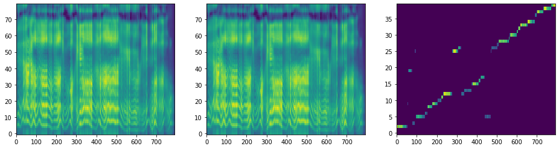</img>


## 3. Generate audios of the 4 cases on 10 validation sentences


```python
from utils import load_wavpath_text_speaker_sex_emotion_lang
```


```python
valsets = dict()
```


```python
speaker = 'ljs-w'
emotion = 'neutral'
valsets[(speaker, emotion)] = load_wavpath_text_speaker_sex_emotion_lang(hparams, 'val', speaker, emotion, 0)[0]
print("len(valsets[({speaker}, {emotion})]) = {length}".format(
    speaker=speaker,
    emotion=emotion,
    length=len(valsets[(speaker, emotion)])
))
```

    len(valsets[(ljs-w, neutral)]) = 100


```python
cnt = 0
samples_per_group = 30
v = valsets[(speaker, emotion)]
for sample in v:
    text = sample[1]
    for daw in [[False,False], [True,True], [False,True], [True,False]]:
        discrete_attention_weight = daw
        wav_name = "[{:03d}]{}_{}_{}_[Discrete({},{})].wav".format(cnt, speaker, emotion, slugify(text), daw[0], daw[1])
        png_name = "[{:03d}]{}_{}_{}_[Discrete({},{})].png".format(cnt, speaker, emotion, slugify(text), daw[0], daw[1])
        wav_path = os.path.join(wav_dir, wav_name)
        png_path = os.path.join(wav_dir, png_name)
        np_audio, sample_rate, sequence = synthesize_speech(text, speaker, emotion, discrete_attention_weight, png_path)
        sf.write(wav_path, np_audio.reshape(-1,1).astype('float32'), hparams.sampling_rate)
        plt.savefig(png_path, bbox_inches='tight')
        print("Saved {}".format(wav_path))
        print("Saved {}".format(png_path))
        #ipd.display(ipd.Audio(wav_path, rate=hparams.sampling_rate))
        ipd.display(ipd.HTML('<audio controls><source src="{}" type="audio/wav"></audio>'.format(drop_top_dir(wav_path))))
        ipd.display(ipd.HTML('</img>'.format(drop_top_dir(png_path))))
    cnt += 1
    print("[{} Done!]======================================================================================================================================================".format(cnt))
    if cnt == samples_per_group:
        break
```

    Speaker: ljs-w
    Emotion: neutral
    Text   : he was reported to have fallen away to a shadow.
    Attention quality:        0.8542
    Forward attentoin ratio:  1.0000
    Attentoin ratio:          0.8542
    Range attentoin ratio:    1.0000
    Multiple attentoin ratio: 0.0000
    Saved inference_ipynb/DiscreteAttentionWeights/DiscreteAttentionWeights/tacotron2_statedict.pt/[000]ljs-w_neutral_he_was_reported_to_have_fallen_away_to_a_shadow_[Discrete(False,False)].wav
    Saved inference_ipynb/DiscreteAttentionWeights/DiscreteAttentionWeights/tacotron2_statedict.pt/[000]ljs-w_neutral_he_was_reported_to_have_fallen_away_to_a_shadow_[Discrete(False,False)].png


<audio controls><source src="DiscreteAttentionWeights/DiscreteAttentionWeights/tacotron2_statedict.pt/[000]ljs-w_neutral_he_was_reported_to_have_fallen_away_to_a_shadow_[Discrete(False,False)].wav" type="audio/wav"></audio>


</img>


    Speaker: ljs-w
    Emotion: neutral
    Text   : he was reported to have fallen away to a shadow.
    Attention quality:        0.9375
    Forward attentoin ratio:  1.0000
    Attentoin ratio:          0.9375
    Range attentoin ratio:    1.0000
    Multiple attentoin ratio: 0.0000
    Saved inference_ipynb/DiscreteAttentionWeights/DiscreteAttentionWeights/tacotron2_statedict.pt/[000]ljs-w_neutral_he_was_reported_to_have_fallen_away_to_a_shadow_[Discrete(True,True)].wav
    Saved inference_ipynb/DiscreteAttentionWeights/DiscreteAttentionWeights/tacotron2_statedict.pt/[000]ljs-w_neutral_he_was_reported_to_have_fallen_away_to_a_shadow_[Discrete(True,True)].png


<audio controls><source src="DiscreteAttentionWeights/DiscreteAttentionWeights/tacotron2_statedict.pt/[000]ljs-w_neutral_he_was_reported_to_have_fallen_away_to_a_shadow_[Discrete(True,True)].wav" type="audio/wav"></audio>


</img>


    Speaker: ljs-w
    Emotion: neutral
    Text   : he was reported to have fallen away to a shadow.
    Attention quality:        0.8333
    Forward attentoin ratio:  1.0000
    Attentoin ratio:          0.8333
    Range attentoin ratio:    1.0000
    Multiple attentoin ratio: 0.0000
    Saved inference_ipynb/DiscreteAttentionWeights/DiscreteAttentionWeights/tacotron2_statedict.pt/[000]ljs-w_neutral_he_was_reported_to_have_fallen_away_to_a_shadow_[Discrete(False,True)].wav
    Saved inference_ipynb/DiscreteAttentionWeights/DiscreteAttentionWeights/tacotron2_statedict.pt/[000]ljs-w_neutral_he_was_reported_to_have_fallen_away_to_a_shadow_[Discrete(False,True)].png


<audio controls><source src="DiscreteAttentionWeights/DiscreteAttentionWeights/tacotron2_statedict.pt/[000]ljs-w_neutral_he_was_reported_to_have_fallen_away_to_a_shadow_[Discrete(False,True)].wav" type="audio/wav"></audio>


</img>


    Speaker: ljs-w
    Emotion: neutral
    Text   : he was reported to have fallen away to a shadow.
    Attention quality:        0.0864
    Forward attentoin ratio:  0.9866
    Attentoin ratio:          0.2083
    Range attentoin ratio:    0.4583
    Multiple attentoin ratio: 0.0833
    Saved inference_ipynb/DiscreteAttentionWeights/DiscreteAttentionWeights/tacotron2_statedict.pt/[000]ljs-w_neutral_he_was_reported_to_have_fallen_away_to_a_shadow_[Discrete(True,False)].wav
    Saved inference_ipynb/DiscreteAttentionWeights/DiscreteAttentionWeights/tacotron2_statedict.pt/[000]ljs-w_neutral_he_was_reported_to_have_fallen_away_to_a_shadow_[Discrete(True,False)].png


<audio controls><source src="DiscreteAttentionWeights/DiscreteAttentionWeights/tacotron2_statedict.pt/[000]ljs-w_neutral_he_was_reported_to_have_fallen_away_to_a_shadow_[Discrete(True,False)].wav" type="audio/wav"></audio>


</img>


    [1 Done!]======================================================================================================================================================
    Speaker: ljs-w
    Emotion: neutral
    Text   : Speaking on a debate on prison matters, he declared that
    Attention quality:        0.7896
    Forward attentoin ratio:  0.9940
    Attentoin ratio:          0.8393
    Range attentoin ratio:    1.0000
    Multiple attentoin ratio: 0.0536
    Saved inference_ipynb/DiscreteAttentionWeights/DiscreteAttentionWeights/tacotron2_statedict.pt/[001]ljs-w_neutral_Speaking_on_a_debate_on_prison_matters_he_declared_that_[Discrete(False,False)].wav
    Saved inference_ipynb/DiscreteAttentionWeights/DiscreteAttentionWeights/tacotron2_statedict.pt/[001]ljs-w_neutral_Speaking_on_a_debate_on_prison_matters_he_declared_that_[Discrete(False,False)].png


<audio controls><source src="DiscreteAttentionWeights/DiscreteAttentionWeights/tacotron2_statedict.pt/[001]ljs-w_neutral_Speaking_on_a_debate_on_prison_matters_he_declared_that_[Discrete(False,False)].wav" type="audio/wav"></audio>


</img>


    Warning! Reached max decoder steps
    Speaker: ljs-w
    Emotion: neutral
    Text   : Speaking on a debate on prison matters, he declared that
    Attention quality:        0.9286
    Forward attentoin ratio:  1.0000
    Attentoin ratio:          0.9286
    Range attentoin ratio:    1.0000
    Multiple attentoin ratio: 0.0000
    Saved inference_ipynb/DiscreteAttentionWeights/DiscreteAttentionWeights/tacotron2_statedict.pt/[001]ljs-w_neutral_Speaking_on_a_debate_on_prison_matters_he_declared_that_[Discrete(True,True)].wav
    Saved inference_ipynb/DiscreteAttentionWeights/DiscreteAttentionWeights/tacotron2_statedict.pt/[001]ljs-w_neutral_Speaking_on_a_debate_on_prison_matters_he_declared_that_[Discrete(True,True)].png


<audio controls><source src="DiscreteAttentionWeights/DiscreteAttentionWeights/tacotron2_statedict.pt/[001]ljs-w_neutral_Speaking_on_a_debate_on_prison_matters_he_declared_that_[Discrete(True,True)].wav" type="audio/wav"></audio>


</img>


    Warning! Reached max decoder steps
    Speaker: ljs-w
    Emotion: neutral
    Text   : Speaking on a debate on prison matters, he declared that
    Attention quality:        0.3972
    Forward attentoin ratio:  0.9980
    Attentoin ratio:          0.9286
    Range attentoin ratio:    1.0000
    Multiple attentoin ratio: 0.5714
    Saved inference_ipynb/DiscreteAttentionWeights/DiscreteAttentionWeights/tacotron2_statedict.pt/[001]ljs-w_neutral_Speaking_on_a_debate_on_prison_matters_he_declared_that_[Discrete(False,True)].wav
    Saved inference_ipynb/DiscreteAttentionWeights/DiscreteAttentionWeights/tacotron2_statedict.pt/[001]ljs-w_neutral_Speaking_on_a_debate_on_prison_matters_he_declared_that_[Discrete(False,True)].png


<audio controls><source src="DiscreteAttentionWeights/DiscreteAttentionWeights/tacotron2_statedict.pt/[001]ljs-w_neutral_Speaking_on_a_debate_on_prison_matters_he_declared_that_[Discrete(False,True)].wav" type="audio/wav"></audio>


</img>


    Warning! Reached max decoder steps
    Speaker: ljs-w
    Emotion: neutral
    Text   : Speaking on a debate on prison matters, he declared that
    Attention quality:        0.3782
    Forward attentoin ratio:  0.9810
    Attentoin ratio:          0.5536
    Range attentoin ratio:    1.0000
    Multiple attentoin ratio: 0.3036
    Saved inference_ipynb/DiscreteAttentionWeights/DiscreteAttentionWeights/tacotron2_statedict.pt/[001]ljs-w_neutral_Speaking_on_a_debate_on_prison_matters_he_declared_that_[Discrete(True,False)].wav
    Saved inference_ipynb/DiscreteAttentionWeights/DiscreteAttentionWeights/tacotron2_statedict.pt/[001]ljs-w_neutral_Speaking_on_a_debate_on_prison_matters_he_declared_that_[Discrete(True,False)].png


<audio controls><source src="DiscreteAttentionWeights/DiscreteAttentionWeights/tacotron2_statedict.pt/[001]ljs-w_neutral_Speaking_on_a_debate_on_prison_matters_he_declared_that_[Discrete(True,False)].wav" type="audio/wav"></audio>


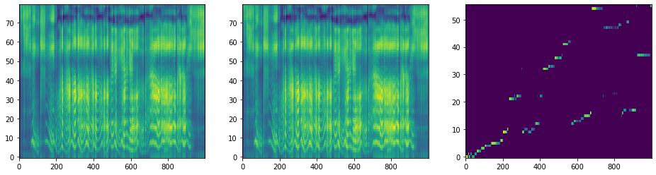</img>


    [2 Done!]======================================================================================================================================================
    Speaker: ljs-w
    Emotion: neutral
    Text   : These pungent and well-grounded strictures applied with still greater force to the unconvicted prisoner, the man who came to the prison innocent, and still uncontaminated,
    Attention quality:        0.8655
    Forward attentoin ratio:  1.0000
    Attentoin ratio:          0.8655
    Range attentoin ratio:    1.0000
    Multiple attentoin ratio: 0.0000
    Saved inference_ipynb/DiscreteAttentionWeights/DiscreteAttentionWeights/tacotron2_statedict.pt/[002]ljs-w_neutral_These_pungent_and_well-grounded_strictures_applied_with_still_greater_force_to_the_unconvicted_prisoner_the_man_who_came_to_the_prison_innocent_and_still_uncontaminated_[Discrete(False,False)].wav
    Saved inference_ipynb/DiscreteAttentionWeights/DiscreteAttentionWeights/tacotron2_statedict.pt/[002]ljs-w_neutral_These_pungent_and_well-grounded_strictures_applied_with_still_greater_force_to_the_unconvicted_prisoner_the_man_who_came_to_the_prison_innocent_and_still_uncontaminated_[Discrete(False,False)].png


<audio controls><source src="DiscreteAttentionWeights/DiscreteAttentionWeights/tacotron2_statedict.pt/[002]ljs-w_neutral_These_pungent_and_well-grounded_strictures_applied_with_still_greater_force_to_the_unconvicted_prisoner_the_man_who_came_to_the_prison_innocent_and_still_uncontaminated_[Discrete(False,False)].wav" type="audio/wav"></audio>


</img>


    Warning! Reached max decoder steps
    Speaker: ljs-w
    Emotion: neutral
    Text   : These pungent and well-grounded strictures applied with still greater force to the unconvicted prisoner, the man who came to the prison innocent, and still uncontaminated,
    Attention quality:        0.1600
    Forward attentoin ratio:  1.0000
    Attentoin ratio:          0.3801
    Range attentoin ratio:    0.4211
    Multiple attentoin ratio: 0.0000
    Saved inference_ipynb/DiscreteAttentionWeights/DiscreteAttentionWeights/tacotron2_statedict.pt/[002]ljs-w_neutral_These_pungent_and_well-grounded_strictures_applied_with_still_greater_force_to_the_unconvicted_prisoner_the_man_who_came_to_the_prison_innocent_and_still_uncontaminated_[Discrete(True,True)].wav
    Saved inference_ipynb/DiscreteAttentionWeights/DiscreteAttentionWeights/tacotron2_statedict.pt/[002]ljs-w_neutral_These_pungent_and_well-grounded_strictures_applied_with_still_greater_force_to_the_unconvicted_prisoner_the_man_who_came_to_the_prison_innocent_and_still_uncontaminated_[Discrete(True,True)].png


<audio controls><source src="DiscreteAttentionWeights/DiscreteAttentionWeights/tacotron2_statedict.pt/[002]ljs-w_neutral_These_pungent_and_well-grounded_strictures_applied_with_still_greater_force_to_the_unconvicted_prisoner_the_man_who_came_to_the_prison_innocent_and_still_uncontaminated_[Discrete(True,True)].wav" type="audio/wav"></audio>


</img>


    Warning! Reached max decoder steps
    Speaker: ljs-w
    Emotion: neutral
    Text   : These pungent and well-grounded strictures applied with still greater force to the unconvicted prisoner, the man who came to the prison innocent, and still uncontaminated,
    Attention quality:        0.7628
    Forward attentoin ratio:  1.0000
    Attentoin ratio:          0.7953
    Range attentoin ratio:    0.9591
    Multiple attentoin ratio: 0.0000
    Saved inference_ipynb/DiscreteAttentionWeights/DiscreteAttentionWeights/tacotron2_statedict.pt/[002]ljs-w_neutral_These_pungent_and_well-grounded_strictures_applied_with_still_greater_force_to_the_unconvicted_prisoner_the_man_who_came_to_the_prison_innocent_and_still_uncontaminated_[Discrete(False,True)].wav
    Saved inference_ipynb/DiscreteAttentionWeights/DiscreteAttentionWeights/tacotron2_statedict.pt/[002]ljs-w_neutral_These_pungent_and_well-grounded_strictures_applied_with_still_greater_force_to_the_unconvicted_prisoner_the_man_who_came_to_the_prison_innocent_and_still_uncontaminated_[Discrete(False,True)].png


<audio controls><source src="DiscreteAttentionWeights/DiscreteAttentionWeights/tacotron2_statedict.pt/[002]ljs-w_neutral_These_pungent_and_well-grounded_strictures_applied_with_still_greater_force_to_the_unconvicted_prisoner_the_man_who_came_to_the_prison_innocent_and_still_uncontaminated_[Discrete(False,True)].wav" type="audio/wav"></audio>


</img>


    Warning! Reached max decoder steps
    Speaker: ljs-w
    Emotion: neutral
    Text   : These pungent and well-grounded strictures applied with still greater force to the unconvicted prisoner, the man who came to the prison innocent, and still uncontaminated,
    Attention quality:        0.0218
    Forward attentoin ratio:  0.9429
    Attentoin ratio:          0.1228
    Range attentoin ratio:    0.2047
    Multiple attentoin ratio: 0.0819
    Saved inference_ipynb/DiscreteAttentionWeights/DiscreteAttentionWeights/tacotron2_statedict.pt/[002]ljs-w_neutral_These_pungent_and_well-grounded_strictures_applied_with_still_greater_force_to_the_unconvicted_prisoner_the_man_who_came_to_the_prison_innocent_and_still_uncontaminated_[Discrete(True,False)].wav
    Saved inference_ipynb/DiscreteAttentionWeights/DiscreteAttentionWeights/tacotron2_statedict.pt/[002]ljs-w_neutral_These_pungent_and_well-grounded_strictures_applied_with_still_greater_force_to_the_unconvicted_prisoner_the_man_who_came_to_the_prison_innocent_and_still_uncontaminated_[Discrete(True,False)].png


<audio controls><source src="DiscreteAttentionWeights/DiscreteAttentionWeights/tacotron2_statedict.pt/[002]ljs-w_neutral_These_pungent_and_well-grounded_strictures_applied_with_still_greater_force_to_the_unconvicted_prisoner_the_man_who_came_to_the_prison_innocent_and_still_uncontaminated_[Discrete(True,False)].wav" type="audio/wav"></audio>


</img>


    [3 Done!]======================================================================================================================================================
    Speaker: ljs-w
    Emotion: neutral
    Text   : although at Mr. Buxton's visit a new jail was in process of erection, the first step towards reform since Howard's visitation in seventeen seventy-four.
    Attention quality:        0.8645
    Forward attentoin ratio:  1.0000
    Attentoin ratio:          0.8645
    Range attentoin ratio:    1.0000
    Multiple attentoin ratio: 0.0000
    Saved inference_ipynb/DiscreteAttentionWeights/DiscreteAttentionWeights/tacotron2_statedict.pt/[003]ljs-w_neutral_although_at_Mr_Buxtons_visit_a_new_jail_was_in_process_of_erection_the_first_step_towards_reform_since_Howards_visitation_in_seventeen_seventy-four_[Discrete(False,False)].wav
    Saved inference_ipynb/DiscreteAttentionWeights/DiscreteAttentionWeights/tacotron2_statedict.pt/[003]ljs-w_neutral_although_at_Mr_Buxtons_visit_a_new_jail_was_in_process_of_erection_the_first_step_towards_reform_since_Howards_visitation_in_seventeen_seventy-four_[Discrete(False,False)].png


<audio controls><source src="DiscreteAttentionWeights/DiscreteAttentionWeights/tacotron2_statedict.pt/[003]ljs-w_neutral_although_at_Mr_Buxtons_visit_a_new_jail_was_in_process_of_erection_the_first_step_towards_reform_since_Howards_visitation_in_seventeen_seventy-four_[Discrete(False,False)].wav" type="audio/wav"></audio>


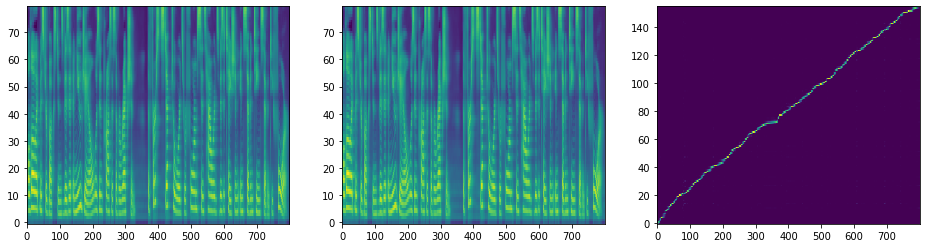</img>


    Warning! Reached max decoder steps
    Speaker: ljs-w
    Emotion: neutral
    Text   : although at Mr. Buxton's visit a new jail was in process of erection, the first step towards reform since Howard's visitation in seventeen seventy-four.
    Attention quality:        0.1169
    Forward attentoin ratio:  1.0000
    Attentoin ratio:          0.3355
    Range attentoin ratio:    0.3484
    Multiple attentoin ratio: 0.0000
    Saved inference_ipynb/DiscreteAttentionWeights/DiscreteAttentionWeights/tacotron2_statedict.pt/[003]ljs-w_neutral_although_at_Mr_Buxtons_visit_a_new_jail_was_in_process_of_erection_the_first_step_towards_reform_since_Howards_visitation_in_seventeen_seventy-four_[Discrete(True,True)].wav
    Saved inference_ipynb/DiscreteAttentionWeights/DiscreteAttentionWeights/tacotron2_statedict.pt/[003]ljs-w_neutral_although_at_Mr_Buxtons_visit_a_new_jail_was_in_process_of_erection_the_first_step_towards_reform_since_Howards_visitation_in_seventeen_seventy-four_[Discrete(True,True)].png


<audio controls><source src="DiscreteAttentionWeights/DiscreteAttentionWeights/tacotron2_statedict.pt/[003]ljs-w_neutral_although_at_Mr_Buxtons_visit_a_new_jail_was_in_process_of_erection_the_first_step_towards_reform_since_Howards_visitation_in_seventeen_seventy-four_[Discrete(True,True)].wav" type="audio/wav"></audio>


</img>


    Speaker: ljs-w
    Emotion: neutral
    Text   : although at Mr. Buxton's visit a new jail was in process of erection, the first step towards reform since Howard's visitation in seventeen seventy-four.
    Attention quality:        0.8323
    Forward attentoin ratio:  1.0000
    Attentoin ratio:          0.8323
    Range attentoin ratio:    1.0000
    Multiple attentoin ratio: 0.0000
    Saved inference_ipynb/DiscreteAttentionWeights/DiscreteAttentionWeights/tacotron2_statedict.pt/[003]ljs-w_neutral_although_at_Mr_Buxtons_visit_a_new_jail_was_in_process_of_erection_the_first_step_towards_reform_since_Howards_visitation_in_seventeen_seventy-four_[Discrete(False,True)].wav
    Saved inference_ipynb/DiscreteAttentionWeights/DiscreteAttentionWeights/tacotron2_statedict.pt/[003]ljs-w_neutral_although_at_Mr_Buxtons_visit_a_new_jail_was_in_process_of_erection_the_first_step_towards_reform_since_Howards_visitation_in_seventeen_seventy-four_[Discrete(False,True)].png


<audio controls><source src="DiscreteAttentionWeights/DiscreteAttentionWeights/tacotron2_statedict.pt/[003]ljs-w_neutral_although_at_Mr_Buxtons_visit_a_new_jail_was_in_process_of_erection_the_first_step_towards_reform_since_Howards_visitation_in_seventeen_seventy-four_[Discrete(False,True)].wav" type="audio/wav"></audio>


</img>


    Warning! Reached max decoder steps
    Speaker: ljs-w
    Emotion: neutral
    Text   : although at Mr. Buxton's visit a new jail was in process of erection, the first step towards reform since Howard's visitation in seventeen seventy-four.
    Attention quality:        0.0625
    Forward attentoin ratio:  0.9860
    Attentoin ratio:          0.1935
    Range attentoin ratio:    0.3548
    Multiple attentoin ratio: 0.0774
    Saved inference_ipynb/DiscreteAttentionWeights/DiscreteAttentionWeights/tacotron2_statedict.pt/[003]ljs-w_neutral_although_at_Mr_Buxtons_visit_a_new_jail_was_in_process_of_erection_the_first_step_towards_reform_since_Howards_visitation_in_seventeen_seventy-four_[Discrete(True,False)].wav
    Saved inference_ipynb/DiscreteAttentionWeights/DiscreteAttentionWeights/tacotron2_statedict.pt/[003]ljs-w_neutral_although_at_Mr_Buxtons_visit_a_new_jail_was_in_process_of_erection_the_first_step_towards_reform_since_Howards_visitation_in_seventeen_seventy-four_[Discrete(True,False)].png


<audio controls><source src="DiscreteAttentionWeights/DiscreteAttentionWeights/tacotron2_statedict.pt/[003]ljs-w_neutral_although_at_Mr_Buxtons_visit_a_new_jail_was_in_process_of_erection_the_first_step_towards_reform_since_Howards_visitation_in_seventeen_seventy-four_[Discrete(True,False)].wav" type="audio/wav"></audio>


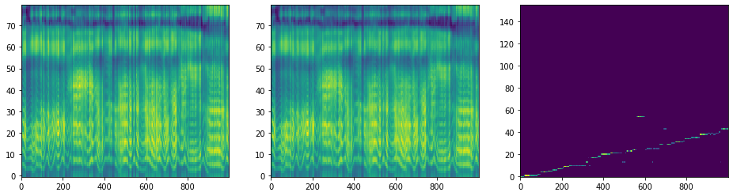</img>


    [4 Done!]======================================================================================================================================================
    Speaker: ljs-w
    Emotion: neutral
    Text   : together with a great increase in the payrolls, there has come a substantial rise in the total of industrial profits
    Attention quality:        0.8448
    Forward attentoin ratio:  1.0000
    Attentoin ratio:          0.8448
    Range attentoin ratio:    1.0000
    Multiple attentoin ratio: 0.0000
    Saved inference_ipynb/DiscreteAttentionWeights/DiscreteAttentionWeights/tacotron2_statedict.pt/[004]ljs-w_neutral_together_with_a_great_increase_in_the_payrolls_there_has_come_a_substantial_rise_in_the_total_of_industrial_profits_[Discrete(False,False)].wav
    Saved inference_ipynb/DiscreteAttentionWeights/DiscreteAttentionWeights/tacotron2_statedict.pt/[004]ljs-w_neutral_together_with_a_great_increase_in_the_payrolls_there_has_come_a_substantial_rise_in_the_total_of_industrial_profits_[Discrete(False,False)].png


<audio controls><source src="DiscreteAttentionWeights/DiscreteAttentionWeights/tacotron2_statedict.pt/[004]ljs-w_neutral_together_with_a_great_increase_in_the_payrolls_there_has_come_a_substantial_rise_in_the_total_of_industrial_profits_[Discrete(False,False)].wav" type="audio/wav"></audio>


</img>


    Warning! Reached max decoder steps
    Speaker: ljs-w
    Emotion: neutral
    Text   : together with a great increase in the payrolls, there has come a substantial rise in the total of industrial profits
    Attention quality:        0.2493
    Forward attentoin ratio:  1.0000
    Attentoin ratio:          0.4741
    Range attentoin ratio:    0.5259
    Multiple attentoin ratio: 0.0000
    Saved inference_ipynb/DiscreteAttentionWeights/DiscreteAttentionWeights/tacotron2_statedict.pt/[004]ljs-w_neutral_together_with_a_great_increase_in_the_payrolls_there_has_come_a_substantial_rise_in_the_total_of_industrial_profits_[Discrete(True,True)].wav
    Saved inference_ipynb/DiscreteAttentionWeights/DiscreteAttentionWeights/tacotron2_statedict.pt/[004]ljs-w_neutral_together_with_a_great_increase_in_the_payrolls_there_has_come_a_substantial_rise_in_the_total_of_industrial_profits_[Discrete(True,True)].png


<audio controls><source src="DiscreteAttentionWeights/DiscreteAttentionWeights/tacotron2_statedict.pt/[004]ljs-w_neutral_together_with_a_great_increase_in_the_payrolls_there_has_come_a_substantial_rise_in_the_total_of_industrial_profits_[Discrete(True,True)].wav" type="audio/wav"></audio>


</img>


    Warning! Reached max decoder steps
    Speaker: ljs-w
    Emotion: neutral
    Text   : together with a great increase in the payrolls, there has come a substantial rise in the total of industrial profits
    Attention quality:        0.7546
    Forward attentoin ratio:  0.9970
    Attentoin ratio:          0.8362
    Range attentoin ratio:    1.0000
    Multiple attentoin ratio: 0.0948
    Saved inference_ipynb/DiscreteAttentionWeights/DiscreteAttentionWeights/tacotron2_statedict.pt/[004]ljs-w_neutral_together_with_a_great_increase_in_the_payrolls_there_has_come_a_substantial_rise_in_the_total_of_industrial_profits_[Discrete(False,True)].wav
    Saved inference_ipynb/DiscreteAttentionWeights/DiscreteAttentionWeights/tacotron2_statedict.pt/[004]ljs-w_neutral_together_with_a_great_increase_in_the_payrolls_there_has_come_a_substantial_rise_in_the_total_of_industrial_profits_[Discrete(False,True)].png


<audio controls><source src="DiscreteAttentionWeights/DiscreteAttentionWeights/tacotron2_statedict.pt/[004]ljs-w_neutral_together_with_a_great_increase_in_the_payrolls_there_has_come_a_substantial_rise_in_the_total_of_industrial_profits_[Discrete(False,True)].wav" type="audio/wav"></audio>


</img>


    Speaker: ljs-w
    Emotion: neutral
    Text   : together with a great increase in the payrolls, there has come a substantial rise in the total of industrial profits
    Attention quality:        0.0385
    Forward attentoin ratio:  0.9628
    Attentoin ratio:          0.1034
    Range attentoin ratio:    0.3966
    Multiple attentoin ratio: 0.0259
    Saved inference_ipynb/DiscreteAttentionWeights/DiscreteAttentionWeights/tacotron2_statedict.pt/[004]ljs-w_neutral_together_with_a_great_increase_in_the_payrolls_there_has_come_a_substantial_rise_in_the_total_of_industrial_profits_[Discrete(True,False)].wav
    Saved inference_ipynb/DiscreteAttentionWeights/DiscreteAttentionWeights/tacotron2_statedict.pt/[004]ljs-w_neutral_together_with_a_great_increase_in_the_payrolls_there_has_come_a_substantial_rise_in_the_total_of_industrial_profits_[Discrete(True,False)].png


<audio controls><source src="DiscreteAttentionWeights/DiscreteAttentionWeights/tacotron2_statedict.pt/[004]ljs-w_neutral_together_with_a_great_increase_in_the_payrolls_there_has_come_a_substantial_rise_in_the_total_of_industrial_profits_[Discrete(True,False)].wav" type="audio/wav"></audio>


</img>


    [5 Done!]======================================================================================================================================================
    Speaker: ljs-w
    Emotion: neutral
    Text   : Let me retrace my steps, and speak more in detail of the treatment of the condemned in those bloodthirsty and brutally indifferent days,
    Attention quality:        0.8309
    Forward attentoin ratio:  0.9986
    Attentoin ratio:          0.8382
    Range attentoin ratio:    1.0000
    Multiple attentoin ratio: 0.0074
    Saved inference_ipynb/DiscreteAttentionWeights/DiscreteAttentionWeights/tacotron2_statedict.pt/[005]ljs-w_neutral_Let_me_retrace_my_steps_and_speak_more_in_detail_of_the_treatment_of_the_condemned_in_those_bloodthirsty_and_brutally_indifferent_days_[Discrete(False,False)].wav
    Saved inference_ipynb/DiscreteAttentionWeights/DiscreteAttentionWeights/tacotron2_statedict.pt/[005]ljs-w_neutral_Let_me_retrace_my_steps_and_speak_more_in_detail_of_the_treatment_of_the_condemned_in_those_bloodthirsty_and_brutally_indifferent_days_[Discrete(False,False)].png


<audio controls><source src="DiscreteAttentionWeights/DiscreteAttentionWeights/tacotron2_statedict.pt/[005]ljs-w_neutral_Let_me_retrace_my_steps_and_speak_more_in_detail_of_the_treatment_of_the_condemned_in_those_bloodthirsty_and_brutally_indifferent_days_[Discrete(False,False)].wav" type="audio/wav"></audio>


</img>


    Warning! Reached max decoder steps
    Speaker: ljs-w
    Emotion: neutral
    Text   : Let me retrace my steps, and speak more in detail of the treatment of the condemned in those bloodthirsty and brutally indifferent days,
    Attention quality:        0.0931
    Forward attentoin ratio:  1.0000
    Attentoin ratio:          0.3015
    Range attentoin ratio:    0.3088
    Multiple attentoin ratio: 0.0000
    Saved inference_ipynb/DiscreteAttentionWeights/DiscreteAttentionWeights/tacotron2_statedict.pt/[005]ljs-w_neutral_Let_me_retrace_my_steps_and_speak_more_in_detail_of_the_treatment_of_the_condemned_in_those_bloodthirsty_and_brutally_indifferent_days_[Discrete(True,True)].wav
    Saved inference_ipynb/DiscreteAttentionWeights/DiscreteAttentionWeights/tacotron2_statedict.pt/[005]ljs-w_neutral_Let_me_retrace_my_steps_and_speak_more_in_detail_of_the_treatment_of_the_condemned_in_those_bloodthirsty_and_brutally_indifferent_days_[Discrete(True,True)].png


<audio controls><source src="DiscreteAttentionWeights/DiscreteAttentionWeights/tacotron2_statedict.pt/[005]ljs-w_neutral_Let_me_retrace_my_steps_and_speak_more_in_detail_of_the_treatment_of_the_condemned_in_those_bloodthirsty_and_brutally_indifferent_days_[Discrete(True,True)].wav" type="audio/wav"></audio>


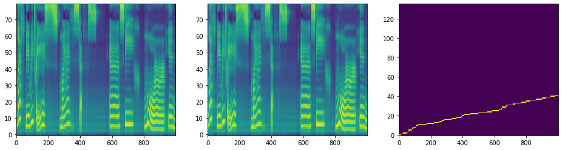</img>


    Speaker: ljs-w
    Emotion: neutral
    Text   : Let me retrace my steps, and speak more in detail of the treatment of the condemned in those bloodthirsty and brutally indifferent days,
    Attention quality:        0.8162
    Forward attentoin ratio:  1.0000
    Attentoin ratio:          0.8162
    Range attentoin ratio:    1.0000
    Multiple attentoin ratio: 0.0000
    Saved inference_ipynb/DiscreteAttentionWeights/DiscreteAttentionWeights/tacotron2_statedict.pt/[005]ljs-w_neutral_Let_me_retrace_my_steps_and_speak_more_in_detail_of_the_treatment_of_the_condemned_in_those_bloodthirsty_and_brutally_indifferent_days_[Discrete(False,True)].wav
    Saved inference_ipynb/DiscreteAttentionWeights/DiscreteAttentionWeights/tacotron2_statedict.pt/[005]ljs-w_neutral_Let_me_retrace_my_steps_and_speak_more_in_detail_of_the_treatment_of_the_condemned_in_those_bloodthirsty_and_brutally_indifferent_days_[Discrete(False,True)].png


<audio controls><source src="DiscreteAttentionWeights/DiscreteAttentionWeights/tacotron2_statedict.pt/[005]ljs-w_neutral_Let_me_retrace_my_steps_and_speak_more_in_detail_of_the_treatment_of_the_condemned_in_those_bloodthirsty_and_brutally_indifferent_days_[Discrete(False,True)].wav" type="audio/wav"></audio>


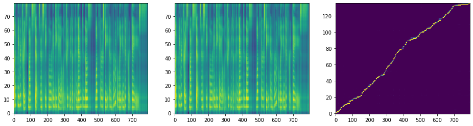</img>


    Speaker: ljs-w
    Emotion: neutral
    Text   : Let me retrace my steps, and speak more in detail of the treatment of the condemned in those bloodthirsty and brutally indifferent days,
    Attention quality:        0.0032
    Forward attentoin ratio:  0.9910
    Attentoin ratio:          0.0368
    Range attentoin ratio:    0.0882
    Multiple attentoin ratio: 0.0147
    Saved inference_ipynb/DiscreteAttentionWeights/DiscreteAttentionWeights/tacotron2_statedict.pt/[005]ljs-w_neutral_Let_me_retrace_my_steps_and_speak_more_in_detail_of_the_treatment_of_the_condemned_in_those_bloodthirsty_and_brutally_indifferent_days_[Discrete(True,False)].wav
    Saved inference_ipynb/DiscreteAttentionWeights/DiscreteAttentionWeights/tacotron2_statedict.pt/[005]ljs-w_neutral_Let_me_retrace_my_steps_and_speak_more_in_detail_of_the_treatment_of_the_condemned_in_those_bloodthirsty_and_brutally_indifferent_days_[Discrete(True,False)].png


<audio controls><source src="DiscreteAttentionWeights/DiscreteAttentionWeights/tacotron2_statedict.pt/[005]ljs-w_neutral_Let_me_retrace_my_steps_and_speak_more_in_detail_of_the_treatment_of_the_condemned_in_those_bloodthirsty_and_brutally_indifferent_days_[Discrete(True,False)].wav" type="audio/wav"></audio>


</img>


    [6 Done!]======================================================================================================================================================
    Speaker: ljs-w
    Emotion: neutral
    Text   : The inadequacy of the jail was noticed and reported upon again and again by the grand juries of the city of London,
    Attention quality:        0.8088
    Forward attentoin ratio:  0.9982
    Attentoin ratio:          0.8174
    Range attentoin ratio:    1.0000
    Multiple attentoin ratio: 0.0087
    Saved inference_ipynb/DiscreteAttentionWeights/DiscreteAttentionWeights/tacotron2_statedict.pt/[006]ljs-w_neutral_The_inadequacy_of_the_jail_was_noticed_and_reported_upon_again_and_again_by_the_grand_juries_of_the_city_of_London_[Discrete(False,False)].wav
    Saved inference_ipynb/DiscreteAttentionWeights/DiscreteAttentionWeights/tacotron2_statedict.pt/[006]ljs-w_neutral_The_inadequacy_of_the_jail_was_noticed_and_reported_upon_again_and_again_by_the_grand_juries_of_the_city_of_London_[Discrete(False,False)].png


<audio controls><source src="DiscreteAttentionWeights/DiscreteAttentionWeights/tacotron2_statedict.pt/[006]ljs-w_neutral_The_inadequacy_of_the_jail_was_noticed_and_reported_upon_again_and_again_by_the_grand_juries_of_the_city_of_London_[Discrete(False,False)].wav" type="audio/wav"></audio>


</img>


    Warning! Reached max decoder steps
    Speaker: ljs-w
    Emotion: neutral
    Text   : The inadequacy of the jail was noticed and reported upon again and again by the grand juries of the city of London,
    Attention quality:        0.2625
    Forward attentoin ratio:  1.0000
    Attentoin ratio:          0.4870
    Range attentoin ratio:    0.5391
    Multiple attentoin ratio: 0.0000
    Saved inference_ipynb/DiscreteAttentionWeights/DiscreteAttentionWeights/tacotron2_statedict.pt/[006]ljs-w_neutral_The_inadequacy_of_the_jail_was_noticed_and_reported_upon_again_and_again_by_the_grand_juries_of_the_city_of_London_[Discrete(True,True)].wav
    Saved inference_ipynb/DiscreteAttentionWeights/DiscreteAttentionWeights/tacotron2_statedict.pt/[006]ljs-w_neutral_The_inadequacy_of_the_jail_was_noticed_and_reported_upon_again_and_again_by_the_grand_juries_of_the_city_of_London_[Discrete(True,True)].png


<audio controls><source src="DiscreteAttentionWeights/DiscreteAttentionWeights/tacotron2_statedict.pt/[006]ljs-w_neutral_The_inadequacy_of_the_jail_was_noticed_and_reported_upon_again_and_again_by_the_grand_juries_of_the_city_of_London_[Discrete(True,True)].wav" type="audio/wav"></audio>


</img>


    Speaker: ljs-w
    Emotion: neutral
    Text   : The inadequacy of the jail was noticed and reported upon again and again by the grand juries of the city of London,
    Attention quality:        0.8000
    Forward attentoin ratio:  1.0000
    Attentoin ratio:          0.8000
    Range attentoin ratio:    1.0000
    Multiple attentoin ratio: 0.0000
    Saved inference_ipynb/DiscreteAttentionWeights/DiscreteAttentionWeights/tacotron2_statedict.pt/[006]ljs-w_neutral_The_inadequacy_of_the_jail_was_noticed_and_reported_upon_again_and_again_by_the_grand_juries_of_the_city_of_London_[Discrete(False,True)].wav
    Saved inference_ipynb/DiscreteAttentionWeights/DiscreteAttentionWeights/tacotron2_statedict.pt/[006]ljs-w_neutral_The_inadequacy_of_the_jail_was_noticed_and_reported_upon_again_and_again_by_the_grand_juries_of_the_city_of_London_[Discrete(False,True)].png


<audio controls><source src="DiscreteAttentionWeights/DiscreteAttentionWeights/tacotron2_statedict.pt/[006]ljs-w_neutral_The_inadequacy_of_the_jail_was_noticed_and_reported_upon_again_and_again_by_the_grand_juries_of_the_city_of_London_[Discrete(False,True)].wav" type="audio/wav"></audio>


</img>


    Warning! Reached max decoder steps
    Speaker: ljs-w
    Emotion: neutral
    Text   : The inadequacy of the jail was noticed and reported upon again and again by the grand juries of the city of London,
    Attention quality:        0.1343
    Forward attentoin ratio:  0.9439
    Attentoin ratio:          0.2087
    Range attentoin ratio:    0.8000
    Multiple attentoin ratio: 0.1478
    Saved inference_ipynb/DiscreteAttentionWeights/DiscreteAttentionWeights/tacotron2_statedict.pt/[006]ljs-w_neutral_The_inadequacy_of_the_jail_was_noticed_and_reported_upon_again_and_again_by_the_grand_juries_of_the_city_of_London_[Discrete(True,False)].wav
    Saved inference_ipynb/DiscreteAttentionWeights/DiscreteAttentionWeights/tacotron2_statedict.pt/[006]ljs-w_neutral_The_inadequacy_of_the_jail_was_noticed_and_reported_upon_again_and_again_by_the_grand_juries_of_the_city_of_London_[Discrete(True,False)].png


<audio controls><source src="DiscreteAttentionWeights/DiscreteAttentionWeights/tacotron2_statedict.pt/[006]ljs-w_neutral_The_inadequacy_of_the_jail_was_noticed_and_reported_upon_again_and_again_by_the_grand_juries_of_the_city_of_London_[Discrete(True,False)].wav" type="audio/wav"></audio>


</img>


    [7 Done!]======================================================================================================================================================
    Speaker: ljs-w
    Emotion: neutral
    Text   : The criteria in effect prior to November twenty-two, nineteen sixty-three, for determining whether to accept material for the PRS general files
    Attention quality:        0.8264
    Forward attentoin ratio:  0.9988
    Attentoin ratio:          0.8392
    Range attentoin ratio:    1.0000
    Multiple attentoin ratio: 0.0140
    Saved inference_ipynb/DiscreteAttentionWeights/DiscreteAttentionWeights/tacotron2_statedict.pt/[007]ljs-w_neutral_The_criteria_in_effect_prior_to_November_twenty-two_nineteen_sixty-three_for_determining_whether_to_accept_material_for_the_PRS_general_files_[Discrete(False,False)].wav
    Saved inference_ipynb/DiscreteAttentionWeights/DiscreteAttentionWeights/tacotron2_statedict.pt/[007]ljs-w_neutral_The_criteria_in_effect_prior_to_November_twenty-two_nineteen_sixty-three_for_determining_whether_to_accept_material_for_the_PRS_general_files_[Discrete(False,False)].png


<audio controls><source src="DiscreteAttentionWeights/DiscreteAttentionWeights/tacotron2_statedict.pt/[007]ljs-w_neutral_The_criteria_in_effect_prior_to_November_twenty-two_nineteen_sixty-three_for_determining_whether_to_accept_material_for_the_PRS_general_files_[Discrete(False,False)].wav" type="audio/wav"></audio>


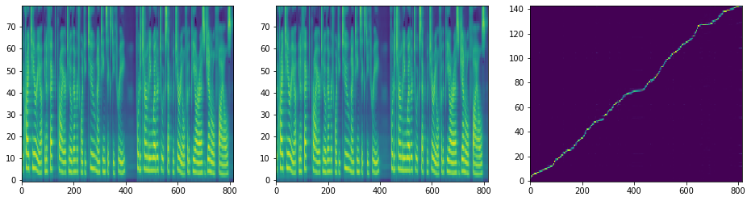</img>


    Warning! Reached max decoder steps
    Speaker: ljs-w
    Emotion: neutral
    Text   : The criteria in effect prior to November twenty-two, nineteen sixty-three, for determining whether to accept material for the PRS general files
    Attention quality:        0.2019
    Forward attentoin ratio:  0.9990
    Attentoin ratio:          0.4406
    Range attentoin ratio:    0.4685
    Multiple attentoin ratio: 0.0210
    Saved inference_ipynb/DiscreteAttentionWeights/DiscreteAttentionWeights/tacotron2_statedict.pt/[007]ljs-w_neutral_The_criteria_in_effect_prior_to_November_twenty-two_nineteen_sixty-three_for_determining_whether_to_accept_material_for_the_PRS_general_files_[Discrete(True,True)].wav
    Saved inference_ipynb/DiscreteAttentionWeights/DiscreteAttentionWeights/tacotron2_statedict.pt/[007]ljs-w_neutral_The_criteria_in_effect_prior_to_November_twenty-two_nineteen_sixty-three_for_determining_whether_to_accept_material_for_the_PRS_general_files_[Discrete(True,True)].png


<audio controls><source src="DiscreteAttentionWeights/DiscreteAttentionWeights/tacotron2_statedict.pt/[007]ljs-w_neutral_The_criteria_in_effect_prior_to_November_twenty-two_nineteen_sixty-three_for_determining_whether_to_accept_material_for_the_PRS_general_files_[Discrete(True,True)].wav" type="audio/wav"></audio>


</img>


    Warning! Reached max decoder steps
    Speaker: ljs-w
    Emotion: neutral
    Text   : The criteria in effect prior to November twenty-two, nineteen sixty-three, for determining whether to accept material for the PRS general files
    Attention quality:        0.7558
    Forward attentoin ratio:  0.9990
    Attentoin ratio:          0.8322
    Range attentoin ratio:    1.0000
    Multiple attentoin ratio: 0.0909
    Saved inference_ipynb/DiscreteAttentionWeights/DiscreteAttentionWeights/tacotron2_statedict.pt/[007]ljs-w_neutral_The_criteria_in_effect_prior_to_November_twenty-two_nineteen_sixty-three_for_determining_whether_to_accept_material_for_the_PRS_general_files_[Discrete(False,True)].wav
    Saved inference_ipynb/DiscreteAttentionWeights/DiscreteAttentionWeights/tacotron2_statedict.pt/[007]ljs-w_neutral_The_criteria_in_effect_prior_to_November_twenty-two_nineteen_sixty-three_for_determining_whether_to_accept_material_for_the_PRS_general_files_[Discrete(False,True)].png


<audio controls><source src="DiscreteAttentionWeights/DiscreteAttentionWeights/tacotron2_statedict.pt/[007]ljs-w_neutral_The_criteria_in_effect_prior_to_November_twenty-two_nineteen_sixty-three_for_determining_whether_to_accept_material_for_the_PRS_general_files_[Discrete(False,True)].wav" type="audio/wav"></audio>


</img>


    Speaker: ljs-w
    Emotion: neutral
    Text   : The criteria in effect prior to November twenty-two, nineteen sixty-three, for determining whether to accept material for the PRS general files
    Attention quality:        0.0403
    Forward attentoin ratio:  0.9669
    Attentoin ratio:          0.1469
    Range attentoin ratio:    0.3077
    Multiple attentoin ratio: 0.0769
    Saved inference_ipynb/DiscreteAttentionWeights/DiscreteAttentionWeights/tacotron2_statedict.pt/[007]ljs-w_neutral_The_criteria_in_effect_prior_to_November_twenty-two_nineteen_sixty-three_for_determining_whether_to_accept_material_for_the_PRS_general_files_[Discrete(True,False)].wav
    Saved inference_ipynb/DiscreteAttentionWeights/DiscreteAttentionWeights/tacotron2_statedict.pt/[007]ljs-w_neutral_The_criteria_in_effect_prior_to_November_twenty-two_nineteen_sixty-three_for_determining_whether_to_accept_material_for_the_PRS_general_files_[Discrete(True,False)].png


<audio controls><source src="DiscreteAttentionWeights/DiscreteAttentionWeights/tacotron2_statedict.pt/[007]ljs-w_neutral_The_criteria_in_effect_prior_to_November_twenty-two_nineteen_sixty-three_for_determining_whether_to_accept_material_for_the_PRS_general_files_[Discrete(True,False)].wav" type="audio/wav"></audio>


</img>


    [8 Done!]======================================================================================================================================================
    Speaker: ljs-w
    Emotion: neutral
    Text   : On October twenty-five,
    Attention quality:        0.9130
    Forward attentoin ratio:  1.0000
    Attentoin ratio:          0.9130
    Range attentoin ratio:    1.0000
    Multiple attentoin ratio: 0.0000
    Saved inference_ipynb/DiscreteAttentionWeights/DiscreteAttentionWeights/tacotron2_statedict.pt/[008]ljs-w_neutral_On_October_twenty-five_[Discrete(False,False)].wav
    Saved inference_ipynb/DiscreteAttentionWeights/DiscreteAttentionWeights/tacotron2_statedict.pt/[008]ljs-w_neutral_On_October_twenty-five_[Discrete(False,False)].png


<audio controls><source src="DiscreteAttentionWeights/DiscreteAttentionWeights/tacotron2_statedict.pt/[008]ljs-w_neutral_On_October_twenty-five_[Discrete(False,False)].wav" type="audio/wav"></audio>


</img>


    Speaker: ljs-w
    Emotion: neutral
    Text   : On October twenty-five,
    Attention quality:        0.8733
    Forward attentoin ratio:  1.0000
    Attentoin ratio:          0.9130
    Range attentoin ratio:    0.9565
    Multiple attentoin ratio: 0.0000
    Saved inference_ipynb/DiscreteAttentionWeights/DiscreteAttentionWeights/tacotron2_statedict.pt/[008]ljs-w_neutral_On_October_twenty-five_[Discrete(True,True)].wav
    Saved inference_ipynb/DiscreteAttentionWeights/DiscreteAttentionWeights/tacotron2_statedict.pt/[008]ljs-w_neutral_On_October_twenty-five_[Discrete(True,True)].png


<audio controls><source src="DiscreteAttentionWeights/DiscreteAttentionWeights/tacotron2_statedict.pt/[008]ljs-w_neutral_On_October_twenty-five_[Discrete(True,True)].wav" type="audio/wav"></audio>


</img>


    Speaker: ljs-w
    Emotion: neutral
    Text   : On October twenty-five,
    Attention quality:        0.8284
    Forward attentoin ratio:  0.9959
    Attentoin ratio:          0.8696
    Range attentoin ratio:    1.0000
    Multiple attentoin ratio: 0.0435
    Saved inference_ipynb/DiscreteAttentionWeights/DiscreteAttentionWeights/tacotron2_statedict.pt/[008]ljs-w_neutral_On_October_twenty-five_[Discrete(False,True)].wav
    Saved inference_ipynb/DiscreteAttentionWeights/DiscreteAttentionWeights/tacotron2_statedict.pt/[008]ljs-w_neutral_On_October_twenty-five_[Discrete(False,True)].png


<audio controls><source src="DiscreteAttentionWeights/DiscreteAttentionWeights/tacotron2_statedict.pt/[008]ljs-w_neutral_On_October_twenty-five_[Discrete(False,True)].wav" type="audio/wav"></audio>


</img>


    Speaker: ljs-w
    Emotion: neutral
    Text   : On October twenty-five,
    Attention quality:        0.6622
    Forward attentoin ratio:  0.9952
    Attentoin ratio:          0.6957
    Range attentoin ratio:    1.0000
    Multiple attentoin ratio: 0.0435
    Saved inference_ipynb/DiscreteAttentionWeights/DiscreteAttentionWeights/tacotron2_statedict.pt/[008]ljs-w_neutral_On_October_twenty-five_[Discrete(True,False)].wav
    Saved inference_ipynb/DiscreteAttentionWeights/DiscreteAttentionWeights/tacotron2_statedict.pt/[008]ljs-w_neutral_On_October_twenty-five_[Discrete(True,False)].png


<audio controls><source src="DiscreteAttentionWeights/DiscreteAttentionWeights/tacotron2_statedict.pt/[008]ljs-w_neutral_On_October_twenty-five_[Discrete(True,False)].wav" type="audio/wav"></audio>


</img>


    [9 Done!]======================================================================================================================================================
    Speaker: ljs-w
    Emotion: neutral
    Text   : is closely reproduced in the life-history of existing deer. Or, in other words,
    Attention quality:        0.8606
    Forward attentoin ratio:  0.9980
    Attentoin ratio:          0.8734
    Range attentoin ratio:    1.0000
    Multiple attentoin ratio: 0.0127
    Saved inference_ipynb/DiscreteAttentionWeights/DiscreteAttentionWeights/tacotron2_statedict.pt/[009]ljs-w_neutral_is_closely_reproduced_in_the_life-history_of_existing_deer_Or_in_other_words_[Discrete(False,False)].wav
    Saved inference_ipynb/DiscreteAttentionWeights/DiscreteAttentionWeights/tacotron2_statedict.pt/[009]ljs-w_neutral_is_closely_reproduced_in_the_life-history_of_existing_deer_Or_in_other_words_[Discrete(False,False)].png


<audio controls><source src="DiscreteAttentionWeights/DiscreteAttentionWeights/tacotron2_statedict.pt/[009]ljs-w_neutral_is_closely_reproduced_in_the_life-history_of_existing_deer_Or_in_other_words_[Discrete(False,False)].wav" type="audio/wav"></audio>


</img>


    Warning! Reached max decoder steps
    Speaker: ljs-w
    Emotion: neutral
    Text   : is closely reproduced in the life-history of existing deer. Or, in other words,
    Attention quality:        0.5199
    Forward attentoin ratio:  1.0000
    Attentoin ratio:          0.6962
    Range attentoin ratio:    0.7468
    Multiple attentoin ratio: 0.0000
    Saved inference_ipynb/DiscreteAttentionWeights/DiscreteAttentionWeights/tacotron2_statedict.pt/[009]ljs-w_neutral_is_closely_reproduced_in_the_life-history_of_existing_deer_Or_in_other_words_[Discrete(True,True)].wav
    Saved inference_ipynb/DiscreteAttentionWeights/DiscreteAttentionWeights/tacotron2_statedict.pt/[009]ljs-w_neutral_is_closely_reproduced_in_the_life-history_of_existing_deer_Or_in_other_words_[Discrete(True,True)].png


<audio controls><source src="DiscreteAttentionWeights/DiscreteAttentionWeights/tacotron2_statedict.pt/[009]ljs-w_neutral_is_closely_reproduced_in_the_life-history_of_existing_deer_Or_in_other_words_[Discrete(True,True)].wav" type="audio/wav"></audio>


</img>


    Speaker: ljs-w
    Emotion: neutral
    Text   : is closely reproduced in the life-history of existing deer. Or, in other words,
    Attention quality:        0.8481
    Forward attentoin ratio:  1.0000
    Attentoin ratio:          0.8481
    Range attentoin ratio:    1.0000
    Multiple attentoin ratio: 0.0000
    Saved inference_ipynb/DiscreteAttentionWeights/DiscreteAttentionWeights/tacotron2_statedict.pt/[009]ljs-w_neutral_is_closely_reproduced_in_the_life-history_of_existing_deer_Or_in_other_words_[Discrete(False,True)].wav
    Saved inference_ipynb/DiscreteAttentionWeights/DiscreteAttentionWeights/tacotron2_statedict.pt/[009]ljs-w_neutral_is_closely_reproduced_in_the_life-history_of_existing_deer_Or_in_other_words_[Discrete(False,True)].png


<audio controls><source src="DiscreteAttentionWeights/DiscreteAttentionWeights/tacotron2_statedict.pt/[009]ljs-w_neutral_is_closely_reproduced_in_the_life-history_of_existing_deer_Or_in_other_words_[Discrete(False,True)].wav" type="audio/wav"></audio>


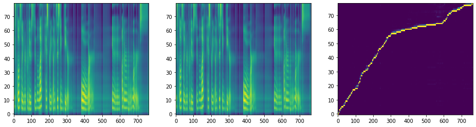</img>


    Warning! Reached max decoder steps
    Speaker: ljs-w
    Emotion: neutral
    Text   : is closely reproduced in the life-history of existing deer. Or, in other words,
    Attention quality:        0.1581
    Forward attentoin ratio:  0.9640
    Attentoin ratio:          0.3165
    Range attentoin ratio:    0.6203
    Multiple attentoin ratio: 0.1646
    Saved inference_ipynb/DiscreteAttentionWeights/DiscreteAttentionWeights/tacotron2_statedict.pt/[009]ljs-w_neutral_is_closely_reproduced_in_the_life-history_of_existing_deer_Or_in_other_words_[Discrete(True,False)].wav
    Saved inference_ipynb/DiscreteAttentionWeights/DiscreteAttentionWeights/tacotron2_statedict.pt/[009]ljs-w_neutral_is_closely_reproduced_in_the_life-history_of_existing_deer_Or_in_other_words_[Discrete(True,False)].png


<audio controls><source src="DiscreteAttentionWeights/DiscreteAttentionWeights/tacotron2_statedict.pt/[009]ljs-w_neutral_is_closely_reproduced_in_the_life-history_of_existing_deer_Or_in_other_words_[Discrete(True,False)].wav" type="audio/wav"></audio>


</img>


    [10 Done!]======================================================================================================================================================
    Speaker: ljs-w
    Emotion: neutral
    Text   : afterwards express a wish to murder the Recorder for having kept them so long in suspense.
    Attention quality:        0.8667
    Forward attentoin ratio:  1.0000
    Attentoin ratio:          0.8667
    Range attentoin ratio:    1.0000
    Multiple attentoin ratio: 0.0000
    Saved inference_ipynb/DiscreteAttentionWeights/DiscreteAttentionWeights/tacotron2_statedict.pt/[010]ljs-w_neutral_afterwards_express_a_wish_to_murder_the_Recorder_for_having_kept_them_so_long_in_suspense_[Discrete(False,False)].wav
    Saved inference_ipynb/DiscreteAttentionWeights/DiscreteAttentionWeights/tacotron2_statedict.pt/[010]ljs-w_neutral_afterwards_express_a_wish_to_murder_the_Recorder_for_having_kept_them_so_long_in_suspense_[Discrete(False,False)].png


<audio controls><source src="DiscreteAttentionWeights/DiscreteAttentionWeights/tacotron2_statedict.pt/[010]ljs-w_neutral_afterwards_express_a_wish_to_murder_the_Recorder_for_having_kept_them_so_long_in_suspense_[Discrete(False,False)].wav" type="audio/wav"></audio>


</img>


    Warning! Reached max decoder steps
    Speaker: ljs-w
    Emotion: neutral
    Text   : afterwards express a wish to murder the Recorder for having kept them so long in suspense.
    Attention quality:        0.3425
    Forward attentoin ratio:  0.9990
    Attentoin ratio:          0.5778
    Range attentoin ratio:    0.6000
    Multiple attentoin ratio: 0.0111
    Saved inference_ipynb/DiscreteAttentionWeights/DiscreteAttentionWeights/tacotron2_statedict.pt/[010]ljs-w_neutral_afterwards_express_a_wish_to_murder_the_Recorder_for_having_kept_them_so_long_in_suspense_[Discrete(True,True)].wav
    Saved inference_ipynb/DiscreteAttentionWeights/DiscreteAttentionWeights/tacotron2_statedict.pt/[010]ljs-w_neutral_afterwards_express_a_wish_to_murder_the_Recorder_for_having_kept_them_so_long_in_suspense_[Discrete(True,True)].png


<audio controls><source src="DiscreteAttentionWeights/DiscreteAttentionWeights/tacotron2_statedict.pt/[010]ljs-w_neutral_afterwards_express_a_wish_to_murder_the_Recorder_for_having_kept_them_so_long_in_suspense_[Discrete(True,True)].wav" type="audio/wav"></audio>


</img>


    Speaker: ljs-w
    Emotion: neutral
    Text   : afterwards express a wish to murder the Recorder for having kept them so long in suspense.
    Attention quality:        0.8556
    Forward attentoin ratio:  1.0000
    Attentoin ratio:          0.8556
    Range attentoin ratio:    1.0000
    Multiple attentoin ratio: 0.0000
    Saved inference_ipynb/DiscreteAttentionWeights/DiscreteAttentionWeights/tacotron2_statedict.pt/[010]ljs-w_neutral_afterwards_express_a_wish_to_murder_the_Recorder_for_having_kept_them_so_long_in_suspense_[Discrete(False,True)].wav
    Saved inference_ipynb/DiscreteAttentionWeights/DiscreteAttentionWeights/tacotron2_statedict.pt/[010]ljs-w_neutral_afterwards_express_a_wish_to_murder_the_Recorder_for_having_kept_them_so_long_in_suspense_[Discrete(False,True)].png


<audio controls><source src="DiscreteAttentionWeights/DiscreteAttentionWeights/tacotron2_statedict.pt/[010]ljs-w_neutral_afterwards_express_a_wish_to_murder_the_Recorder_for_having_kept_them_so_long_in_suspense_[Discrete(False,True)].wav" type="audio/wav"></audio>


</img>


    Speaker: ljs-w
    Emotion: neutral
    Text   : afterwards express a wish to murder the Recorder for having kept them so long in suspense.
    Attention quality:        0.1760
    Forward attentoin ratio:  0.9844
    Attentoin ratio:          0.2444
    Range attentoin ratio:    0.8333
    Multiple attentoin ratio: 0.1222
    Saved inference_ipynb/DiscreteAttentionWeights/DiscreteAttentionWeights/tacotron2_statedict.pt/[010]ljs-w_neutral_afterwards_express_a_wish_to_murder_the_Recorder_for_having_kept_them_so_long_in_suspense_[Discrete(True,False)].wav
    Saved inference_ipynb/DiscreteAttentionWeights/DiscreteAttentionWeights/tacotron2_statedict.pt/[010]ljs-w_neutral_afterwards_express_a_wish_to_murder_the_Recorder_for_having_kept_them_so_long_in_suspense_[Discrete(True,False)].png


<audio controls><source src="DiscreteAttentionWeights/DiscreteAttentionWeights/tacotron2_statedict.pt/[010]ljs-w_neutral_afterwards_express_a_wish_to_murder_the_Recorder_for_having_kept_them_so_long_in_suspense_[Discrete(True,False)].wav" type="audio/wav"></audio>


</img>


    [11 Done!]======================================================================================================================================================
    Speaker: ljs-w
    Emotion: neutral
    Text   : According to O'Donnell, quote, we had a motorcade wherever we went, end quote.
    Attention quality:        0.7982
    Forward attentoin ratio:  0.9929
    Attentoin ratio:          0.8590
    Range attentoin ratio:    1.0000
    Multiple attentoin ratio: 0.0641
    Saved inference_ipynb/DiscreteAttentionWeights/DiscreteAttentionWeights/tacotron2_statedict.pt/[011]ljs-w_neutral_According_to_ODonnell_quote_we_had_a_motorcade_wherever_we_went_end_quote_[Discrete(False,False)].wav
    Saved inference_ipynb/DiscreteAttentionWeights/DiscreteAttentionWeights/tacotron2_statedict.pt/[011]ljs-w_neutral_According_to_ODonnell_quote_we_had_a_motorcade_wherever_we_went_end_quote_[Discrete(False,False)].png


<audio controls><source src="DiscreteAttentionWeights/DiscreteAttentionWeights/tacotron2_statedict.pt/[011]ljs-w_neutral_According_to_ODonnell_quote_we_had_a_motorcade_wherever_we_went_end_quote_[Discrete(False,False)].wav" type="audio/wav"></audio>


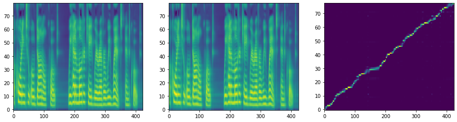</img>


    Warning! Reached max decoder steps
    Speaker: ljs-w
    Emotion: neutral
    Text   : According to O'Donnell, quote, we had a motorcade wherever we went, end quote.
    Attention quality:        0.6509
    Forward attentoin ratio:  1.0000
    Attentoin ratio:          0.7692
    Range attentoin ratio:    0.8462
    Multiple attentoin ratio: 0.0000
    Saved inference_ipynb/DiscreteAttentionWeights/DiscreteAttentionWeights/tacotron2_statedict.pt/[011]ljs-w_neutral_According_to_ODonnell_quote_we_had_a_motorcade_wherever_we_went_end_quote_[Discrete(True,True)].wav
    Saved inference_ipynb/DiscreteAttentionWeights/DiscreteAttentionWeights/tacotron2_statedict.pt/[011]ljs-w_neutral_According_to_ODonnell_quote_we_had_a_motorcade_wherever_we_went_end_quote_[Discrete(True,True)].png


<audio controls><source src="DiscreteAttentionWeights/DiscreteAttentionWeights/tacotron2_statedict.pt/[011]ljs-w_neutral_According_to_ODonnell_quote_we_had_a_motorcade_wherever_we_went_end_quote_[Discrete(True,True)].wav" type="audio/wav"></audio>


</img>


    Speaker: ljs-w
    Emotion: neutral
    Text   : According to O'Donnell, quote, we had a motorcade wherever we went, end quote.
    Attention quality:        0.8333
    Forward attentoin ratio:  1.0000
    Attentoin ratio:          0.8333
    Range attentoin ratio:    1.0000
    Multiple attentoin ratio: 0.0000
    Saved inference_ipynb/DiscreteAttentionWeights/DiscreteAttentionWeights/tacotron2_statedict.pt/[011]ljs-w_neutral_According_to_ODonnell_quote_we_had_a_motorcade_wherever_we_went_end_quote_[Discrete(False,True)].wav
    Saved inference_ipynb/DiscreteAttentionWeights/DiscreteAttentionWeights/tacotron2_statedict.pt/[011]ljs-w_neutral_According_to_ODonnell_quote_we_had_a_motorcade_wherever_we_went_end_quote_[Discrete(False,True)].png


<audio controls><source src="DiscreteAttentionWeights/DiscreteAttentionWeights/tacotron2_statedict.pt/[011]ljs-w_neutral_According_to_ODonnell_quote_we_had_a_motorcade_wherever_we_went_end_quote_[Discrete(False,True)].wav" type="audio/wav"></audio>


</img>


    Speaker: ljs-w
    Emotion: neutral
    Text   : According to O'Donnell, quote, we had a motorcade wherever we went, end quote.
    Attention quality:        0.1446
    Forward attentoin ratio:  0.9778
    Attentoin ratio:          0.1667
    Range attentoin ratio:    0.9615
    Multiple attentoin ratio: 0.0769
    Saved inference_ipynb/DiscreteAttentionWeights/DiscreteAttentionWeights/tacotron2_statedict.pt/[011]ljs-w_neutral_According_to_ODonnell_quote_we_had_a_motorcade_wherever_we_went_end_quote_[Discrete(True,False)].wav
    Saved inference_ipynb/DiscreteAttentionWeights/DiscreteAttentionWeights/tacotron2_statedict.pt/[011]ljs-w_neutral_According_to_ODonnell_quote_we_had_a_motorcade_wherever_we_went_end_quote_[Discrete(True,False)].png


<audio controls><source src="DiscreteAttentionWeights/DiscreteAttentionWeights/tacotron2_statedict.pt/[011]ljs-w_neutral_According_to_ODonnell_quote_we_had_a_motorcade_wherever_we_went_end_quote_[Discrete(True,False)].wav" type="audio/wav"></audio>


</img>


    [12 Done!]======================================================================================================================================================
    Speaker: ljs-w
    Emotion: neutral
    Text   : Energy enters the plant, to a small extent,
    Attention quality:        0.8803
    Forward attentoin ratio:  0.9961
    Attentoin ratio:          0.8837
    Range attentoin ratio:    1.0000
    Multiple attentoin ratio: 0.0000
    Saved inference_ipynb/DiscreteAttentionWeights/DiscreteAttentionWeights/tacotron2_statedict.pt/[012]ljs-w_neutral_Energy_enters_the_plant_to_a_small_extent_[Discrete(False,False)].wav
    Saved inference_ipynb/DiscreteAttentionWeights/DiscreteAttentionWeights/tacotron2_statedict.pt/[012]ljs-w_neutral_Energy_enters_the_plant_to_a_small_extent_[Discrete(False,False)].png


<audio controls><source src="DiscreteAttentionWeights/DiscreteAttentionWeights/tacotron2_statedict.pt/[012]ljs-w_neutral_Energy_enters_the_plant_to_a_small_extent_[Discrete(False,False)].wav" type="audio/wav"></audio>


</img>


    Speaker: ljs-w
    Emotion: neutral
    Text   : Energy enters the plant, to a small extent,
    Attention quality:        0.9313
    Forward attentoin ratio:  1.0000
    Attentoin ratio:          0.9535
    Range attentoin ratio:    0.9767
    Multiple attentoin ratio: 0.0000
    Saved inference_ipynb/DiscreteAttentionWeights/DiscreteAttentionWeights/tacotron2_statedict.pt/[012]ljs-w_neutral_Energy_enters_the_plant_to_a_small_extent_[Discrete(True,True)].wav
    Saved inference_ipynb/DiscreteAttentionWeights/DiscreteAttentionWeights/tacotron2_statedict.pt/[012]ljs-w_neutral_Energy_enters_the_plant_to_a_small_extent_[Discrete(True,True)].png


<audio controls><source src="DiscreteAttentionWeights/DiscreteAttentionWeights/tacotron2_statedict.pt/[012]ljs-w_neutral_Energy_enters_the_plant_to_a_small_extent_[Discrete(True,True)].wav" type="audio/wav"></audio>


</img>


    Speaker: ljs-w
    Emotion: neutral
    Text   : Energy enters the plant, to a small extent,
    Attention quality:        0.8140
    Forward attentoin ratio:  1.0000
    Attentoin ratio:          0.8140
    Range attentoin ratio:    1.0000
    Multiple attentoin ratio: 0.0000
    Saved inference_ipynb/DiscreteAttentionWeights/DiscreteAttentionWeights/tacotron2_statedict.pt/[012]ljs-w_neutral_Energy_enters_the_plant_to_a_small_extent_[Discrete(False,True)].wav
    Saved inference_ipynb/DiscreteAttentionWeights/DiscreteAttentionWeights/tacotron2_statedict.pt/[012]ljs-w_neutral_Energy_enters_the_plant_to_a_small_extent_[Discrete(False,True)].png


<audio controls><source src="DiscreteAttentionWeights/DiscreteAttentionWeights/tacotron2_statedict.pt/[012]ljs-w_neutral_Energy_enters_the_plant_to_a_small_extent_[Discrete(False,True)].wav" type="audio/wav"></audio>


</img>


    Warning! Reached max decoder steps
    Speaker: ljs-w
    Emotion: neutral
    Text   : Energy enters the plant, to a small extent,
    Attention quality:        0.6159
    Forward attentoin ratio:  0.9860
    Attentoin ratio:          0.8140
    Range attentoin ratio:    1.0000
    Multiple attentoin ratio: 0.2326
    Saved inference_ipynb/DiscreteAttentionWeights/DiscreteAttentionWeights/tacotron2_statedict.pt/[012]ljs-w_neutral_Energy_enters_the_plant_to_a_small_extent_[Discrete(True,False)].wav
    Saved inference_ipynb/DiscreteAttentionWeights/DiscreteAttentionWeights/tacotron2_statedict.pt/[012]ljs-w_neutral_Energy_enters_the_plant_to_a_small_extent_[Discrete(True,False)].png


<audio controls><source src="DiscreteAttentionWeights/DiscreteAttentionWeights/tacotron2_statedict.pt/[012]ljs-w_neutral_Energy_enters_the_plant_to_a_small_extent_[Discrete(True,False)].wav" type="audio/wav"></audio>


</img>


    [13 Done!]======================================================================================================================================================
    Speaker: ljs-w
    Emotion: neutral
    Text   : even when the high sheriff had told him there was no possibility of a reprieve, and within a few hours of execution.
    Attention quality:        0.8276
    Forward attentoin ratio:  1.0000
    Attentoin ratio:          0.8276
    Range attentoin ratio:    1.0000
    Multiple attentoin ratio: 0.0000
    Saved inference_ipynb/DiscreteAttentionWeights/DiscreteAttentionWeights/tacotron2_statedict.pt/[013]ljs-w_neutral_even_when_the_high_sheriff_had_told_him_there_was_no_possibility_of_a_reprieve_and_within_a_few_hours_of_execution_[Discrete(False,False)].wav
    Saved inference_ipynb/DiscreteAttentionWeights/DiscreteAttentionWeights/tacotron2_statedict.pt/[013]ljs-w_neutral_even_when_the_high_sheriff_had_told_him_there_was_no_possibility_of_a_reprieve_and_within_a_few_hours_of_execution_[Discrete(False,False)].png


<audio controls><source src="DiscreteAttentionWeights/DiscreteAttentionWeights/tacotron2_statedict.pt/[013]ljs-w_neutral_even_when_the_high_sheriff_had_told_him_there_was_no_possibility_of_a_reprieve_and_within_a_few_hours_of_execution_[Discrete(False,False)].wav" type="audio/wav"></audio>


</img>


    Warning! Reached max decoder steps
    Speaker: ljs-w
    Emotion: neutral
    Text   : even when the high sheriff had told him there was no possibility of a reprieve, and within a few hours of execution.
    Attention quality:        0.1391
    Forward attentoin ratio:  1.0000
    Attentoin ratio:          0.3362
    Range attentoin ratio:    0.4138
    Multiple attentoin ratio: 0.0000
    Saved inference_ipynb/DiscreteAttentionWeights/DiscreteAttentionWeights/tacotron2_statedict.pt/[013]ljs-w_neutral_even_when_the_high_sheriff_had_told_him_there_was_no_possibility_of_a_reprieve_and_within_a_few_hours_of_execution_[Discrete(True,True)].wav
    Saved inference_ipynb/DiscreteAttentionWeights/DiscreteAttentionWeights/tacotron2_statedict.pt/[013]ljs-w_neutral_even_when_the_high_sheriff_had_told_him_there_was_no_possibility_of_a_reprieve_and_within_a_few_hours_of_execution_[Discrete(True,True)].png


<audio controls><source src="DiscreteAttentionWeights/DiscreteAttentionWeights/tacotron2_statedict.pt/[013]ljs-w_neutral_even_when_the_high_sheriff_had_told_him_there_was_no_possibility_of_a_reprieve_and_within_a_few_hours_of_execution_[Discrete(True,True)].wav" type="audio/wav"></audio>


</img>


    Speaker: ljs-w
    Emotion: neutral
    Text   : even when the high sheriff had told him there was no possibility of a reprieve, and within a few hours of execution.
    Attention quality:        0.7953
    Forward attentoin ratio:  0.9986
    Attentoin ratio:          0.8103
    Range attentoin ratio:    1.0000
    Multiple attentoin ratio: 0.0172
    Saved inference_ipynb/DiscreteAttentionWeights/DiscreteAttentionWeights/tacotron2_statedict.pt/[013]ljs-w_neutral_even_when_the_high_sheriff_had_told_him_there_was_no_possibility_of_a_reprieve_and_within_a_few_hours_of_execution_[Discrete(False,True)].wav
    Saved inference_ipynb/DiscreteAttentionWeights/DiscreteAttentionWeights/tacotron2_statedict.pt/[013]ljs-w_neutral_even_when_the_high_sheriff_had_told_him_there_was_no_possibility_of_a_reprieve_and_within_a_few_hours_of_execution_[Discrete(False,True)].png


<audio controls><source src="DiscreteAttentionWeights/DiscreteAttentionWeights/tacotron2_statedict.pt/[013]ljs-w_neutral_even_when_the_high_sheriff_had_told_him_there_was_no_possibility_of_a_reprieve_and_within_a_few_hours_of_execution_[Discrete(False,True)].wav" type="audio/wav"></audio>


</img>


    Speaker: ljs-w
    Emotion: neutral
    Text   : even when the high sheriff had told him there was no possibility of a reprieve, and within a few hours of execution.
    Attention quality:        0.0636
    Forward attentoin ratio:  0.9738
    Attentoin ratio:          0.1724
    Range attentoin ratio:    0.4224
    Multiple attentoin ratio: 0.1034
    Saved inference_ipynb/DiscreteAttentionWeights/DiscreteAttentionWeights/tacotron2_statedict.pt/[013]ljs-w_neutral_even_when_the_high_sheriff_had_told_him_there_was_no_possibility_of_a_reprieve_and_within_a_few_hours_of_execution_[Discrete(True,False)].wav
    Saved inference_ipynb/DiscreteAttentionWeights/DiscreteAttentionWeights/tacotron2_statedict.pt/[013]ljs-w_neutral_even_when_the_high_sheriff_had_told_him_there_was_no_possibility_of_a_reprieve_and_within_a_few_hours_of_execution_[Discrete(True,False)].png


<audio controls><source src="DiscreteAttentionWeights/DiscreteAttentionWeights/tacotron2_statedict.pt/[013]ljs-w_neutral_even_when_the_high_sheriff_had_told_him_there_was_no_possibility_of_a_reprieve_and_within_a_few_hours_of_execution_[Discrete(True,False)].wav" type="audio/wav"></audio>


</img>


    [14 Done!]======================================================================================================================================================
    Speaker: ljs-w
    Emotion: neutral
    Text   : once you know that you must put the crosshairs on the target and that is all that is necessary.
    Attention quality:        0.7895
    Forward attentoin ratio:  1.0000
    Attentoin ratio:          0.7895
    Range attentoin ratio:    1.0000
    Multiple attentoin ratio: 0.0000
    Saved inference_ipynb/DiscreteAttentionWeights/DiscreteAttentionWeights/tacotron2_statedict.pt/[014]ljs-w_neutral_once_you_know_that_you_must_put_the_crosshairs_on_the_target_and_that_is_all_that_is_necessary_[Discrete(False,False)].wav
    Saved inference_ipynb/DiscreteAttentionWeights/DiscreteAttentionWeights/tacotron2_statedict.pt/[014]ljs-w_neutral_once_you_know_that_you_must_put_the_crosshairs_on_the_target_and_that_is_all_that_is_necessary_[Discrete(False,False)].png


<audio controls><source src="DiscreteAttentionWeights/DiscreteAttentionWeights/tacotron2_statedict.pt/[014]ljs-w_neutral_once_you_know_that_you_must_put_the_crosshairs_on_the_target_and_that_is_all_that_is_necessary_[Discrete(False,False)].wav" type="audio/wav"></audio>


</img>


    Warning! Reached max decoder steps
    Speaker: ljs-w
    Emotion: neutral
    Text   : once you know that you must put the crosshairs on the target and that is all that is necessary.
    Attention quality:        0.4370
    Forward attentoin ratio:  1.0000
    Attentoin ratio:          0.6105
    Range attentoin ratio:    0.7158
    Multiple attentoin ratio: 0.0000
    Saved inference_ipynb/DiscreteAttentionWeights/DiscreteAttentionWeights/tacotron2_statedict.pt/[014]ljs-w_neutral_once_you_know_that_you_must_put_the_crosshairs_on_the_target_and_that_is_all_that_is_necessary_[Discrete(True,True)].wav
    Saved inference_ipynb/DiscreteAttentionWeights/DiscreteAttentionWeights/tacotron2_statedict.pt/[014]ljs-w_neutral_once_you_know_that_you_must_put_the_crosshairs_on_the_target_and_that_is_all_that_is_necessary_[Discrete(True,True)].png


<audio controls><source src="DiscreteAttentionWeights/DiscreteAttentionWeights/tacotron2_statedict.pt/[014]ljs-w_neutral_once_you_know_that_you_must_put_the_crosshairs_on_the_target_and_that_is_all_that_is_necessary_[Discrete(True,True)].wav" type="audio/wav"></audio>


</img>


    Speaker: ljs-w
    Emotion: neutral
    Text   : once you know that you must put the crosshairs on the target and that is all that is necessary.
    Attention quality:        0.6947
    Forward attentoin ratio:  1.0000
    Attentoin ratio:          0.6947
    Range attentoin ratio:    1.0000
    Multiple attentoin ratio: 0.0000
    Saved inference_ipynb/DiscreteAttentionWeights/DiscreteAttentionWeights/tacotron2_statedict.pt/[014]ljs-w_neutral_once_you_know_that_you_must_put_the_crosshairs_on_the_target_and_that_is_all_that_is_necessary_[Discrete(False,True)].wav
    Saved inference_ipynb/DiscreteAttentionWeights/DiscreteAttentionWeights/tacotron2_statedict.pt/[014]ljs-w_neutral_once_you_know_that_you_must_put_the_crosshairs_on_the_target_and_that_is_all_that_is_necessary_[Discrete(False,True)].png


<audio controls><source src="DiscreteAttentionWeights/DiscreteAttentionWeights/tacotron2_statedict.pt/[014]ljs-w_neutral_once_you_know_that_you_must_put_the_crosshairs_on_the_target_and_that_is_all_that_is_necessary_[Discrete(False,True)].wav" type="audio/wav"></audio>


</img>


    Warning! Reached max decoder steps
    Speaker: ljs-w
    Emotion: neutral
    Text   : once you know that you must put the crosshairs on the target and that is all that is necessary.
    Attention quality:        0.1125
    Forward attentoin ratio:  0.9630
    Attentoin ratio:          0.2737
    Range attentoin ratio:    0.4947
    Multiple attentoin ratio: 0.1368
    Saved inference_ipynb/DiscreteAttentionWeights/DiscreteAttentionWeights/tacotron2_statedict.pt/[014]ljs-w_neutral_once_you_know_that_you_must_put_the_crosshairs_on_the_target_and_that_is_all_that_is_necessary_[Discrete(True,False)].wav
    Saved inference_ipynb/DiscreteAttentionWeights/DiscreteAttentionWeights/tacotron2_statedict.pt/[014]ljs-w_neutral_once_you_know_that_you_must_put_the_crosshairs_on_the_target_and_that_is_all_that_is_necessary_[Discrete(True,False)].png


<audio controls><source src="DiscreteAttentionWeights/DiscreteAttentionWeights/tacotron2_statedict.pt/[014]ljs-w_neutral_once_you_know_that_you_must_put_the_crosshairs_on_the_target_and_that_is_all_that_is_necessary_[Discrete(True,False)].wav" type="audio/wav"></audio>


</img>


    [15 Done!]======================================================================================================================================================
    Speaker: ljs-w
    Emotion: neutral
    Text   : long narrow rooms -- one thirty-six feet, six twenty-three feet, and the eighth eighteen,
    Attention quality:        0.8443
    Forward attentoin ratio:  0.9983
    Attentoin ratio:          0.8652
    Range attentoin ratio:    1.0000
    Multiple attentoin ratio: 0.0225
    Saved inference_ipynb/DiscreteAttentionWeights/DiscreteAttentionWeights/tacotron2_statedict.pt/[015]ljs-w_neutral_long_narrow_rooms_--_one_thirty-six_feet_six_twenty-three_feet_and_the_eighth_eighteen_[Discrete(False,False)].wav
    Saved inference_ipynb/DiscreteAttentionWeights/DiscreteAttentionWeights/tacotron2_statedict.pt/[015]ljs-w_neutral_long_narrow_rooms_--_one_thirty-six_feet_six_twenty-three_feet_and_the_eighth_eighteen_[Discrete(False,False)].png


<audio controls><source src="DiscreteAttentionWeights/DiscreteAttentionWeights/tacotron2_statedict.pt/[015]ljs-w_neutral_long_narrow_rooms_--_one_thirty-six_feet_six_twenty-three_feet_and_the_eighth_eighteen_[Discrete(False,False)].wav" type="audio/wav"></audio>


</img>


    Warning! Reached max decoder steps
    Speaker: ljs-w
    Emotion: neutral
    Text   : long narrow rooms -- one thirty-six feet, six twenty-three feet, and the eighth eighteen,
    Attention quality:        0.3040
    Forward attentoin ratio:  1.0000
    Attentoin ratio:          0.4831
    Range attentoin ratio:    0.6292
    Multiple attentoin ratio: 0.0000
    Saved inference_ipynb/DiscreteAttentionWeights/DiscreteAttentionWeights/tacotron2_statedict.pt/[015]ljs-w_neutral_long_narrow_rooms_--_one_thirty-six_feet_six_twenty-three_feet_and_the_eighth_eighteen_[Discrete(True,True)].wav
    Saved inference_ipynb/DiscreteAttentionWeights/DiscreteAttentionWeights/tacotron2_statedict.pt/[015]ljs-w_neutral_long_narrow_rooms_--_one_thirty-six_feet_six_twenty-three_feet_and_the_eighth_eighteen_[Discrete(True,True)].png


<audio controls><source src="DiscreteAttentionWeights/DiscreteAttentionWeights/tacotron2_statedict.pt/[015]ljs-w_neutral_long_narrow_rooms_--_one_thirty-six_feet_six_twenty-three_feet_and_the_eighth_eighteen_[Discrete(True,True)].wav" type="audio/wav"></audio>


</img>


    Warning! Reached max decoder steps
    Speaker: ljs-w
    Emotion: neutral
    Text   : long narrow rooms -- one thirty-six feet, six twenty-three feet, and the eighth eighteen,
    Attention quality:        0.5569
    Forward attentoin ratio:  0.9980
    Attentoin ratio:          0.5843
    Range attentoin ratio:    0.9551
    Multiple attentoin ratio: 0.0000
    Saved inference_ipynb/DiscreteAttentionWeights/DiscreteAttentionWeights/tacotron2_statedict.pt/[015]ljs-w_neutral_long_narrow_rooms_--_one_thirty-six_feet_six_twenty-three_feet_and_the_eighth_eighteen_[Discrete(False,True)].wav
    Saved inference_ipynb/DiscreteAttentionWeights/DiscreteAttentionWeights/tacotron2_statedict.pt/[015]ljs-w_neutral_long_narrow_rooms_--_one_thirty-six_feet_six_twenty-three_feet_and_the_eighth_eighteen_[Discrete(False,True)].png


<audio controls><source src="DiscreteAttentionWeights/DiscreteAttentionWeights/tacotron2_statedict.pt/[015]ljs-w_neutral_long_narrow_rooms_--_one_thirty-six_feet_six_twenty-three_feet_and_the_eighth_eighteen_[Discrete(False,True)].wav" type="audio/wav"></audio>


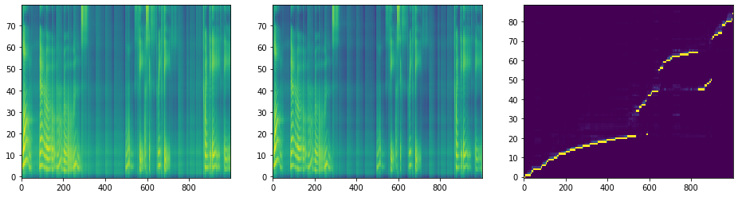</img>


    Warning! Reached max decoder steps
    Speaker: ljs-w
    Emotion: neutral
    Text   : long narrow rooms -- one thirty-six feet, six twenty-three feet, and the eighth eighteen,
    Attention quality:        0.1306
    Forward attentoin ratio:  0.9710
    Attentoin ratio:          0.2697
    Range attentoin ratio:    0.5843
    Multiple attentoin ratio: 0.1461
    Saved inference_ipynb/DiscreteAttentionWeights/DiscreteAttentionWeights/tacotron2_statedict.pt/[015]ljs-w_neutral_long_narrow_rooms_--_one_thirty-six_feet_six_twenty-three_feet_and_the_eighth_eighteen_[Discrete(True,False)].wav
    Saved inference_ipynb/DiscreteAttentionWeights/DiscreteAttentionWeights/tacotron2_statedict.pt/[015]ljs-w_neutral_long_narrow_rooms_--_one_thirty-six_feet_six_twenty-three_feet_and_the_eighth_eighteen_[Discrete(True,False)].png


<audio controls><source src="DiscreteAttentionWeights/DiscreteAttentionWeights/tacotron2_statedict.pt/[015]ljs-w_neutral_long_narrow_rooms_--_one_thirty-six_feet_six_twenty-three_feet_and_the_eighth_eighteen_[Discrete(True,False)].wav" type="audio/wav"></audio>


</img>


    [16 Done!]======================================================================================================================================================
    Speaker: ljs-w
    Emotion: neutral
    Text   : which Sir Joshua Jebb told the committee he considered the proper elements of penal discipline.
    Attention quality:        0.8421
    Forward attentoin ratio:  1.0000
    Attentoin ratio:          0.8421
    Range attentoin ratio:    1.0000
    Multiple attentoin ratio: 0.0000
    Saved inference_ipynb/DiscreteAttentionWeights/DiscreteAttentionWeights/tacotron2_statedict.pt/[016]ljs-w_neutral_which_Sir_Joshua_Jebb_told_the_committee_he_considered_the_proper_elements_of_penal_discipline_[Discrete(False,False)].wav
    Saved inference_ipynb/DiscreteAttentionWeights/DiscreteAttentionWeights/tacotron2_statedict.pt/[016]ljs-w_neutral_which_Sir_Joshua_Jebb_told_the_committee_he_considered_the_proper_elements_of_penal_discipline_[Discrete(False,False)].png


<audio controls><source src="DiscreteAttentionWeights/DiscreteAttentionWeights/tacotron2_statedict.pt/[016]ljs-w_neutral_which_Sir_Joshua_Jebb_told_the_committee_he_considered_the_proper_elements_of_penal_discipline_[Discrete(False,False)].wav" type="audio/wav"></audio>


</img>


    Warning! Reached max decoder steps
    Speaker: ljs-w
    Emotion: neutral
    Text   : which Sir Joshua Jebb told the committee he considered the proper elements of penal discipline.
    Attention quality:        0.4664
    Forward attentoin ratio:  1.0000
    Attentoin ratio:          0.6421
    Range attentoin ratio:    0.7263
    Multiple attentoin ratio: 0.0000
    Saved inference_ipynb/DiscreteAttentionWeights/DiscreteAttentionWeights/tacotron2_statedict.pt/[016]ljs-w_neutral_which_Sir_Joshua_Jebb_told_the_committee_he_considered_the_proper_elements_of_penal_discipline_[Discrete(True,True)].wav
    Saved inference_ipynb/DiscreteAttentionWeights/DiscreteAttentionWeights/tacotron2_statedict.pt/[016]ljs-w_neutral_which_Sir_Joshua_Jebb_told_the_committee_he_considered_the_proper_elements_of_penal_discipline_[Discrete(True,True)].png


<audio controls><source src="DiscreteAttentionWeights/DiscreteAttentionWeights/tacotron2_statedict.pt/[016]ljs-w_neutral_which_Sir_Joshua_Jebb_told_the_committee_he_considered_the_proper_elements_of_penal_discipline_[Discrete(True,True)].wav" type="audio/wav"></audio>


</img>


    Speaker: ljs-w
    Emotion: neutral
    Text   : which Sir Joshua Jebb told the committee he considered the proper elements of penal discipline.
    Attention quality:        0.7789
    Forward attentoin ratio:  1.0000
    Attentoin ratio:          0.7789
    Range attentoin ratio:    1.0000
    Multiple attentoin ratio: 0.0000
    Saved inference_ipynb/DiscreteAttentionWeights/DiscreteAttentionWeights/tacotron2_statedict.pt/[016]ljs-w_neutral_which_Sir_Joshua_Jebb_told_the_committee_he_considered_the_proper_elements_of_penal_discipline_[Discrete(False,True)].wav
    Saved inference_ipynb/DiscreteAttentionWeights/DiscreteAttentionWeights/tacotron2_statedict.pt/[016]ljs-w_neutral_which_Sir_Joshua_Jebb_told_the_committee_he_considered_the_proper_elements_of_penal_discipline_[Discrete(False,True)].png


<audio controls><source src="DiscreteAttentionWeights/DiscreteAttentionWeights/tacotron2_statedict.pt/[016]ljs-w_neutral_which_Sir_Joshua_Jebb_told_the_committee_he_considered_the_proper_elements_of_penal_discipline_[Discrete(False,True)].wav" type="audio/wav"></audio>


</img>


    Speaker: ljs-w
    Emotion: neutral
    Text   : which Sir Joshua Jebb told the committee he considered the proper elements of penal discipline.
    Attention quality:        0.0502
    Forward attentoin ratio:  0.9863
    Attentoin ratio:          0.1684
    Range attentoin ratio:    0.3158
    Multiple attentoin ratio: 0.0421
    Saved inference_ipynb/DiscreteAttentionWeights/DiscreteAttentionWeights/tacotron2_statedict.pt/[016]ljs-w_neutral_which_Sir_Joshua_Jebb_told_the_committee_he_considered_the_proper_elements_of_penal_discipline_[Discrete(True,False)].wav
    Saved inference_ipynb/DiscreteAttentionWeights/DiscreteAttentionWeights/tacotron2_statedict.pt/[016]ljs-w_neutral_which_Sir_Joshua_Jebb_told_the_committee_he_considered_the_proper_elements_of_penal_discipline_[Discrete(True,False)].png


<audio controls><source src="DiscreteAttentionWeights/DiscreteAttentionWeights/tacotron2_statedict.pt/[016]ljs-w_neutral_which_Sir_Joshua_Jebb_told_the_committee_he_considered_the_proper_elements_of_penal_discipline_[Discrete(True,False)].wav" type="audio/wav"></audio>


</img>


    [17 Done!]======================================================================================================================================================
    Speaker: ljs-w
    Emotion: neutral
    Text   : If somebody did that to me, a lousy trick like that, to take my wife away, and all the furniture, I would be mad as hell, too.
    Attention quality:        0.8571
    Forward attentoin ratio:  0.9976
    Attentoin ratio:          0.8730
    Range attentoin ratio:    1.0000
    Multiple attentoin ratio: 0.0159
    Saved inference_ipynb/DiscreteAttentionWeights/DiscreteAttentionWeights/tacotron2_statedict.pt/[017]ljs-w_neutral_If_somebody_did_that_to_me_a_lousy_trick_like_that_to_take_my_wife_away_and_all_the_furniture_I_would_be_mad_as_hell_too_[Discrete(False,False)].wav
    Saved inference_ipynb/DiscreteAttentionWeights/DiscreteAttentionWeights/tacotron2_statedict.pt/[017]ljs-w_neutral_If_somebody_did_that_to_me_a_lousy_trick_like_that_to_take_my_wife_away_and_all_the_furniture_I_would_be_mad_as_hell_too_[Discrete(False,False)].png


<audio controls><source src="DiscreteAttentionWeights/DiscreteAttentionWeights/tacotron2_statedict.pt/[017]ljs-w_neutral_If_somebody_did_that_to_me_a_lousy_trick_like_that_to_take_my_wife_away_and_all_the_furniture_I_would_be_mad_as_hell_too_[Discrete(False,False)].wav" type="audio/wav"></audio>


</img>


    Warning! Reached max decoder steps
    Speaker: ljs-w
    Emotion: neutral
    Text   : If somebody did that to me, a lousy trick like that, to take my wife away, and all the furniture, I would be mad as hell, too.
    Attention quality:        0.1539
    Forward attentoin ratio:  1.0000
    Attentoin ratio:          0.3730
    Range attentoin ratio:    0.4127
    Multiple attentoin ratio: 0.0000
    Saved inference_ipynb/DiscreteAttentionWeights/DiscreteAttentionWeights/tacotron2_statedict.pt/[017]ljs-w_neutral_If_somebody_did_that_to_me_a_lousy_trick_like_that_to_take_my_wife_away_and_all_the_furniture_I_would_be_mad_as_hell_too_[Discrete(True,True)].wav
    Saved inference_ipynb/DiscreteAttentionWeights/DiscreteAttentionWeights/tacotron2_statedict.pt/[017]ljs-w_neutral_If_somebody_did_that_to_me_a_lousy_trick_like_that_to_take_my_wife_away_and_all_the_furniture_I_would_be_mad_as_hell_too_[Discrete(True,True)].png


<audio controls><source src="DiscreteAttentionWeights/DiscreteAttentionWeights/tacotron2_statedict.pt/[017]ljs-w_neutral_If_somebody_did_that_to_me_a_lousy_trick_like_that_to_take_my_wife_away_and_all_the_furniture_I_would_be_mad_as_hell_too_[Discrete(True,True)].wav" type="audio/wav"></audio>


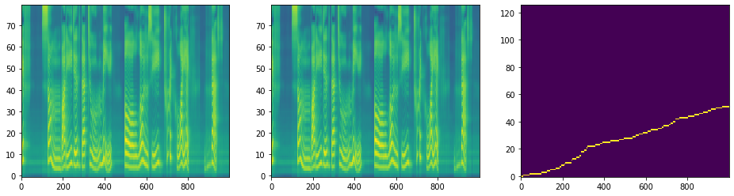</img>


    Warning! Reached max decoder steps
    Speaker: ljs-w
    Emotion: neutral
    Text   : If somebody did that to me, a lousy trick like that, to take my wife away, and all the furniture, I would be mad as hell, too.
    Attention quality:        0.7108
    Forward attentoin ratio:  1.0000
    Attentoin ratio:          0.7222
    Range attentoin ratio:    0.9841
    Multiple attentoin ratio: 0.0000
    Saved inference_ipynb/DiscreteAttentionWeights/DiscreteAttentionWeights/tacotron2_statedict.pt/[017]ljs-w_neutral_If_somebody_did_that_to_me_a_lousy_trick_like_that_to_take_my_wife_away_and_all_the_furniture_I_would_be_mad_as_hell_too_[Discrete(False,True)].wav
    Saved inference_ipynb/DiscreteAttentionWeights/DiscreteAttentionWeights/tacotron2_statedict.pt/[017]ljs-w_neutral_If_somebody_did_that_to_me_a_lousy_trick_like_that_to_take_my_wife_away_and_all_the_furniture_I_would_be_mad_as_hell_too_[Discrete(False,True)].png


<audio controls><source src="DiscreteAttentionWeights/DiscreteAttentionWeights/tacotron2_statedict.pt/[017]ljs-w_neutral_If_somebody_did_that_to_me_a_lousy_trick_like_that_to_take_my_wife_away_and_all_the_furniture_I_would_be_mad_as_hell_too_[Discrete(False,True)].wav" type="audio/wav"></audio>


</img>


    Speaker: ljs-w
    Emotion: neutral
    Text   : If somebody did that to me, a lousy trick like that, to take my wife away, and all the furniture, I would be mad as hell, too.
    Attention quality:        0.0002
    Forward attentoin ratio:  0.9730
    Attentoin ratio:          0.0159
    Range attentoin ratio:    0.0159
    Multiple attentoin ratio: 0.0159
    Saved inference_ipynb/DiscreteAttentionWeights/DiscreteAttentionWeights/tacotron2_statedict.pt/[017]ljs-w_neutral_If_somebody_did_that_to_me_a_lousy_trick_like_that_to_take_my_wife_away_and_all_the_furniture_I_would_be_mad_as_hell_too_[Discrete(True,False)].wav
    Saved inference_ipynb/DiscreteAttentionWeights/DiscreteAttentionWeights/tacotron2_statedict.pt/[017]ljs-w_neutral_If_somebody_did_that_to_me_a_lousy_trick_like_that_to_take_my_wife_away_and_all_the_furniture_I_would_be_mad_as_hell_too_[Discrete(True,False)].png


<audio controls><source src="DiscreteAttentionWeights/DiscreteAttentionWeights/tacotron2_statedict.pt/[017]ljs-w_neutral_If_somebody_did_that_to_me_a_lousy_trick_like_that_to_take_my_wife_away_and_all_the_furniture_I_would_be_mad_as_hell_too_[Discrete(True,False)].wav" type="audio/wav"></audio>


</img>


    [18 Done!]======================================================================================================================================================
    Speaker: ljs-w
    Emotion: neutral
    Text   : Mrs. Mary Brock, the wife of a mechanic who worked at the station, was there at the time and she saw a white male,
    Attention quality:        0.8448
    Forward attentoin ratio:  1.0000
    Attentoin ratio:          0.8448
    Range attentoin ratio:    1.0000
    Multiple attentoin ratio: 0.0000
    Saved inference_ipynb/DiscreteAttentionWeights/DiscreteAttentionWeights/tacotron2_statedict.pt/[018]ljs-w_neutral_Mrs_Mary_Brock_the_wife_of_a_mechanic_who_worked_at_the_station_was_there_at_the_time_and_she_saw_a_white_male_[Discrete(False,False)].wav
    Saved inference_ipynb/DiscreteAttentionWeights/DiscreteAttentionWeights/tacotron2_statedict.pt/[018]ljs-w_neutral_Mrs_Mary_Brock_the_wife_of_a_mechanic_who_worked_at_the_station_was_there_at_the_time_and_she_saw_a_white_male_[Discrete(False,False)].png


<audio controls><source src="DiscreteAttentionWeights/DiscreteAttentionWeights/tacotron2_statedict.pt/[018]ljs-w_neutral_Mrs_Mary_Brock_the_wife_of_a_mechanic_who_worked_at_the_station_was_there_at_the_time_and_she_saw_a_white_male_[Discrete(False,False)].wav" type="audio/wav"></audio>


</img>


    Warning! Reached max decoder steps
    Speaker: ljs-w
    Emotion: neutral
    Text   : Mrs. Mary Brock, the wife of a mechanic who worked at the station, was there at the time and she saw a white male,
    Attention quality:        0.2085
    Forward attentoin ratio:  1.0000
    Attentoin ratio:          0.4397
    Range attentoin ratio:    0.4741
    Multiple attentoin ratio: 0.0000
    Saved inference_ipynb/DiscreteAttentionWeights/DiscreteAttentionWeights/tacotron2_statedict.pt/[018]ljs-w_neutral_Mrs_Mary_Brock_the_wife_of_a_mechanic_who_worked_at_the_station_was_there_at_the_time_and_she_saw_a_white_male_[Discrete(True,True)].wav
    Saved inference_ipynb/DiscreteAttentionWeights/DiscreteAttentionWeights/tacotron2_statedict.pt/[018]ljs-w_neutral_Mrs_Mary_Brock_the_wife_of_a_mechanic_who_worked_at_the_station_was_there_at_the_time_and_she_saw_a_white_male_[Discrete(True,True)].png


<audio controls><source src="DiscreteAttentionWeights/DiscreteAttentionWeights/tacotron2_statedict.pt/[018]ljs-w_neutral_Mrs_Mary_Brock_the_wife_of_a_mechanic_who_worked_at_the_station_was_there_at_the_time_and_she_saw_a_white_male_[Discrete(True,True)].wav" type="audio/wav"></audio>


</img>


    Speaker: ljs-w
    Emotion: neutral
    Text   : Mrs. Mary Brock, the wife of a mechanic who worked at the station, was there at the time and she saw a white male,
    Attention quality:        0.7328
    Forward attentoin ratio:  1.0000
    Attentoin ratio:          0.7328
    Range attentoin ratio:    1.0000
    Multiple attentoin ratio: 0.0000
    Saved inference_ipynb/DiscreteAttentionWeights/DiscreteAttentionWeights/tacotron2_statedict.pt/[018]ljs-w_neutral_Mrs_Mary_Brock_the_wife_of_a_mechanic_who_worked_at_the_station_was_there_at_the_time_and_she_saw_a_white_male_[Discrete(False,True)].wav
    Saved inference_ipynb/DiscreteAttentionWeights/DiscreteAttentionWeights/tacotron2_statedict.pt/[018]ljs-w_neutral_Mrs_Mary_Brock_the_wife_of_a_mechanic_who_worked_at_the_station_was_there_at_the_time_and_she_saw_a_white_male_[Discrete(False,True)].png


<audio controls><source src="DiscreteAttentionWeights/DiscreteAttentionWeights/tacotron2_statedict.pt/[018]ljs-w_neutral_Mrs_Mary_Brock_the_wife_of_a_mechanic_who_worked_at_the_station_was_there_at_the_time_and_she_saw_a_white_male_[Discrete(False,True)].wav" type="audio/wav"></audio>


</img>


    Speaker: ljs-w
    Emotion: neutral
    Text   : Mrs. Mary Brock, the wife of a mechanic who worked at the station, was there at the time and she saw a white male,
    Attention quality:        0.0769
    Forward attentoin ratio:  0.9833
    Attentoin ratio:          0.0862
    Range attentoin ratio:    0.9310
    Multiple attentoin ratio: 0.0259
    Saved inference_ipynb/DiscreteAttentionWeights/DiscreteAttentionWeights/tacotron2_statedict.pt/[018]ljs-w_neutral_Mrs_Mary_Brock_the_wife_of_a_mechanic_who_worked_at_the_station_was_there_at_the_time_and_she_saw_a_white_male_[Discrete(True,False)].wav
    Saved inference_ipynb/DiscreteAttentionWeights/DiscreteAttentionWeights/tacotron2_statedict.pt/[018]ljs-w_neutral_Mrs_Mary_Brock_the_wife_of_a_mechanic_who_worked_at_the_station_was_there_at_the_time_and_she_saw_a_white_male_[Discrete(True,False)].png


<audio controls><source src="DiscreteAttentionWeights/DiscreteAttentionWeights/tacotron2_statedict.pt/[018]ljs-w_neutral_Mrs_Mary_Brock_the_wife_of_a_mechanic_who_worked_at_the_station_was_there_at_the_time_and_she_saw_a_white_male_[Discrete(True,False)].wav" type="audio/wav"></audio>


</img>


    [19 Done!]======================================================================================================================================================
    Speaker: ljs-w
    Emotion: neutral
    Text   : On one occasion Mrs. Johnson, accompanied by two Secret Service agents, left the room to see Mrs. Kennedy and Mrs. Connally.
    Attention quality:        0.8613
    Forward attentoin ratio:  0.9986
    Attentoin ratio:          0.8692
    Range attentoin ratio:    1.0000
    Multiple attentoin ratio: 0.0077
    Saved inference_ipynb/DiscreteAttentionWeights/DiscreteAttentionWeights/tacotron2_statedict.pt/[019]ljs-w_neutral_On_one_occasion_Mrs_Johnson_accompanied_by_two_Secret_Service_agents_left_the_room_to_see_Mrs_Kennedy_and_Mrs_Connally_[Discrete(False,False)].wav
    Saved inference_ipynb/DiscreteAttentionWeights/DiscreteAttentionWeights/tacotron2_statedict.pt/[019]ljs-w_neutral_On_one_occasion_Mrs_Johnson_accompanied_by_two_Secret_Service_agents_left_the_room_to_see_Mrs_Kennedy_and_Mrs_Connally_[Discrete(False,False)].png


<audio controls><source src="DiscreteAttentionWeights/DiscreteAttentionWeights/tacotron2_statedict.pt/[019]ljs-w_neutral_On_one_occasion_Mrs_Johnson_accompanied_by_two_Secret_Service_agents_left_the_room_to_see_Mrs_Kennedy_and_Mrs_Connally_[Discrete(False,False)].wav" type="audio/wav"></audio>


</img>


    Warning! Reached max decoder steps
    Speaker: ljs-w
    Emotion: neutral
    Text   : On one occasion Mrs. Johnson, accompanied by two Secret Service agents, left the room to see Mrs. Kennedy and Mrs. Connally.
    Attention quality:        0.2498
    Forward attentoin ratio:  1.0000
    Attentoin ratio:          0.4846
    Range attentoin ratio:    0.5154
    Multiple attentoin ratio: 0.0000
    Saved inference_ipynb/DiscreteAttentionWeights/DiscreteAttentionWeights/tacotron2_statedict.pt/[019]ljs-w_neutral_On_one_occasion_Mrs_Johnson_accompanied_by_two_Secret_Service_agents_left_the_room_to_see_Mrs_Kennedy_and_Mrs_Connally_[Discrete(True,True)].wav
    Saved inference_ipynb/DiscreteAttentionWeights/DiscreteAttentionWeights/tacotron2_statedict.pt/[019]ljs-w_neutral_On_one_occasion_Mrs_Johnson_accompanied_by_two_Secret_Service_agents_left_the_room_to_see_Mrs_Kennedy_and_Mrs_Connally_[Discrete(True,True)].png


<audio controls><source src="DiscreteAttentionWeights/DiscreteAttentionWeights/tacotron2_statedict.pt/[019]ljs-w_neutral_On_one_occasion_Mrs_Johnson_accompanied_by_two_Secret_Service_agents_left_the_room_to_see_Mrs_Kennedy_and_Mrs_Connally_[Discrete(True,True)].wav" type="audio/wav"></audio>


</img>


    Speaker: ljs-w
    Emotion: neutral
    Text   : On one occasion Mrs. Johnson, accompanied by two Secret Service agents, left the room to see Mrs. Kennedy and Mrs. Connally.
    Attention quality:        0.7692
    Forward attentoin ratio:  1.0000
    Attentoin ratio:          0.7692
    Range attentoin ratio:    1.0000
    Multiple attentoin ratio: 0.0000
    Saved inference_ipynb/DiscreteAttentionWeights/DiscreteAttentionWeights/tacotron2_statedict.pt/[019]ljs-w_neutral_On_one_occasion_Mrs_Johnson_accompanied_by_two_Secret_Service_agents_left_the_room_to_see_Mrs_Kennedy_and_Mrs_Connally_[Discrete(False,True)].wav
    Saved inference_ipynb/DiscreteAttentionWeights/DiscreteAttentionWeights/tacotron2_statedict.pt/[019]ljs-w_neutral_On_one_occasion_Mrs_Johnson_accompanied_by_two_Secret_Service_agents_left_the_room_to_see_Mrs_Kennedy_and_Mrs_Connally_[Discrete(False,True)].png


<audio controls><source src="DiscreteAttentionWeights/DiscreteAttentionWeights/tacotron2_statedict.pt/[019]ljs-w_neutral_On_one_occasion_Mrs_Johnson_accompanied_by_two_Secret_Service_agents_left_the_room_to_see_Mrs_Kennedy_and_Mrs_Connally_[Discrete(False,True)].wav" type="audio/wav"></audio>


</img>


    Warning! Reached max decoder steps
    Speaker: ljs-w
    Emotion: neutral
    Text   : On one occasion Mrs. Johnson, accompanied by two Secret Service agents, left the room to see Mrs. Kennedy and Mrs. Connally.
    Attention quality:        0.1160
    Forward attentoin ratio:  0.9850
    Attentoin ratio:          0.1923
    Range attentoin ratio:    0.6692
    Multiple attentoin ratio: 0.0846
    Saved inference_ipynb/DiscreteAttentionWeights/DiscreteAttentionWeights/tacotron2_statedict.pt/[019]ljs-w_neutral_On_one_occasion_Mrs_Johnson_accompanied_by_two_Secret_Service_agents_left_the_room_to_see_Mrs_Kennedy_and_Mrs_Connally_[Discrete(True,False)].wav
    Saved inference_ipynb/DiscreteAttentionWeights/DiscreteAttentionWeights/tacotron2_statedict.pt/[019]ljs-w_neutral_On_one_occasion_Mrs_Johnson_accompanied_by_two_Secret_Service_agents_left_the_room_to_see_Mrs_Kennedy_and_Mrs_Connally_[Discrete(True,False)].png


<audio controls><source src="DiscreteAttentionWeights/DiscreteAttentionWeights/tacotron2_statedict.pt/[019]ljs-w_neutral_On_one_occasion_Mrs_Johnson_accompanied_by_two_Secret_Service_agents_left_the_room_to_see_Mrs_Kennedy_and_Mrs_Connally_[Discrete(True,False)].wav" type="audio/wav"></audio>


</img>


    [20 Done!]======================================================================================================================================================
    Speaker: ljs-w
    Emotion: neutral
    Text   : After this the sheriffs sent for another rope, but the spectators interfered, and the man was carried back to jail.
    Attention quality:        0.8522
    Forward attentoin ratio:  1.0000
    Attentoin ratio:          0.8522
    Range attentoin ratio:    1.0000
    Multiple attentoin ratio: 0.0000
    Saved inference_ipynb/DiscreteAttentionWeights/DiscreteAttentionWeights/tacotron2_statedict.pt/[020]ljs-w_neutral_After_this_the_sheriffs_sent_for_another_rope_but_the_spectators_interfered_and_the_man_was_carried_back_to_jail_[Discrete(False,False)].wav
    Saved inference_ipynb/DiscreteAttentionWeights/DiscreteAttentionWeights/tacotron2_statedict.pt/[020]ljs-w_neutral_After_this_the_sheriffs_sent_for_another_rope_but_the_spectators_interfered_and_the_man_was_carried_back_to_jail_[Discrete(False,False)].png


<audio controls><source src="DiscreteAttentionWeights/DiscreteAttentionWeights/tacotron2_statedict.pt/[020]ljs-w_neutral_After_this_the_sheriffs_sent_for_another_rope_but_the_spectators_interfered_and_the_man_was_carried_back_to_jail_[Discrete(False,False)].wav" type="audio/wav"></audio>


</img>


    Warning! Reached max decoder steps
    Speaker: ljs-w
    Emotion: neutral
    Text   : After this the sheriffs sent for another rope, but the spectators interfered, and the man was carried back to jail.
    Attention quality:        0.2491
    Forward attentoin ratio:  1.0000
    Attentoin ratio:          0.4696
    Range attentoin ratio:    0.5304
    Multiple attentoin ratio: 0.0000
    Saved inference_ipynb/DiscreteAttentionWeights/DiscreteAttentionWeights/tacotron2_statedict.pt/[020]ljs-w_neutral_After_this_the_sheriffs_sent_for_another_rope_but_the_spectators_interfered_and_the_man_was_carried_back_to_jail_[Discrete(True,True)].wav
    Saved inference_ipynb/DiscreteAttentionWeights/DiscreteAttentionWeights/tacotron2_statedict.pt/[020]ljs-w_neutral_After_this_the_sheriffs_sent_for_another_rope_but_the_spectators_interfered_and_the_man_was_carried_back_to_jail_[Discrete(True,True)].png


<audio controls><source src="DiscreteAttentionWeights/DiscreteAttentionWeights/tacotron2_statedict.pt/[020]ljs-w_neutral_After_this_the_sheriffs_sent_for_another_rope_but_the_spectators_interfered_and_the_man_was_carried_back_to_jail_[Discrete(True,True)].wav" type="audio/wav"></audio>


</img>


    Speaker: ljs-w
    Emotion: neutral
    Text   : After this the sheriffs sent for another rope, but the spectators interfered, and the man was carried back to jail.
    Attention quality:        0.7826
    Forward attentoin ratio:  1.0000
    Attentoin ratio:          0.7826
    Range attentoin ratio:    1.0000
    Multiple attentoin ratio: 0.0000
    Saved inference_ipynb/DiscreteAttentionWeights/DiscreteAttentionWeights/tacotron2_statedict.pt/[020]ljs-w_neutral_After_this_the_sheriffs_sent_for_another_rope_but_the_spectators_interfered_and_the_man_was_carried_back_to_jail_[Discrete(False,True)].wav
    Saved inference_ipynb/DiscreteAttentionWeights/DiscreteAttentionWeights/tacotron2_statedict.pt/[020]ljs-w_neutral_After_this_the_sheriffs_sent_for_another_rope_but_the_spectators_interfered_and_the_man_was_carried_back_to_jail_[Discrete(False,True)].png


<audio controls><source src="DiscreteAttentionWeights/DiscreteAttentionWeights/tacotron2_statedict.pt/[020]ljs-w_neutral_After_this_the_sheriffs_sent_for_another_rope_but_the_spectators_interfered_and_the_man_was_carried_back_to_jail_[Discrete(False,True)].wav" type="audio/wav"></audio>


</img>


    Speaker: ljs-w
    Emotion: neutral
    Text   : After this the sheriffs sent for another rope, but the spectators interfered, and the man was carried back to jail.
    Attention quality:        0.0052
    Forward attentoin ratio:  0.9935
    Attentoin ratio:          0.0696
    Range attentoin ratio:    0.0783
    Multiple attentoin ratio: 0.0348
    Saved inference_ipynb/DiscreteAttentionWeights/DiscreteAttentionWeights/tacotron2_statedict.pt/[020]ljs-w_neutral_After_this_the_sheriffs_sent_for_another_rope_but_the_spectators_interfered_and_the_man_was_carried_back_to_jail_[Discrete(True,False)].wav
    Saved inference_ipynb/DiscreteAttentionWeights/DiscreteAttentionWeights/tacotron2_statedict.pt/[020]ljs-w_neutral_After_this_the_sheriffs_sent_for_another_rope_but_the_spectators_interfered_and_the_man_was_carried_back_to_jail_[Discrete(True,False)].png


<audio controls><source src="DiscreteAttentionWeights/DiscreteAttentionWeights/tacotron2_statedict.pt/[020]ljs-w_neutral_After_this_the_sheriffs_sent_for_another_rope_but_the_spectators_interfered_and_the_man_was_carried_back_to_jail_[Discrete(True,False)].wav" type="audio/wav"></audio>


</img>


    [21 Done!]======================================================================================================================================================
    Speaker: ljs-w
    Emotion: neutral
    Text   : the fatal consequences whereof might be prevented if the justices of the peace were duly authorized
    Attention quality:        0.8182
    Forward attentoin ratio:  1.0000
    Attentoin ratio:          0.8182
    Range attentoin ratio:    1.0000
    Multiple attentoin ratio: 0.0000
    Saved inference_ipynb/DiscreteAttentionWeights/DiscreteAttentionWeights/tacotron2_statedict.pt/[021]ljs-w_neutral_the_fatal_consequences_whereof_might_be_prevented_if_the_justices_of_the_peace_were_duly_authorized_[Discrete(False,False)].wav
    Saved inference_ipynb/DiscreteAttentionWeights/DiscreteAttentionWeights/tacotron2_statedict.pt/[021]ljs-w_neutral_the_fatal_consequences_whereof_might_be_prevented_if_the_justices_of_the_peace_were_duly_authorized_[Discrete(False,False)].png


<audio controls><source src="DiscreteAttentionWeights/DiscreteAttentionWeights/tacotron2_statedict.pt/[021]ljs-w_neutral_the_fatal_consequences_whereof_might_be_prevented_if_the_justices_of_the_peace_were_duly_authorized_[Discrete(False,False)].wav" type="audio/wav"></audio>


</img>


    Warning! Reached max decoder steps
    Speaker: ljs-w
    Emotion: neutral
    Text   : the fatal consequences whereof might be prevented if the justices of the peace were duly authorized
    Attention quality:        0.3722
    Forward attentoin ratio:  1.0000
    Attentoin ratio:          0.5758
    Range attentoin ratio:    0.6465
    Multiple attentoin ratio: 0.0000
    Saved inference_ipynb/DiscreteAttentionWeights/DiscreteAttentionWeights/tacotron2_statedict.pt/[021]ljs-w_neutral_the_fatal_consequences_whereof_might_be_prevented_if_the_justices_of_the_peace_were_duly_authorized_[Discrete(True,True)].wav
    Saved inference_ipynb/DiscreteAttentionWeights/DiscreteAttentionWeights/tacotron2_statedict.pt/[021]ljs-w_neutral_the_fatal_consequences_whereof_might_be_prevented_if_the_justices_of_the_peace_were_duly_authorized_[Discrete(True,True)].png


<audio controls><source src="DiscreteAttentionWeights/DiscreteAttentionWeights/tacotron2_statedict.pt/[021]ljs-w_neutral_the_fatal_consequences_whereof_might_be_prevented_if_the_justices_of_the_peace_were_duly_authorized_[Discrete(True,True)].wav" type="audio/wav"></audio>


</img>


    Warning! Reached max decoder steps
    Speaker: ljs-w
    Emotion: neutral
    Text   : the fatal consequences whereof might be prevented if the justices of the peace were duly authorized
    Attention quality:        0.6761
    Forward attentoin ratio:  0.9980
    Attentoin ratio:          0.8081
    Range attentoin ratio:    1.0000
    Multiple attentoin ratio: 0.1616
    Saved inference_ipynb/DiscreteAttentionWeights/DiscreteAttentionWeights/tacotron2_statedict.pt/[021]ljs-w_neutral_the_fatal_consequences_whereof_might_be_prevented_if_the_justices_of_the_peace_were_duly_authorized_[Discrete(False,True)].wav
    Saved inference_ipynb/DiscreteAttentionWeights/DiscreteAttentionWeights/tacotron2_statedict.pt/[021]ljs-w_neutral_the_fatal_consequences_whereof_might_be_prevented_if_the_justices_of_the_peace_were_duly_authorized_[Discrete(False,True)].png


<audio controls><source src="DiscreteAttentionWeights/DiscreteAttentionWeights/tacotron2_statedict.pt/[021]ljs-w_neutral_the_fatal_consequences_whereof_might_be_prevented_if_the_justices_of_the_peace_were_duly_authorized_[Discrete(False,True)].wav" type="audio/wav"></audio>


</img>


    Warning! Reached max decoder steps
    Speaker: ljs-w
    Emotion: neutral
    Text   : the fatal consequences whereof might be prevented if the justices of the peace were duly authorized
    Attention quality:        0.1467
    Forward attentoin ratio:  0.9540
    Attentoin ratio:          0.2828
    Range attentoin ratio:    0.6566
    Multiple attentoin ratio: 0.1717
    Saved inference_ipynb/DiscreteAttentionWeights/DiscreteAttentionWeights/tacotron2_statedict.pt/[021]ljs-w_neutral_the_fatal_consequences_whereof_might_be_prevented_if_the_justices_of_the_peace_were_duly_authorized_[Discrete(True,False)].wav
    Saved inference_ipynb/DiscreteAttentionWeights/DiscreteAttentionWeights/tacotron2_statedict.pt/[021]ljs-w_neutral_the_fatal_consequences_whereof_might_be_prevented_if_the_justices_of_the_peace_were_duly_authorized_[Discrete(True,False)].png


<audio controls><source src="DiscreteAttentionWeights/DiscreteAttentionWeights/tacotron2_statedict.pt/[021]ljs-w_neutral_the_fatal_consequences_whereof_might_be_prevented_if_the_justices_of_the_peace_were_duly_authorized_[Discrete(True,False)].wav" type="audio/wav"></audio>


</img>


    [22 Done!]======================================================================================================================================================
    Speaker: ljs-w
    Emotion: neutral
    Text   : While they were in a state of insensibility the murder was committed.
    Attention quality:        0.7075
    Forward attentoin ratio:  0.9901
    Attentoin ratio:          0.7826
    Range attentoin ratio:    1.0000
    Multiple attentoin ratio: 0.0870
    Saved inference_ipynb/DiscreteAttentionWeights/DiscreteAttentionWeights/tacotron2_statedict.pt/[022]ljs-w_neutral_While_they_were_in_a_state_of_insensibility_the_murder_was_committed_[Discrete(False,False)].wav
    Saved inference_ipynb/DiscreteAttentionWeights/DiscreteAttentionWeights/tacotron2_statedict.pt/[022]ljs-w_neutral_While_they_were_in_a_state_of_insensibility_the_murder_was_committed_[Discrete(False,False)].png


<audio controls><source src="DiscreteAttentionWeights/DiscreteAttentionWeights/tacotron2_statedict.pt/[022]ljs-w_neutral_While_they_were_in_a_state_of_insensibility_the_murder_was_committed_[Discrete(False,False)].wav" type="audio/wav"></audio>


</img>


    Warning! Reached max decoder steps
    Speaker: ljs-w
    Emotion: neutral
    Text   : While they were in a state of insensibility the murder was committed.
    Attention quality:        0.6578
    Forward attentoin ratio:  1.0000
    Attentoin ratio:          0.7826
    Range attentoin ratio:    0.8406
    Multiple attentoin ratio: 0.0000
    Saved inference_ipynb/DiscreteAttentionWeights/DiscreteAttentionWeights/tacotron2_statedict.pt/[022]ljs-w_neutral_While_they_were_in_a_state_of_insensibility_the_murder_was_committed_[Discrete(True,True)].wav
    Saved inference_ipynb/DiscreteAttentionWeights/DiscreteAttentionWeights/tacotron2_statedict.pt/[022]ljs-w_neutral_While_they_were_in_a_state_of_insensibility_the_murder_was_committed_[Discrete(True,True)].png


<audio controls><source src="DiscreteAttentionWeights/DiscreteAttentionWeights/tacotron2_statedict.pt/[022]ljs-w_neutral_While_they_were_in_a_state_of_insensibility_the_murder_was_committed_[Discrete(True,True)].wav" type="audio/wav"></audio>


</img>


    Speaker: ljs-w
    Emotion: neutral
    Text   : While they were in a state of insensibility the murder was committed.
    Attention quality:        0.7692
    Forward attentoin ratio:  0.9973
    Attentoin ratio:          0.7826
    Range attentoin ratio:    1.0000
    Multiple attentoin ratio: 0.0145
    Saved inference_ipynb/DiscreteAttentionWeights/DiscreteAttentionWeights/tacotron2_statedict.pt/[022]ljs-w_neutral_While_they_were_in_a_state_of_insensibility_the_murder_was_committed_[Discrete(False,True)].wav
    Saved inference_ipynb/DiscreteAttentionWeights/DiscreteAttentionWeights/tacotron2_statedict.pt/[022]ljs-w_neutral_While_they_were_in_a_state_of_insensibility_the_murder_was_committed_[Discrete(False,True)].png


<audio controls><source src="DiscreteAttentionWeights/DiscreteAttentionWeights/tacotron2_statedict.pt/[022]ljs-w_neutral_While_they_were_in_a_state_of_insensibility_the_murder_was_committed_[Discrete(False,True)].wav" type="audio/wav"></audio>


</img>


    Speaker: ljs-w
    Emotion: neutral
    Text   : While they were in a state of insensibility the murder was committed.
    Attention quality:        0.2333
    Forward attentoin ratio:  0.9832
    Attentoin ratio:          0.3043
    Range attentoin ratio:    0.8406
    Multiple attentoin ratio: 0.0725
    Saved inference_ipynb/DiscreteAttentionWeights/DiscreteAttentionWeights/tacotron2_statedict.pt/[022]ljs-w_neutral_While_they_were_in_a_state_of_insensibility_the_murder_was_committed_[Discrete(True,False)].wav
    Saved inference_ipynb/DiscreteAttentionWeights/DiscreteAttentionWeights/tacotron2_statedict.pt/[022]ljs-w_neutral_While_they_were_in_a_state_of_insensibility_the_murder_was_committed_[Discrete(True,False)].png


<audio controls><source src="DiscreteAttentionWeights/DiscreteAttentionWeights/tacotron2_statedict.pt/[022]ljs-w_neutral_While_they_were_in_a_state_of_insensibility_the_murder_was_committed_[Discrete(True,False)].wav" type="audio/wav"></audio>


</img>


    [23 Done!]======================================================================================================================================================
    Speaker: ljs-w
    Emotion: neutral
    Text   : as is shown by the report of the Commissioners to inquire into the state of the municipal corporations in eighteen thirty-five.
    Attention quality:        0.8352
    Forward attentoin ratio:  0.9965
    Attentoin ratio:          0.8583
    Range attentoin ratio:    0.9921
    Multiple attentoin ratio: 0.0157
    Saved inference_ipynb/DiscreteAttentionWeights/DiscreteAttentionWeights/tacotron2_statedict.pt/[023]ljs-w_neutral_as_is_shown_by_the_report_of_the_Commissioners_to_inquire_into_the_state_of_the_municipal_corporations_in_eighteen_thirty-five_[Discrete(False,False)].wav
    Saved inference_ipynb/DiscreteAttentionWeights/DiscreteAttentionWeights/tacotron2_statedict.pt/[023]ljs-w_neutral_as_is_shown_by_the_report_of_the_Commissioners_to_inquire_into_the_state_of_the_municipal_corporations_in_eighteen_thirty-five_[Discrete(False,False)].png


<audio controls><source src="DiscreteAttentionWeights/DiscreteAttentionWeights/tacotron2_statedict.pt/[023]ljs-w_neutral_as_is_shown_by_the_report_of_the_Commissioners_to_inquire_into_the_state_of_the_municipal_corporations_in_eighteen_thirty-five_[Discrete(False,False)].wav" type="audio/wav"></audio>


</img>


    Warning! Reached max decoder steps
    Speaker: ljs-w
    Emotion: neutral
    Text   : as is shown by the report of the Commissioners to inquire into the state of the municipal corporations in eighteen thirty-five.
    Attention quality:        0.4046
    Forward attentoin ratio:  1.0000
    Attentoin ratio:          0.5906
    Range attentoin ratio:    0.6850
    Multiple attentoin ratio: 0.0000
    Saved inference_ipynb/DiscreteAttentionWeights/DiscreteAttentionWeights/tacotron2_statedict.pt/[023]ljs-w_neutral_as_is_shown_by_the_report_of_the_Commissioners_to_inquire_into_the_state_of_the_municipal_corporations_in_eighteen_thirty-five_[Discrete(True,True)].wav
    Saved inference_ipynb/DiscreteAttentionWeights/DiscreteAttentionWeights/tacotron2_statedict.pt/[023]ljs-w_neutral_as_is_shown_by_the_report_of_the_Commissioners_to_inquire_into_the_state_of_the_municipal_corporations_in_eighteen_thirty-five_[Discrete(True,True)].png


<audio controls><source src="DiscreteAttentionWeights/DiscreteAttentionWeights/tacotron2_statedict.pt/[023]ljs-w_neutral_as_is_shown_by_the_report_of_the_Commissioners_to_inquire_into_the_state_of_the_municipal_corporations_in_eighteen_thirty-five_[Discrete(True,True)].wav" type="audio/wav"></audio>


</img>


    Speaker: ljs-w
    Emotion: neutral
    Text   : as is shown by the report of the Commissioners to inquire into the state of the municipal corporations in eighteen thirty-five.
    Attention quality:        0.8346
    Forward attentoin ratio:  1.0000
    Attentoin ratio:          0.8346
    Range attentoin ratio:    1.0000
    Multiple attentoin ratio: 0.0000
    Saved inference_ipynb/DiscreteAttentionWeights/DiscreteAttentionWeights/tacotron2_statedict.pt/[023]ljs-w_neutral_as_is_shown_by_the_report_of_the_Commissioners_to_inquire_into_the_state_of_the_municipal_corporations_in_eighteen_thirty-five_[Discrete(False,True)].wav
    Saved inference_ipynb/DiscreteAttentionWeights/DiscreteAttentionWeights/tacotron2_statedict.pt/[023]ljs-w_neutral_as_is_shown_by_the_report_of_the_Commissioners_to_inquire_into_the_state_of_the_municipal_corporations_in_eighteen_thirty-five_[Discrete(False,True)].png


<audio controls><source src="DiscreteAttentionWeights/DiscreteAttentionWeights/tacotron2_statedict.pt/[023]ljs-w_neutral_as_is_shown_by_the_report_of_the_Commissioners_to_inquire_into_the_state_of_the_municipal_corporations_in_eighteen_thirty-five_[Discrete(False,True)].wav" type="audio/wav"></audio>


</img>


    Speaker: ljs-w
    Emotion: neutral
    Text   : as is shown by the report of the Commissioners to inquire into the state of the municipal corporations in eighteen thirty-five.
    Attention quality:        0.0782
    Forward attentoin ratio:  0.9832
    Attentoin ratio:          0.1811
    Range attentoin ratio:    0.4724
    Multiple attentoin ratio: 0.0709
    Saved inference_ipynb/DiscreteAttentionWeights/DiscreteAttentionWeights/tacotron2_statedict.pt/[023]ljs-w_neutral_as_is_shown_by_the_report_of_the_Commissioners_to_inquire_into_the_state_of_the_municipal_corporations_in_eighteen_thirty-five_[Discrete(True,False)].wav
    Saved inference_ipynb/DiscreteAttentionWeights/DiscreteAttentionWeights/tacotron2_statedict.pt/[023]ljs-w_neutral_as_is_shown_by_the_report_of_the_Commissioners_to_inquire_into_the_state_of_the_municipal_corporations_in_eighteen_thirty-five_[Discrete(True,False)].png


<audio controls><source src="DiscreteAttentionWeights/DiscreteAttentionWeights/tacotron2_statedict.pt/[023]ljs-w_neutral_as_is_shown_by_the_report_of_the_Commissioners_to_inquire_into_the_state_of_the_municipal_corporations_in_eighteen_thirty-five_[Discrete(True,False)].wav" type="audio/wav"></audio>


</img>


    [24 Done!]======================================================================================================================================================
    Speaker: ljs-w
    Emotion: neutral
    Text   : then let twenty days pass, and at the end of that time station near the Chaldasan gates a body of four thousand.
    Attention quality:        0.8317
    Forward attentoin ratio:  0.9984
    Attentoin ratio:          0.8482
    Range attentoin ratio:    1.0000
    Multiple attentoin ratio: 0.0179
    Saved inference_ipynb/DiscreteAttentionWeights/DiscreteAttentionWeights/tacotron2_statedict.pt/[024]ljs-w_neutral_then_let_twenty_days_pass_and_at_the_end_of_that_time_station_near_the_Chaldasan_gates_a_body_of_four_thousand_[Discrete(False,False)].wav
    Saved inference_ipynb/DiscreteAttentionWeights/DiscreteAttentionWeights/tacotron2_statedict.pt/[024]ljs-w_neutral_then_let_twenty_days_pass_and_at_the_end_of_that_time_station_near_the_Chaldasan_gates_a_body_of_four_thousand_[Discrete(False,False)].png


<audio controls><source src="DiscreteAttentionWeights/DiscreteAttentionWeights/tacotron2_statedict.pt/[024]ljs-w_neutral_then_let_twenty_days_pass_and_at_the_end_of_that_time_station_near_the_Chaldasan_gates_a_body_of_four_thousand_[Discrete(False,False)].wav" type="audio/wav"></audio>


</img>


    Warning! Reached max decoder steps
    Speaker: ljs-w
    Emotion: neutral
    Text   : then let twenty days pass, and at the end of that time station near the Chaldasan gates a body of four thousand.
    Attention quality:        0.2894
    Forward attentoin ratio:  1.0000
    Attentoin ratio:          0.4911
    Range attentoin ratio:    0.5893
    Multiple attentoin ratio: 0.0000
    Saved inference_ipynb/DiscreteAttentionWeights/DiscreteAttentionWeights/tacotron2_statedict.pt/[024]ljs-w_neutral_then_let_twenty_days_pass_and_at_the_end_of_that_time_station_near_the_Chaldasan_gates_a_body_of_four_thousand_[Discrete(True,True)].wav
    Saved inference_ipynb/DiscreteAttentionWeights/DiscreteAttentionWeights/tacotron2_statedict.pt/[024]ljs-w_neutral_then_let_twenty_days_pass_and_at_the_end_of_that_time_station_near_the_Chaldasan_gates_a_body_of_four_thousand_[Discrete(True,True)].png


<audio controls><source src="DiscreteAttentionWeights/DiscreteAttentionWeights/tacotron2_statedict.pt/[024]ljs-w_neutral_then_let_twenty_days_pass_and_at_the_end_of_that_time_station_near_the_Chaldasan_gates_a_body_of_four_thousand_[Discrete(True,True)].wav" type="audio/wav"></audio>


</img>


    Warning! Reached max decoder steps
    Speaker: ljs-w
    Emotion: neutral
    Text   : then let twenty days pass, and at the end of that time station near the Chaldasan gates a body of four thousand.
    Attention quality:        0.7695
    Forward attentoin ratio:  0.9980
    Attentoin ratio:          0.8304
    Range attentoin ratio:    1.0000
    Multiple attentoin ratio: 0.0714
    Saved inference_ipynb/DiscreteAttentionWeights/DiscreteAttentionWeights/tacotron2_statedict.pt/[024]ljs-w_neutral_then_let_twenty_days_pass_and_at_the_end_of_that_time_station_near_the_Chaldasan_gates_a_body_of_four_thousand_[Discrete(False,True)].wav
    Saved inference_ipynb/DiscreteAttentionWeights/DiscreteAttentionWeights/tacotron2_statedict.pt/[024]ljs-w_neutral_then_let_twenty_days_pass_and_at_the_end_of_that_time_station_near_the_Chaldasan_gates_a_body_of_four_thousand_[Discrete(False,True)].png


<audio controls><source src="DiscreteAttentionWeights/DiscreteAttentionWeights/tacotron2_statedict.pt/[024]ljs-w_neutral_then_let_twenty_days_pass_and_at_the_end_of_that_time_station_near_the_Chaldasan_gates_a_body_of_four_thousand_[Discrete(False,True)].wav" type="audio/wav"></audio>


</img>


    Speaker: ljs-w
    Emotion: neutral
    Text   : then let twenty days pass, and at the end of that time station near the Chaldasan gates a body of four thousand.
    Attention quality:        0.0005
    Forward attentoin ratio:  1.0000
    Attentoin ratio:          0.0179
    Range attentoin ratio:    0.0268
    Multiple attentoin ratio: 0.0000
    Saved inference_ipynb/DiscreteAttentionWeights/DiscreteAttentionWeights/tacotron2_statedict.pt/[024]ljs-w_neutral_then_let_twenty_days_pass_and_at_the_end_of_that_time_station_near_the_Chaldasan_gates_a_body_of_four_thousand_[Discrete(True,False)].wav
    Saved inference_ipynb/DiscreteAttentionWeights/DiscreteAttentionWeights/tacotron2_statedict.pt/[024]ljs-w_neutral_then_let_twenty_days_pass_and_at_the_end_of_that_time_station_near_the_Chaldasan_gates_a_body_of_four_thousand_[Discrete(True,False)].png


<audio controls><source src="DiscreteAttentionWeights/DiscreteAttentionWeights/tacotron2_statedict.pt/[024]ljs-w_neutral_then_let_twenty_days_pass_and_at_the_end_of_that_time_station_near_the_Chaldasan_gates_a_body_of_four_thousand_[Discrete(True,False)].wav" type="audio/wav"></audio>


</img>


    [25 Done!]======================================================================================================================================================
    Speaker: ljs-w
    Emotion: neutral
    Text   : He was seen afterwards smoking and talking with his hosts in their back parlor, and never seen again alive.
    Attention quality:        0.8504
    Forward attentoin ratio:  0.9983
    Attentoin ratio:          0.8598
    Range attentoin ratio:    1.0000
    Multiple attentoin ratio: 0.0093
    Saved inference_ipynb/DiscreteAttentionWeights/DiscreteAttentionWeights/tacotron2_statedict.pt/[025]ljs-w_neutral_He_was_seen_afterwards_smoking_and_talking_with_his_hosts_in_their_back_parlor_and_never_seen_again_alive_[Discrete(False,False)].wav
    Saved inference_ipynb/DiscreteAttentionWeights/DiscreteAttentionWeights/tacotron2_statedict.pt/[025]ljs-w_neutral_He_was_seen_afterwards_smoking_and_talking_with_his_hosts_in_their_back_parlor_and_never_seen_again_alive_[Discrete(False,False)].png


<audio controls><source src="DiscreteAttentionWeights/DiscreteAttentionWeights/tacotron2_statedict.pt/[025]ljs-w_neutral_He_was_seen_afterwards_smoking_and_talking_with_his_hosts_in_their_back_parlor_and_never_seen_again_alive_[Discrete(False,False)].wav" type="audio/wav"></audio>


</img>


    Warning! Reached max decoder steps
    Speaker: ljs-w
    Emotion: neutral
    Text   : He was seen afterwards smoking and talking with his hosts in their back parlor, and never seen again alive.
    Attention quality:        0.3574
    Forward attentoin ratio:  1.0000
    Attentoin ratio:          0.5794
    Range attentoin ratio:    0.6168
    Multiple attentoin ratio: 0.0000
    Saved inference_ipynb/DiscreteAttentionWeights/DiscreteAttentionWeights/tacotron2_statedict.pt/[025]ljs-w_neutral_He_was_seen_afterwards_smoking_and_talking_with_his_hosts_in_their_back_parlor_and_never_seen_again_alive_[Discrete(True,True)].wav
    Saved inference_ipynb/DiscreteAttentionWeights/DiscreteAttentionWeights/tacotron2_statedict.pt/[025]ljs-w_neutral_He_was_seen_afterwards_smoking_and_talking_with_his_hosts_in_their_back_parlor_and_never_seen_again_alive_[Discrete(True,True)].png


<audio controls><source src="DiscreteAttentionWeights/DiscreteAttentionWeights/tacotron2_statedict.pt/[025]ljs-w_neutral_He_was_seen_afterwards_smoking_and_talking_with_his_hosts_in_their_back_parlor_and_never_seen_again_alive_[Discrete(True,True)].wav" type="audio/wav"></audio>


</img>


    Speaker: ljs-w
    Emotion: neutral
    Text   : He was seen afterwards smoking and talking with his hosts in their back parlor, and never seen again alive.
    Attention quality:        0.8785
    Forward attentoin ratio:  1.0000
    Attentoin ratio:          0.8785
    Range attentoin ratio:    1.0000
    Multiple attentoin ratio: 0.0000
    Saved inference_ipynb/DiscreteAttentionWeights/DiscreteAttentionWeights/tacotron2_statedict.pt/[025]ljs-w_neutral_He_was_seen_afterwards_smoking_and_talking_with_his_hosts_in_their_back_parlor_and_never_seen_again_alive_[Discrete(False,True)].wav
    Saved inference_ipynb/DiscreteAttentionWeights/DiscreteAttentionWeights/tacotron2_statedict.pt/[025]ljs-w_neutral_He_was_seen_afterwards_smoking_and_talking_with_his_hosts_in_their_back_parlor_and_never_seen_again_alive_[Discrete(False,True)].png


<audio controls><source src="DiscreteAttentionWeights/DiscreteAttentionWeights/tacotron2_statedict.pt/[025]ljs-w_neutral_He_was_seen_afterwards_smoking_and_talking_with_his_hosts_in_their_back_parlor_and_never_seen_again_alive_[Discrete(False,True)].wav" type="audio/wav"></audio>


</img>


    Warning! Reached max decoder steps
    Speaker: ljs-w
    Emotion: neutral
    Text   : He was seen afterwards smoking and talking with his hosts in their back parlor, and never seen again alive.
    Attention quality:        0.0319
    Forward attentoin ratio:  0.9169
    Attentoin ratio:          0.1495
    Range attentoin ratio:    0.2617
    Multiple attentoin ratio: 0.1121
    Saved inference_ipynb/DiscreteAttentionWeights/DiscreteAttentionWeights/tacotron2_statedict.pt/[025]ljs-w_neutral_He_was_seen_afterwards_smoking_and_talking_with_his_hosts_in_their_back_parlor_and_never_seen_again_alive_[Discrete(True,False)].wav
    Saved inference_ipynb/DiscreteAttentionWeights/DiscreteAttentionWeights/tacotron2_statedict.pt/[025]ljs-w_neutral_He_was_seen_afterwards_smoking_and_talking_with_his_hosts_in_their_back_parlor_and_never_seen_again_alive_[Discrete(True,False)].png


<audio controls><source src="DiscreteAttentionWeights/DiscreteAttentionWeights/tacotron2_statedict.pt/[025]ljs-w_neutral_He_was_seen_afterwards_smoking_and_talking_with_his_hosts_in_their_back_parlor_and_never_seen_again_alive_[Discrete(True,False)].wav" type="audio/wav"></audio>


</img>


    [26 Done!]======================================================================================================================================================
    Speaker: ljs-w
    Emotion: neutral
    Text   : which he kept concealed in a hiding-place with a trap-door just under his bed.
    Attention quality:        0.8332
    Forward attentoin ratio:  0.9974
    Attentoin ratio:          0.8462
    Range attentoin ratio:    1.0000
    Multiple attentoin ratio: 0.0128
    Saved inference_ipynb/DiscreteAttentionWeights/DiscreteAttentionWeights/tacotron2_statedict.pt/[026]ljs-w_neutral_which_he_kept_concealed_in_a_hiding-place_with_a_trap-door_just_under_his_bed_[Discrete(False,False)].wav
    Saved inference_ipynb/DiscreteAttentionWeights/DiscreteAttentionWeights/tacotron2_statedict.pt/[026]ljs-w_neutral_which_he_kept_concealed_in_a_hiding-place_with_a_trap-door_just_under_his_bed_[Discrete(False,False)].png


<audio controls><source src="DiscreteAttentionWeights/DiscreteAttentionWeights/tacotron2_statedict.pt/[026]ljs-w_neutral_which_he_kept_concealed_in_a_hiding-place_with_a_trap-door_just_under_his_bed_[Discrete(False,False)].wav" type="audio/wav"></audio>


</img>


    Warning! Reached max decoder steps
    Speaker: ljs-w
    Emotion: neutral
    Text   : which he kept concealed in a hiding-place with a trap-door just under his bed.
    Attention quality:        0.3629
    Forward attentoin ratio:  1.0000
    Attentoin ratio:          0.5897
    Range attentoin ratio:    0.6154
    Multiple attentoin ratio: 0.0000
    Saved inference_ipynb/DiscreteAttentionWeights/DiscreteAttentionWeights/tacotron2_statedict.pt/[026]ljs-w_neutral_which_he_kept_concealed_in_a_hiding-place_with_a_trap-door_just_under_his_bed_[Discrete(True,True)].wav
    Saved inference_ipynb/DiscreteAttentionWeights/DiscreteAttentionWeights/tacotron2_statedict.pt/[026]ljs-w_neutral_which_he_kept_concealed_in_a_hiding-place_with_a_trap-door_just_under_his_bed_[Discrete(True,True)].png


<audio controls><source src="DiscreteAttentionWeights/DiscreteAttentionWeights/tacotron2_statedict.pt/[026]ljs-w_neutral_which_he_kept_concealed_in_a_hiding-place_with_a_trap-door_just_under_his_bed_[Discrete(True,True)].wav" type="audio/wav"></audio>


</img>


    Speaker: ljs-w
    Emotion: neutral
    Text   : which he kept concealed in a hiding-place with a trap-door just under his bed.
    Attention quality:        0.7949
    Forward attentoin ratio:  1.0000
    Attentoin ratio:          0.7949
    Range attentoin ratio:    1.0000
    Multiple attentoin ratio: 0.0000
    Saved inference_ipynb/DiscreteAttentionWeights/DiscreteAttentionWeights/tacotron2_statedict.pt/[026]ljs-w_neutral_which_he_kept_concealed_in_a_hiding-place_with_a_trap-door_just_under_his_bed_[Discrete(False,True)].wav
    Saved inference_ipynb/DiscreteAttentionWeights/DiscreteAttentionWeights/tacotron2_statedict.pt/[026]ljs-w_neutral_which_he_kept_concealed_in_a_hiding-place_with_a_trap-door_just_under_his_bed_[Discrete(False,True)].png


<audio controls><source src="DiscreteAttentionWeights/DiscreteAttentionWeights/tacotron2_statedict.pt/[026]ljs-w_neutral_which_he_kept_concealed_in_a_hiding-place_with_a_trap-door_just_under_his_bed_[Discrete(False,True)].wav" type="audio/wav"></audio>


</img>


    Warning! Reached max decoder steps
    Speaker: ljs-w
    Emotion: neutral
    Text   : which he kept concealed in a hiding-place with a trap-door just under his bed.
    Attention quality:        0.2553
    Forward attentoin ratio:  0.9610
    Attentoin ratio:          0.3718
    Range attentoin ratio:    0.8846
    Multiple attentoin ratio: 0.1923
    Saved inference_ipynb/DiscreteAttentionWeights/DiscreteAttentionWeights/tacotron2_statedict.pt/[026]ljs-w_neutral_which_he_kept_concealed_in_a_hiding-place_with_a_trap-door_just_under_his_bed_[Discrete(True,False)].wav
    Saved inference_ipynb/DiscreteAttentionWeights/DiscreteAttentionWeights/tacotron2_statedict.pt/[026]ljs-w_neutral_which_he_kept_concealed_in_a_hiding-place_with_a_trap-door_just_under_his_bed_[Discrete(True,False)].png


<audio controls><source src="DiscreteAttentionWeights/DiscreteAttentionWeights/tacotron2_statedict.pt/[026]ljs-w_neutral_which_he_kept_concealed_in_a_hiding-place_with_a_trap-door_just_under_his_bed_[Discrete(True,False)].wav" type="audio/wav"></audio>


</img>


    [27 Done!]======================================================================================================================================================
    Speaker: ljs-w
    Emotion: neutral
    Text   : These were damnatory facts which well supported the prosecution.
    Attention quality:        0.7847
    Forward attentoin ratio:  0.9969
    Attentoin ratio:          0.8125
    Range attentoin ratio:    1.0000
    Multiple attentoin ratio: 0.0312
    Saved inference_ipynb/DiscreteAttentionWeights/DiscreteAttentionWeights/tacotron2_statedict.pt/[027]ljs-w_neutral_These_were_damnatory_facts_which_well_supported_the_prosecution_[Discrete(False,False)].wav
    Saved inference_ipynb/DiscreteAttentionWeights/DiscreteAttentionWeights/tacotron2_statedict.pt/[027]ljs-w_neutral_These_were_damnatory_facts_which_well_supported_the_prosecution_[Discrete(False,False)].png


<audio controls><source src="DiscreteAttentionWeights/DiscreteAttentionWeights/tacotron2_statedict.pt/[027]ljs-w_neutral_These_were_damnatory_facts_which_well_supported_the_prosecution_[Discrete(False,False)].wav" type="audio/wav"></audio>


</img>


    Warning! Reached max decoder steps
    Speaker: ljs-w
    Emotion: neutral
    Text   : These were damnatory facts which well supported the prosecution.
    Attention quality:        0.3656
    Forward attentoin ratio:  0.9990
    Attentoin ratio:          0.6094
    Range attentoin ratio:    0.6406
    Multiple attentoin ratio: 0.0625
    Saved inference_ipynb/DiscreteAttentionWeights/DiscreteAttentionWeights/tacotron2_statedict.pt/[027]ljs-w_neutral_These_were_damnatory_facts_which_well_supported_the_prosecution_[Discrete(True,True)].wav
    Saved inference_ipynb/DiscreteAttentionWeights/DiscreteAttentionWeights/tacotron2_statedict.pt/[027]ljs-w_neutral_These_were_damnatory_facts_which_well_supported_the_prosecution_[Discrete(True,True)].png


<audio controls><source src="DiscreteAttentionWeights/DiscreteAttentionWeights/tacotron2_statedict.pt/[027]ljs-w_neutral_These_were_damnatory_facts_which_well_supported_the_prosecution_[Discrete(True,True)].wav" type="audio/wav"></audio>


</img>


    Speaker: ljs-w
    Emotion: neutral
    Text   : These were damnatory facts which well supported the prosecution.
    Attention quality:        0.7969
    Forward attentoin ratio:  1.0000
    Attentoin ratio:          0.7969
    Range attentoin ratio:    1.0000
    Multiple attentoin ratio: 0.0000
    Saved inference_ipynb/DiscreteAttentionWeights/DiscreteAttentionWeights/tacotron2_statedict.pt/[027]ljs-w_neutral_These_were_damnatory_facts_which_well_supported_the_prosecution_[Discrete(False,True)].wav
    Saved inference_ipynb/DiscreteAttentionWeights/DiscreteAttentionWeights/tacotron2_statedict.pt/[027]ljs-w_neutral_These_were_damnatory_facts_which_well_supported_the_prosecution_[Discrete(False,True)].png


<audio controls><source src="DiscreteAttentionWeights/DiscreteAttentionWeights/tacotron2_statedict.pt/[027]ljs-w_neutral_These_were_damnatory_facts_which_well_supported_the_prosecution_[Discrete(False,True)].wav" type="audio/wav"></audio>


</img>


    Warning! Reached max decoder steps
    Speaker: ljs-w
    Emotion: neutral
    Text   : These were damnatory facts which well supported the prosecution.
    Attention quality:        0.2011
    Forward attentoin ratio:  0.9439
    Attentoin ratio:          0.2969
    Range attentoin ratio:    0.9375
    Multiple attentoin ratio: 0.2344
    Saved inference_ipynb/DiscreteAttentionWeights/DiscreteAttentionWeights/tacotron2_statedict.pt/[027]ljs-w_neutral_These_were_damnatory_facts_which_well_supported_the_prosecution_[Discrete(True,False)].wav
    Saved inference_ipynb/DiscreteAttentionWeights/DiscreteAttentionWeights/tacotron2_statedict.pt/[027]ljs-w_neutral_These_were_damnatory_facts_which_well_supported_the_prosecution_[Discrete(True,False)].png


<audio controls><source src="DiscreteAttentionWeights/DiscreteAttentionWeights/tacotron2_statedict.pt/[027]ljs-w_neutral_These_were_damnatory_facts_which_well_supported_the_prosecution_[Discrete(True,False)].wav" type="audio/wav"></audio>


</img>


    [28 Done!]======================================================================================================================================================
    Speaker: ljs-w
    Emotion: neutral
    Text   : He was never satisfied with anything.
    Attention quality:        0.8919
    Forward attentoin ratio:  1.0000
    Attentoin ratio:          0.8919
    Range attentoin ratio:    1.0000
    Multiple attentoin ratio: 0.0000
    Saved inference_ipynb/DiscreteAttentionWeights/DiscreteAttentionWeights/tacotron2_statedict.pt/[028]ljs-w_neutral_He_was_never_satisfied_with_anything_[Discrete(False,False)].wav
    Saved inference_ipynb/DiscreteAttentionWeights/DiscreteAttentionWeights/tacotron2_statedict.pt/[028]ljs-w_neutral_He_was_never_satisfied_with_anything_[Discrete(False,False)].png


<audio controls><source src="DiscreteAttentionWeights/DiscreteAttentionWeights/tacotron2_statedict.pt/[028]ljs-w_neutral_He_was_never_satisfied_with_anything_[Discrete(False,False)].wav" type="audio/wav"></audio>


</img>


    Speaker: ljs-w
    Emotion: neutral
    Text   : He was never satisfied with anything.
    Attention quality:        0.9730
    Forward attentoin ratio:  1.0000
    Attentoin ratio:          0.9730
    Range attentoin ratio:    1.0000
    Multiple attentoin ratio: 0.0000
    Saved inference_ipynb/DiscreteAttentionWeights/DiscreteAttentionWeights/tacotron2_statedict.pt/[028]ljs-w_neutral_He_was_never_satisfied_with_anything_[Discrete(True,True)].wav
    Saved inference_ipynb/DiscreteAttentionWeights/DiscreteAttentionWeights/tacotron2_statedict.pt/[028]ljs-w_neutral_He_was_never_satisfied_with_anything_[Discrete(True,True)].png


<audio controls><source src="DiscreteAttentionWeights/DiscreteAttentionWeights/tacotron2_statedict.pt/[028]ljs-w_neutral_He_was_never_satisfied_with_anything_[Discrete(True,True)].wav" type="audio/wav"></audio>


</img>


    Speaker: ljs-w
    Emotion: neutral
    Text   : He was never satisfied with anything.
    Attention quality:        0.9189
    Forward attentoin ratio:  1.0000
    Attentoin ratio:          0.9189
    Range attentoin ratio:    1.0000
    Multiple attentoin ratio: 0.0000
    Saved inference_ipynb/DiscreteAttentionWeights/DiscreteAttentionWeights/tacotron2_statedict.pt/[028]ljs-w_neutral_He_was_never_satisfied_with_anything_[Discrete(False,True)].wav
    Saved inference_ipynb/DiscreteAttentionWeights/DiscreteAttentionWeights/tacotron2_statedict.pt/[028]ljs-w_neutral_He_was_never_satisfied_with_anything_[Discrete(False,True)].png


<audio controls><source src="DiscreteAttentionWeights/DiscreteAttentionWeights/tacotron2_statedict.pt/[028]ljs-w_neutral_He_was_never_satisfied_with_anything_[Discrete(False,True)].wav" type="audio/wav"></audio>


</img>


    Speaker: ljs-w
    Emotion: neutral
    Text   : He was never satisfied with anything.
    Attention quality:        0.1595
    Forward attentoin ratio:  0.9898
    Attentoin ratio:          0.3243
    Range attentoin ratio:    0.5405
    Multiple attentoin ratio: 0.0811
    Saved inference_ipynb/DiscreteAttentionWeights/DiscreteAttentionWeights/tacotron2_statedict.pt/[028]ljs-w_neutral_He_was_never_satisfied_with_anything_[Discrete(True,False)].wav
    Saved inference_ipynb/DiscreteAttentionWeights/DiscreteAttentionWeights/tacotron2_statedict.pt/[028]ljs-w_neutral_He_was_never_satisfied_with_anything_[Discrete(True,False)].png


<audio controls><source src="DiscreteAttentionWeights/DiscreteAttentionWeights/tacotron2_statedict.pt/[028]ljs-w_neutral_He_was_never_satisfied_with_anything_[Discrete(True,False)].wav" type="audio/wav"></audio>


</img>


    [29 Done!]======================================================================================================================================================
    Speaker: ljs-w
    Emotion: neutral
    Text   : "Mller, Mller, He's the man," till a diversion was created by the appearance of the gallows, which was received with continuous yells.
    Attention quality:        0.8284
    Forward attentoin ratio:  1.0000
    Attentoin ratio:          0.8284
    Range attentoin ratio:    1.0000
    Multiple attentoin ratio: 0.0000
    Saved inference_ipynb/DiscreteAttentionWeights/DiscreteAttentionWeights/tacotron2_statedict.pt/[029]ljs-w_neutral_Mller_Mller_Hes_the_man_till_a_diversion_was_created_by_the_appearance_of_the_gallows_which_was_received_with_continuous_yells_[Discrete(False,False)].wav
    Saved inference_ipynb/DiscreteAttentionWeights/DiscreteAttentionWeights/tacotron2_statedict.pt/[029]ljs-w_neutral_Mller_Mller_Hes_the_man_till_a_diversion_was_created_by_the_appearance_of_the_gallows_which_was_received_with_continuous_yells_[Discrete(False,False)].png


<audio controls><source src="DiscreteAttentionWeights/DiscreteAttentionWeights/tacotron2_statedict.pt/[029]ljs-w_neutral_Mller_Mller_Hes_the_man_till_a_diversion_was_created_by_the_appearance_of_the_gallows_which_was_received_with_continuous_yells_[Discrete(False,False)].wav" type="audio/wav"></audio>


</img>


    Warning! Reached max decoder steps
    Speaker: ljs-w
    Emotion: neutral
    Text   : "Mller, Mller, He's the man," till a diversion was created by the appearance of the gallows, which was received with continuous yells.
    Attention quality:        0.2222
    Forward attentoin ratio:  1.0000
    Attentoin ratio:          0.4254
    Range attentoin ratio:    0.5224
    Multiple attentoin ratio: 0.0000
    Saved inference_ipynb/DiscreteAttentionWeights/DiscreteAttentionWeights/tacotron2_statedict.pt/[029]ljs-w_neutral_Mller_Mller_Hes_the_man_till_a_diversion_was_created_by_the_appearance_of_the_gallows_which_was_received_with_continuous_yells_[Discrete(True,True)].wav
    Saved inference_ipynb/DiscreteAttentionWeights/DiscreteAttentionWeights/tacotron2_statedict.pt/[029]ljs-w_neutral_Mller_Mller_Hes_the_man_till_a_diversion_was_created_by_the_appearance_of_the_gallows_which_was_received_with_continuous_yells_[Discrete(True,True)].png


<audio controls><source src="DiscreteAttentionWeights/DiscreteAttentionWeights/tacotron2_statedict.pt/[029]ljs-w_neutral_Mller_Mller_Hes_the_man_till_a_diversion_was_created_by_the_appearance_of_the_gallows_which_was_received_with_continuous_yells_[Discrete(True,True)].wav" type="audio/wav"></audio>


</img>


    Warning! Reached max decoder steps
    Speaker: ljs-w
    Emotion: neutral
    Text   : "Mller, Mller, He's the man," till a diversion was created by the appearance of the gallows, which was received with continuous yells.
    Attention quality:        0.4021
    Forward attentoin ratio:  1.0000
    Attentoin ratio:          0.5672
    Range attentoin ratio:    0.7090
    Multiple attentoin ratio: 0.0000
    Saved inference_ipynb/DiscreteAttentionWeights/DiscreteAttentionWeights/tacotron2_statedict.pt/[029]ljs-w_neutral_Mller_Mller_Hes_the_man_till_a_diversion_was_created_by_the_appearance_of_the_gallows_which_was_received_with_continuous_yells_[Discrete(False,True)].wav
    Saved inference_ipynb/DiscreteAttentionWeights/DiscreteAttentionWeights/tacotron2_statedict.pt/[029]ljs-w_neutral_Mller_Mller_Hes_the_man_till_a_diversion_was_created_by_the_appearance_of_the_gallows_which_was_received_with_continuous_yells_[Discrete(False,True)].png


<audio controls><source src="DiscreteAttentionWeights/DiscreteAttentionWeights/tacotron2_statedict.pt/[029]ljs-w_neutral_Mller_Mller_Hes_the_man_till_a_diversion_was_created_by_the_appearance_of_the_gallows_which_was_received_with_continuous_yells_[Discrete(False,True)].wav" type="audio/wav"></audio>


</img>


    Speaker: ljs-w
    Emotion: neutral
    Text   : "Mller, Mller, He's the man," till a diversion was created by the appearance of the gallows, which was received with continuous yells.
    Attention quality:        0.0020
    Forward attentoin ratio:  1.0000
    Attentoin ratio:          0.0448
    Range attentoin ratio:    0.0448
    Multiple attentoin ratio: 0.0000
    Saved inference_ipynb/DiscreteAttentionWeights/DiscreteAttentionWeights/tacotron2_statedict.pt/[029]ljs-w_neutral_Mller_Mller_Hes_the_man_till_a_diversion_was_created_by_the_appearance_of_the_gallows_which_was_received_with_continuous_yells_[Discrete(True,False)].wav
    Saved inference_ipynb/DiscreteAttentionWeights/DiscreteAttentionWeights/tacotron2_statedict.pt/[029]ljs-w_neutral_Mller_Mller_Hes_the_man_till_a_diversion_was_created_by_the_appearance_of_the_gallows_which_was_received_with_continuous_yells_[Discrete(True,False)].png


<audio controls><source src="DiscreteAttentionWeights/DiscreteAttentionWeights/tacotron2_statedict.pt/[029]ljs-w_neutral_Mller_Mller_Hes_the_man_till_a_diversion_was_created_by_the_appearance_of_the_gallows_which_was_received_with_continuous_yells_[Discrete(True,False)].wav" type="audio/wav"></audio>


</img>


    [30 Done!]======================================================================================================================================================

